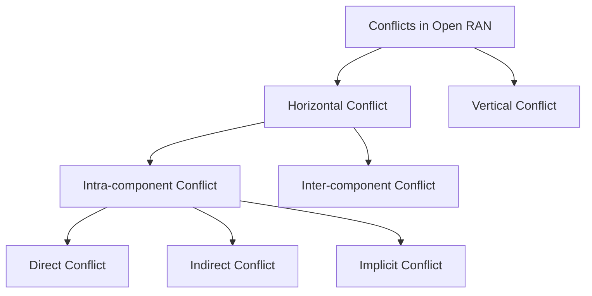
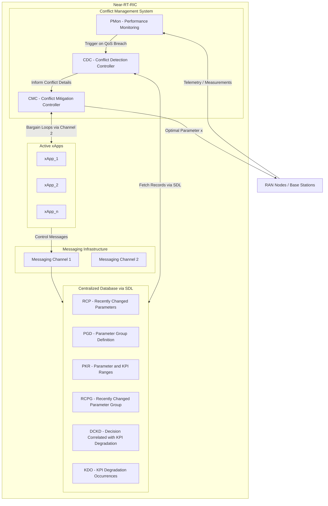
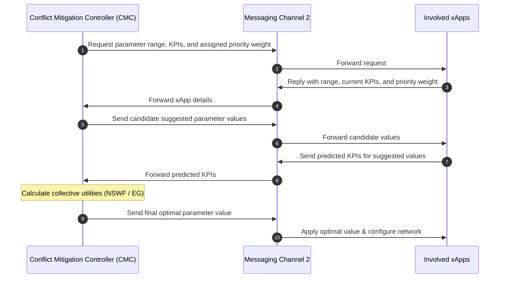
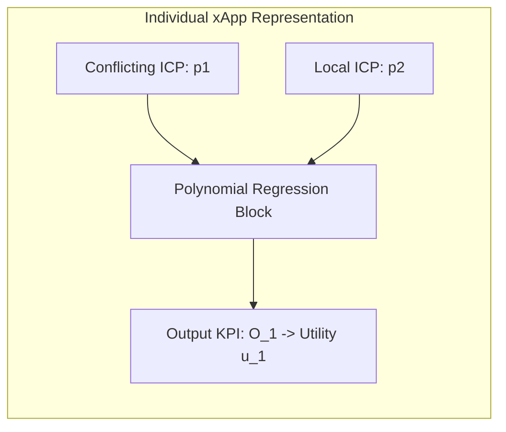

Here is a comprehensive summary of the paper **"Conflict Management in the Near-RT-RIC of Open RAN: A Game Theoretic Approach"** (Wadud et al.) and its accompanying repository.

---

### **1. Problem**

* **Disaggregated Multi-Vendor Architecture**: Open Radio Access Network (Open RAN) disaggregates traditional monolithic RAN components into open, virtualized, software-defined stacks managed by intelligent control applications (xApps and rApps) from multiple external vendors.
* **Control Decision Conflicts**: Multiple xApps operating concurrently in the Near-Real-Time RAN Intelligent Controller (Near-RT-RIC) share network resources and independently adjust control parameters. When different vendor xApps modify the same parameters or indirectly affect each other's performance targets, control decision conflicts occur.
* **System Performance Degradation**: Unmitigated conflicts cause severe performance degradation, network instability, and violations of Service Level Agreements (SLAs) / Quality of Service (QoS) requirements.
* **Taxonomy of Targeted Intra-Component Conflicts**:
  * **Direct Conflict**: Two or more xApps request conflicting configurations for the exact same Input Control Parameter (ICP) simultaneously (e.g., one xApp demanding higher transmit power while another demands lower power).
  * **Indirect Conflict**: Parameter modifications made by one xApp indirectly impact or alter the operational domain of another xApp (e.g., adjusting Remote Electrical Tilt [RET] affects handover boundaries managed by a Cell Individual Offset [CIO] xApp).
  * **Implicit Conflict**: Two xApps independently optimize separate target KPIs but cause non-obvious, adversarial interference to each other's performance.

---

### **2. Similar Work Mentioned in the Paper**

* **Traditional Single-Vendor RAN**: In legacy single-vendor RANs, equipment configurations were proprietary and closed; any parameter clashes were resolved internally within the vendor's proprietary equipment.
* **Self-Organizing Networks (SON)**: Open RAN adopts principles from SON, where multi-vendor SON Functions (SFs)—similar to xApps and rApps—automate network operation and management goals.
* **O-RAN Alliance Standards & Architectures**:
  * Architecture, interfaces (A1, E1, E2, F1, O1), and Near-RT RIC control loop specifications defined by Polese et al. and O-RAN Working Groups 1 & 3.
  * Adamczyk & Kliks proposed an initial taxonomy of Open RAN conflicts (horizontal vs. vertical, intra- vs. inter-component) and defined basic pre-action and post-action conflict mitigation concepts.
  * Zhang et al. studied multi-vendor resource allocation where xApps operate without direct communication.
* **Game-Theoretic & Mathematical Foundations**:
  * Ramezani & Endriss, as well as Brânzei et al., provided mathematical foundations for Nash Social Welfare Functions (NSWF) in multi-agent resource allocation.
  * Banerjee et al. explored control, coordination, and Gaussian distribution modeling for network KPIs in autonomous networks.

---

### **3. Gap Addressed**

* **Absence of Standardized Conflict Mitigation in O-RAN**: Most prominent Open RAN specifications—including the official O-RAN Alliance architecture—lack a standardized Conflict Mitigation System (CMS) in the Near-RT-RIC.
* **Inadequacy of Naive / Binary Prioritization**: Naive pre-action resolution schemes that simply prioritize one request ("winner-takes-all") are sub-optimal because completely discarding one xApp's request fails to achieve collective network efficiency or fairness.
* **Inability to Intercept Indirect/Implicit Conflicts Pre-Action**: Indirect and implicit conflicts cannot be observed directly before action execution; they require post-action measurement and coordination that existing frameworks do not handle.
* **Multi-Vendor Information Isolation**: Vendor xApps are independent black boxes that do not communicate directly or exchange internal private information with one another, making traditional joint optimization infeasible.
* **Lack of Dynamic SLA/QoS-Driven Mitigation**: Existing architectures lack a system triggered by QoS breaches that can dynamically support both non-priority scenarios (maximizing total collective utility) and priority scenarios (enforcing MNO preference weights).

---

### **4. Approach**

The paper proposes an independent **Conflict Management System (CMS)** integrated into the Near-RT-RIC, featuring two dedicated messaging channels, a centralized database accessed via a Shared Data Layer (SDL), and cooperative game-theoretic bargaining controllers.

#### **System Components & Workflow**:
1. **Infrastructure & Shared Data Layer (SDL) Database**:
   * **Channel 1**: Redirects all xApp control messages to the centralized database.
   * **Channel 2**: Establishes a dedicated closed-loop channel between xApps and the Conflict Mitigation Controller (CMC).
   * **Database Tables**:
     * `RCP`: Stores recently changed parameter values with timestamps.
     * `PGD`: Groups parameters that influence the same operational area (e.g., antenna tilt and CIO in the handover boundary group).
     * `RCPG`: Stores changes to PGD-affiliated parameters with timestamps.
     * `PKR`: Stores minimum/maximum bounds for parameters and KPIs.
     * `DCKD`: Stores KPI threshold bounds based on QoS/SLA requirements.
     * `KDO`: Records KPI degradation occurrences following parameter changes.

2. **Performance Monitoring (PMon) Component**:
   * Continuously collects performance measurements from RAN nodes, calculates KPIs, and compares them against predefined QoS thresholds. If a KPI breaches its SLA range, PMon logs the event in `KDO` and sends a trigger to the CDC.

3. **Conflict Detection Controller (CDC)**:
   * Upon receiving a PMon trigger, CDC fetches the parameter responsible for degradation and classifies the conflict:
     * **Indirect Conflict**: Flagged if the parameter belongs to an affiliated group in `PGD`.
     * **Direct Conflict**: Flagged if the parameter has no `PGD` affiliation but matches recent changes in `RCP`.
     * **Implicit Conflict**: Flagged if no match is found in `PGD` or `RCP`.
   * CDC passes two parameter state records (the record when KPI was above QoS threshold and the record after degradation) to the CMC.

4. **Conflict Mitigation Controller (CMC) & Game-Theoretic Bargaining**:
   * **Closed-Loop Bargaining**: CMC communicates with involved xApps over Channel 2 to request KPI bounds, parameter operating ranges, and priority weights.
   * **Utility Normalization**: Converts raw KPIs (with different units) onto a uniform scale of \\(\\) (or \\(\\) in evaluations) using min-max normalization:
     \\[f_i(x) = u_i = \frac{1}{|J|} \sum_{j \in [1, |J|]} \left( \frac{o_{ij} - o_{ij}^{\min}}{o_{ij}^{\max} - o_{ij}^{\min}} \times 10 \right)\\]
   * **Non-Priority Scenario — Nash Social Welfare Function (NSWF)**:
     Calculates the product of individual xApp utilities to maximize collective system satisfaction and balance fairness with efficiency:
     \\[\text{NSWF}(x) = \prod_{i \in [1, |Z|]} f_i(x), \quad \forall i \in Z\\]
   * **Priority Scenario — Eisenberg-Galle (EG) Convex Linear Program**:
     Incorporates operator-assigned priority weights (\\(w_i\\), where \\(\sum w_i = 1\\)) to prioritize critical xApps (e.g., MRO during call drop spikes) while still computing a compromise setting for lower-priority apps:
     $$\max : F = \sum_{i \in [1, |s|]} w_i f_i(x) \quad \text{s.t. } \sum_{i \in [1, |Z|]} w_i = 1, \quad p_{\min, \text{opt}}^m \le x \le p_{\max, \text{opt}}^m$$

---

### **5. Results**

#### **Experimental Model & Setup**:
* **xApps Evaluated**: Mobility Load Balancing (\\(\text{xApp}_1\\)), Capacity and Coverage Optimization (\\(\text{xApp}_2\\)), Energy Saving (\\(\text{xApp}_3\\)), and Mobility Robustness Optimization (\\(\text{xApp}_4\\)).
* **Shared Parameter**: Transmission Power (\\(p_1\\) / TxP) evaluated across range \\([-150, 150]\\).
* **Non-Conflicting Parameters**: Configured as \\(p_2 = 20, p_3 = 60, p_4 \in [-100, 100], p_5 = 60, p_6 \in [-50, 150], p_7 = 60\\).
* **Machine Learning Representation**: Intelligent xApps modeled using Polynomial Regression Blocks in Python, trained on synthetic datasets (`data1.csv` to `data4.csv` generated via Gaussian KPI distribution functions).
* **Priority Weights**: Assigned by Mobile Network Operator (MNO) as:
  * Direct Conflict: \\(\{\text{xApp}_1 = 0.4, \text{xApp}_2 = 0.6\}\\).
  * Indirect Conflict: \\(\{\text{xApp}_2 = 0.1, \text{xApp}_4 = 0.9\}\\).
  * Implicit Conflict: \\(\{\text{xApp}_1 = 0.9, \text{xApp}_3 = 0.1\}\\).

#### **Detailed Scenario Outcomes**:

| Conflict Scenario | Initial Unmitigated State & Clashes | Arithmetic Mean (AM) Result | NSWF Result (Non-Priority) | Eisenberg-Galle (EG) Result (Priority) |
| :--- | :--- | :--- | :--- | :--- |
| **Direct Conflict** (\\(\text{xApp}_1\\) vs. \\(\text{xApp}_2\\)) | \\(\text{xApp}_1\\) demands \\(p_1 = -50\\) (\\(u_1 = 0.5, u_2 = 0.25\\)); \\(\text{xApp}_2\\) demands \\(p_1 = 50\\) (\\(u_2 = 1.0, u_1 = 0.0\\)). | Suggests \\(p_1 = 0\\); yields \\(u_1 \approx 0.02, u_2 \approx 0.72\\). | Suggests \\(p_1 = -18\\); maximizes collective utility across both xApps without favoring either. | Suggests \\(p_1 = 22\\); prioritizes \\(\text{xApp}_2\\) per MNO weight (\\(0.6\\) vs \\(0.4\\)). |
| **Indirect Conflict** (\\(\text{xApp}_2\\) vs. \\(\text{xApp}_4\\)) | \\(\text{xApp}_2\\) sets \\(p_1 = 0\\) at \\(t_2\\), indirectly collapsing \\(\text{xApp}_4\\) utility near zero. | Suggests \\(p_1 = 12\\); fails to improve \\(\text{xApp}_4\\) utility. | Suggests \\(p_1 = 66\\); significantly enhances collective utility for both xApps. | Suggests \\(p_1 = 110\\); substantially increases \\(\text{xApp}_4\\) utility when prioritized by MNO (\\(w = 0.9\\)). |
| **Implicit Conflict** (\\(\text{xApp}_1\\) vs. \\(\text{xApp}_3\\)) | \\(\text{xApp}_1\\) sets \\(p_1 = -85\\) at \\(t'_2\\), causing implicit drop in \\(\text{xApp}_3\\) utility below \\(0.4\\). | Suggests \\(p_1 = -84\\); provides minimal improvement for \\(\text{xApp}_3\\). | Suggests \\(p_1 = -62\\); restores \\(\text{xApp}_3\\) utility while balancing \\(\text{xApp}_1\\). | Suggests \\(p_1 = -75\\); maintains higher utility for \\(\text{xApp}_1\\) when prioritized (\\(w = 0.9\\)). |

---

### **6. Conclusion**

* **Vendor-Agnostic Conflict Management**: Demonstrates an independent, game-theory-based CMS architecture for Near-RT-RIC that effectively detects and resolves multi-vendor xApp conflicts without requiring xApps to exchange private information.
* **Balanced Utility Optimization**: Proves that cooperative bargaining (NSWF for equal priority and EG convex optimization for MNO-weighted priority) achieves optimal parameter configurations that outperform traditional arithmetic averaging and binary overrides.
* **Limitations & Challenges**:
  * **Computational Latency**: As the density of xApps and ICPs grows, the iterative bargaining loops increase computational complexity, which may exceed the Near-RT-RIC time threshold (\\(10\text{ ms}\\) to \\(1\text{ s}\\)).
  * **Utility Mapping Difficulty**: Transforming complex, multi-unit real-world KPIs into scalar utility functions remains challenging.
  * **Theoretical Evaluation**: The framework was validated on an experimental Gaussian model and requires real-world testbed verification.
* **Future Work**: Plans to transition the CMS to real-world Open RAN testbeds, reduce bargaining complexity, explore machine learning for conflict prediction, and employ Multi-Agent Reinforcement Learning (MARL) for automated conflict mitigation.

---

💡 **Next Step:** Would you like to explore how this game-theoretic bargaining approach compares to QoS-Aware Constraint Projection (QACM) or digital twin continuous action blending?