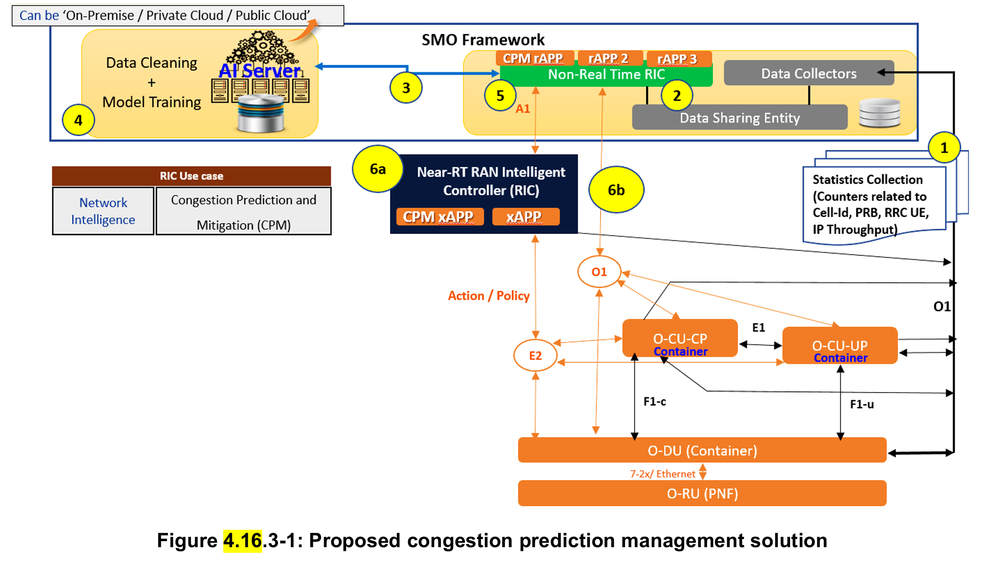

4.16 Congestion prediction and management 
4.16.1 Background information 
This use case provides a proactive approach to congestion handling in the base station by analysing the radio resource 
utilization and taking timely corrective action so as to mitigate any potential congestion in the system.  
4.16.2 Motivation 
Large-scale commercial cellular networks have many problems - like cell congestions leading to RLF (Radio Link Failure, 
etc.), handover failure, poor data rates etc. Network congestion is a crucial problem for the telecom operators as it affects 
the Quality of Service (QoS) of the users directly. An operator has many solutions like offload (across carriers, Wi-Fi, 
etc.) or antenna techniques (cell split, higher order MIMO, etc.) to handle congestion. However, the congestion patterns 
in the network are not fully understood and mitigation is done post facto at the expense of the prolonged user experience 
degradation. The congestion mitigation is critical for operators to retain their subscribers for operator and individual user experience. With 5G, the congestion needs to be handled to as to best utilize the radio resources. Today operators do not 
have a well-defined mechanism to predict congestion. The main objective of this use case is to use the embedded 
intelligence of O-RAN to predict the congestion ahead of time, so that operators can keep the cell congestion mitigation 
solution in place before the congestion is predicted to happen. 
4.16.3 Proposed solution 
CPM (Congestion Prediction & Management) architecture is proposed to detect and mitigate congestion pro-actively. In 
the CPM architecture, E2 node statistics [counters] are collected by the data collector of SMO. This is done over the O1 
interface. The pre-processing of data is also done in the same place. Pre-processing includes adding VNF/cell 
names/numbers and ids to the data and converting counters into KPI using KPI logic. After preprocessing data is shared 
with Non-RT RIC deployed in the SMO using a data sharing entity. Non-RT RIC will invoke the corresponding training 
model/application in an AI server inside SMO (it can be placed outside SMO also). The data cleaning and training will 
happen and the predicted KPIs will be sent back to CPM rApp in Non-RT RIC. Machine learning models can be used to 
learn and predict the future traffic for the next hour/day/month. The prediction window can be configured by operators as 
per the available data and its periodicity. CPM rApp in Non-RT RIC will form the inference. Inference logic to define cell 
congestion can be like: 
1. The average user-perceived IP throughput < P Mbps 
2. DL PRB utilization > Q% 
3. Average RRC user > R 
The inference will contain the cell ids, information about whether the cell is congested or not, time stamp of cell 
congestion and predicted KPI value (to decide the congestion intensity). As per the CPM rApp information in Non-RT 
RIC, there are two options to mitigate cell congestion as follows: 
Option a: CPM rApp in Non-RT RIC transfers the inference to the CPM xApp in Near-RT RIC through A1 interface. 
Near-RT RIC can decide the mitigation solutions as per the inference. Mitigation solutions can include 
1. Switching to dual connectivity mode  
2. Debarring of user access  
3. Load sharing 
These solutions can be controlled over E2 interface. 
Option b: Non-RT RIC can also directly help to mitigate the congestion with the help of O1 interface. Some of the 
mitigation solutions can be  
1. Splitting a cell (assuming hardware support available)  
2. Add more carriers 
3. Switching to higher order MIMO  
4. Switching some of the users to Wi-Fi 
Finally, the E2 nodes feedback can be sent to Non-RT RIC through O1 interface. The proposed CPM solution is shown 
in figure 4.16.3-1 in detail. 
NOTE: There can be more mitigation solutions apart from the one provided in steps 6a and 6b (see figure 4.16.3-1). 
Choosing the mitigation solution is up to the operator to decide as per the congestion intensity (specified in the inference).

4.16.4 Benefits of O-RAN architecture 
All the main O-RAN components can leverage from proposed CPM use case. It predicts congestion before its occurrence 
so that an operator can configure the cell and prevent the degradation of QoS of a cell. AI server in SMO can be utilized 
for model training of KPIs. Similar models can be used to predict KPIs for other use cases as well. Non-RT RIC can be 
utilized to prepare inference based on predicted KPIs and congestion logic. These inference can be helpful for operators 
to choose on what solutions can be applied for a give congestion severity. CPM utilize Near-RT RIC for configuring a 
cell well before the congestion based on the inference and infrastructure dynamics.