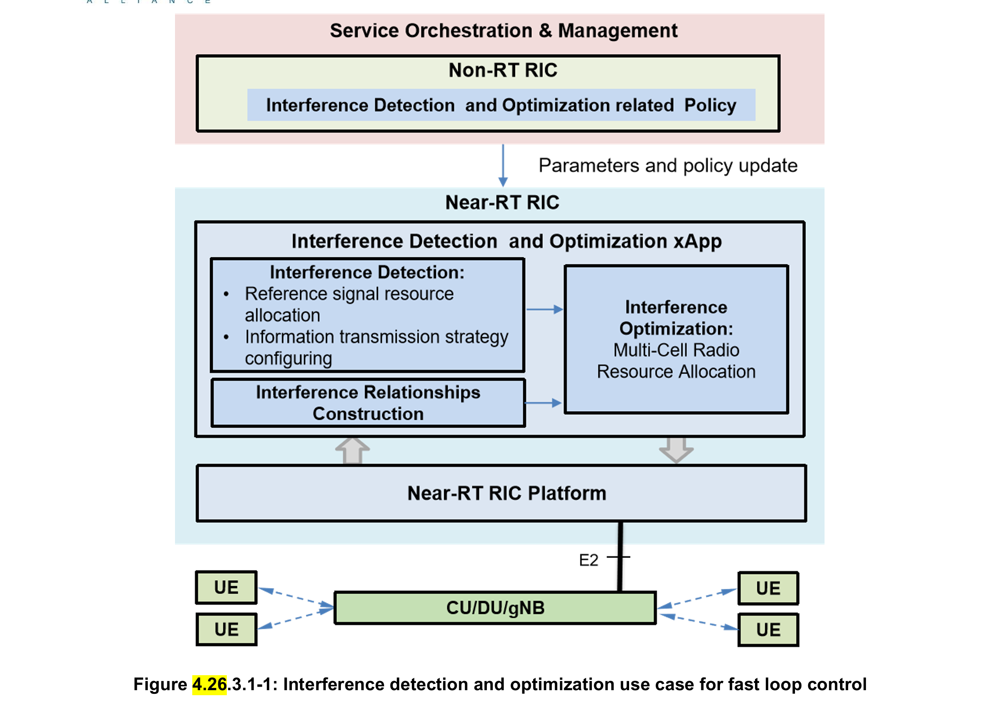
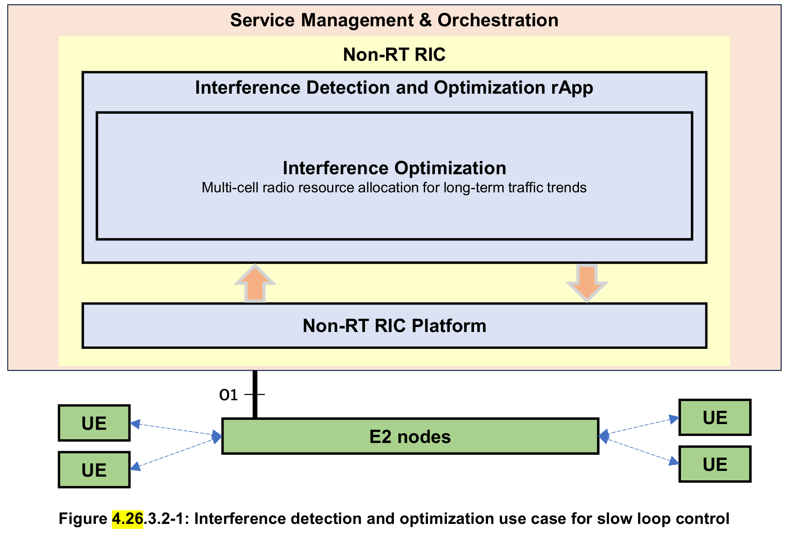
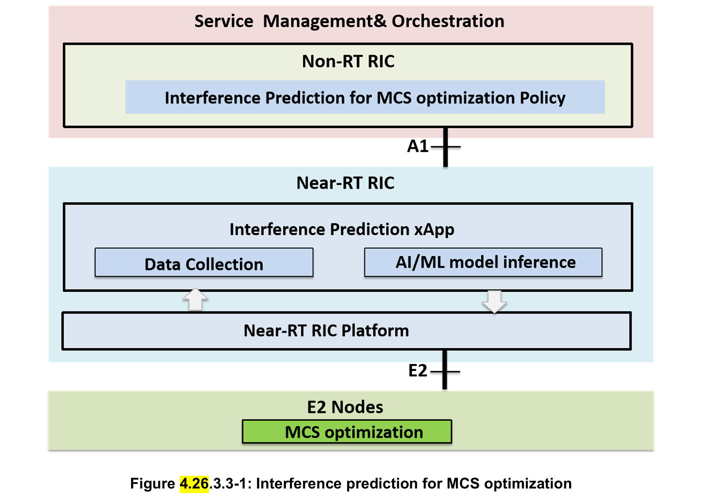

4.26 Interference detection, prediction and optimization 

4.26.1 Background information 
LTE and 5G network are deployed based on co-frequency networking due to limited radio resources, which leads to co
frequency interference becoming the bottleneck of network performance. Heterogeneous networks as well as ultra-dense 
networks make inter-cell interference more complex. As a result, how to detect and/or predict, and then optimize 
interference is of great importance for wireless networks. Current research mainly focuses on a class of interference 
optimization solutions called Inter-Cell Interference Coordination (ICIC), which iclude static ICIC and dynamic ICIC, 
assuming that inter-cell interference is available via detection and/or prediction. The principle of ICIC is to restrict the 
use of radio resources in individual cells in an inter-cell coordination manner, including restricting which time-frequency 
resources are available, or limiting their transmitting power on certain time-frequency resources. The principle of ICIC is 
to divide all cells in the network in several categories, then divides the UE to Cell Edge User (CEU) as well as Cell Center 
User (CCU), and schedule CEU to edge radio resources. 
Such ICIC solutions suffer from the following limitations: 
• The radio resources are allocated statically or in non-real time, and do not support dynamic adjustment, which 
causes low radio resource utilization. 
• ICIC depends on specific ideal cell networking structure, and the performance of interference optimization 
algorithm is poor for complex networking structure. 
• The radio resource allocation is based on cell level, and do not support UE level or UE group level. 
• The measurement data is used for post-interference analysis and optimization, in a non-real-time manner. 
Besides, current research may mainly focus on interference optimization, based on the assumption that inter-cell 
interference is available via detection and/or prediction. In fact, interference detection and prediction is not less important 
than interference optimization. On the one hand, interference detection and/or prediction with high accuracy contributes 
to accurate and efficient interference optimization. On the other hand, interference detection and/or prediction can be 
utilized to optimize other transmission configurations, e.g., Modulation and Coding Scheme (MCS), not limited to radio 
resources allocation. 
In addition to LTE and 5G interference, there are other non-3GPP types of interference experienced in a 5G network 
including internal RF interference, such as passive intermodulation, and external RF interference, such as ducting, that 
need to be detected and optimized. To support effective interference optimization, there is a need to identify the source of 
the interference in terms of interference type and geographical location. 
Thanks to the open interface and intelligent functionalities provided by the O-RAN architecture, multi-cell-based 
collaborative real-time interference detection, prediction and interference optimization schemes can be realized. Multi
dimensional data, e.g., network level measurement data, can be acquired and used for interference detection, interference 
prediction, interference relationships construction, and interference optimization in real time. Interference relationship 
construction can further take QoS related metrics into analysis to facilitate UE service assurance through interference 
management. Based on the A1 policy as well as interference relationships, Near-RT RIC ensures optimal radio resource 
allocation for UE or UE group or RAN slice through E2 interface towards RAN for interference optimization. In addition, 
based on the history interference detection, Near-RT RIC can predict interference for future data transmissions and thus 
facilitates MCS optimization to adapt to fluctuating interference. 

4.26.2 Motivation 
The main objective is to ensure interference optimization to be supported within the O-RAN architecture and its open 
interfaces in a way that allows UE or UE group or RAN slice or cell level modification of RAN behavior, features, 
scheduling, resource allocation procedures and other configuration based on user QoS requirements or other multi
dimensional data. This includes: 
1. Interference detection. Near-RT RIC helps UE(s) to achieve UE-level interference detection by optimally 
configuring the reference signal resource allocation and information transmission strategy for the serving cell and 
its intra-frequency neighboring cells. Near RT RIC helps UL interference detection, classification and locating by 
leveraging the measurements of the interference levels and interference patterns at PRBs and mMIMO beams. 
Based on the A1 policy (interference detection related policy) developed by the Non-RT RIC, Near-RT RIC 
generates and sends the E2 control or policy, such as allocated resource(s) of the reference signal, information 
transmission strategy to indicate UE for channel measurement, channel estimation and interference measurement 
as well as PRBs and mMIMO beams to be monitored. Interference detection, classification and locating results 
can be used as a trigger condition for interference optimization or exposed to other xApps. 
2. Interference relationships construction. Interference optimization is assisted by interference relationships, e.g., 
interference graph, which are used to describe the potential interference relationships between UEs or UE groups 
or RAN slices or PRBs or mMIMO beams in a multi-cell coverage area. Interference relationships are constructed 
by Near-RT RIC. Multi-dimensional data, e.g., QoS related metrics from SMO and network level measurement 
reported by RAN through E2 interface can be used for Near-RT RIC to construct interference relationships. 
3. Interference optimization. Near-RT RIC achieves interference optimization by optimally allocating radio 
resources to UEs or UE groups or RAN slices or cells or PRBs or mMIMO beams based on the interference 
relationship between UEs or UE groups or RAN slices or cells or PRBs or mMIMO beams as described in the 
interference relationship. Near-RT RIC receives the interference optimization related policy through A1 interface 
and the measurement data through E2 interface, and then the Near-RT RIC formulates an interference optimization 
policy for the serving cell and its intra-frequency neighboring cells based on the interference relationship, 
including radio resource allocation. 
4. Above interference optimization flow can be locally applied even in Non-RT RIC by closed loop control via O1 
interface for long-term traffic trends. The optimization by Near-RT RIC is fast loop optimization, while the 
optimization by Non-RT RIC is slow loop optimization. Appropriate approaches can be selected depending on 
traffic trends or use cases. 
5. Interference prediction. In many cases, there is a time delay between the measurement and use of the channel, so 
that in time the channel information obtained at the moment of the reference signal measurement is accurate, and 
at the moment of use the channel information is outdated. Taking uplink transmission as an example, the 
transmission configuration (e.g., RB allocation and MCS) for PUSCH is indicated in the Downlink Control 
Information (DCI), which is sent by gNB ahead of K2 slots before PUSCH transmission. The transmission 
configuration is determined by gNB, based on the latest estimated channel quality, e.g., SINR, via channel 
measurement. Due to the fluctuation of wireless links, the channel quality may have changed dramatically from 
the moment of channel measurement to the moment of PUSCH transmission, leading to performance degradation. 
In this way, predicting future interference in data transmission for uplink transmission configuration optimization, 
such as MCS optimization, maximises the transmission efficiency of the wireless link while ensuring reliability. 

4.26.3 Proposed solution 
4.26.3.1 Fast loop optimization 
The concept of interference detection and optimization use case for fast loop control is given in figure 4.26.3.1-1.

The interference detection and optimization application includes interference detection, classification and locating, 
interference relationships construction, as well as interference optimization, which are deployed in Near-RT RIC. 
In the process of implementing interference detection and optimization, Non-RT RIC generates interference detection and 
optimization-related policy and sends the policy to Near-RT RIC via A1 interface. Interference detection and optimization
related policy includes reference signal type, measurement report configuration, neighborhood list of serving cell, 
interference detection execution period, threshold for performing interference optimization, etc. 
The Near-RT RIC receives interference detection and optimization policies from the Non-RT RIC and obtains the 
necessary interference-related measurements from the network-level measurement reports via the E2 interface for 
interference relationshipsgraph construction, e.g., interference graph, and interference optimization-related E2 control or 
policy generation. The Near-RT RIC sends control or policies via the E2 interface to the RAN for interference 
optimization, and also sends Non-RT RIC with interference optimization performance reports for evaluation and 
optimization. One of the examples in resource allocation control is that Near-RT RIC separates resources between 
aggressor and victim cells for per-slice interference (as specified in [i.42], clause 9.3.16). Other examples of resource 
allocation control for cell resources include Tx power, PRB blanking, carrier aggregation, and beam management 
including beam forming and beam muting. 
The base station supports the reporting of network status and UE measurement data based on the policies developed by 
Near-RT RIC and sends them to Near-RT RIC via E2 interface with the required granularity. At the same time, the base 
station supports the execution of interference optimization policies based on E2 messages to achieve, e.g., resource 
allocation for the UE (or UE group or RAN slice).
UEs support network interference detection based on the reference signal configuration and report the result to RAN. 
RAN supports uplink interference detection, classification and locating based on the interference levels and interference 
patterns of PRBs as well as mMIMO beams/interference. 
4.26.3.1.1 Interference detection 
The Near-RT RIC generates an interference detection policy (E2 policy) based on the interference detection related policy 
(A1 policy) sent by the Non-RT RIC. The interference detection policy includes:  
1) allocated resource(s) of the reference signal for the gNB(s); 
2) information transmission strategy configured for the intra-frequency cells adjacent to the cells corresponding to the 
gNB(s); 
3) detection profile for interference levels and interference patterns of PRBs where detection profile contains the 
criteria for engaging the E2 service; 
4) detection profile for mMIMO beams/interference where detection profile contains the criteria for engaging the E2 
service. 
Based on the reference signal resource configuration and information transmission strategy configuration for the serving 
cell and intra-frequency neighboring cells, the UE can perform real-time interference detection. Based on detection profile 
for interference levels and interference patterns of PRBs as well as detection profile for mMIMO beams/interference, 
RAN can perform near-RT interference detection, classification and locating. 
4.26.3.1.2 Interference relationships construction 
Near-RT RIC constructs interference relationships, e.g., interference graph, between UEs and UE groups and RAN slice 
based on the received QoS related metrics from SMO and network level measurement from RAN. Near-RT RIC uses 
interference relationshipsgraph for interference optimization. Near-RT RIC constructs interference relationships based on 
the scheduled resources of PRBs of the serving cell and its intra-frequency neighboring cells as well as parameters of 
mMIMO beams. 
4.26.3.1.3 Interference optimization 
When the interference detection result meets the interference optimization conditions (e.g., the interference value detected 
by UE is greater than the interference optimization threshold, the interference level and interference pattern of PRBs meet 
criteria in the detection profile or the mMIMO beams/interference meet the criteria in the detection profile), the 
interference optimization formulates an interference optimization policy based on the latest interference relationships and 
selects appropriate time and frequency domain for radio resources for DL or UL transmission in the service cell and its 
intra-frequency neighboring cells in order to achieve multi-cell radio resource coordination or active interference 
avoidance, and thus achieve interference optimization. 
4.26.3.2 Slow loop optimization 
The concept of interference detection and optimization use case for slow loop control is given in figure 4.26.3.2-1.

The interference detection and optimization application includes interference detection, interference relationships 
construction, and interference optimization, which are deployed in Non-RT RIC. 
In the process of implementing interference detection and optimization, Non-RT RIC generates interference detection and 
optimization-related policy and sends control based on the policy to E2 nodes via O1 interface. The control information 
includes appropriate time and frequency domain resources in the service cell and its intra-frequency neighboring cells. 
The base station supports the reporting of network status based on the policies developed by control information from 
Non-RT RIC and sends them to Non-RT RIC via O1 interface with the required granularity. At the same time, the base 
station supports the execution of interference optimization policies based on the control information to achieve resource 
allocation for the UE (or UE group or RAN slice). 
UEs support network interference detection based on the reference signal configuration and report the result to RAN. 
4.26.3.2.1 Interference detection and optimization 
When the interference detection result meets the interference optimization conditions (the interference value detected by 
UE is greater than the interference optimization threshold), the interference optimization formulates an interference 
optimization policy based on the latest interference relationships and selects appropriate time and frequency domain 
resources in the service cell and its intra-frequency neighboring cells in order to achieve multi-cell radio resource 
coordination or active interference avoidance, and thus achieve interference optimization. 
4.26.3.3 Interference prediction for MCS optimization 
The concept of the interference prediction for MCS optimization is given in figure 4.26.3.3-1.

In the process of implementing interference prediction for MCS optimization, Non-RT RIC generates interference 
prediction related policy and sends the policy to Near-RT RIC via A1 interface. Interference prediction for MCS 
optimization related policy includes neighborhood list of serving cell, prediction granularities and  prediction steps, etc.  
The Near-RT RIC receives interference prediction for MCS optimization policies from the Non-RT RIC and obtains the 
necessary data required for interference prediction from the reports via the E2 interface for interference prediction related 
E2 control or policy generation.  
Assuming the AI/ML model training using the training data set is on Non-RT RIC or on Near-RT RIC,  the trained AI/ML 
model will be deployed in the Near-RT RIC used for the AI/ML model inference. 
The Near-RT RIC sends control or policies with the predicted uplink interference to the E2 node via the E2 interface for 
MCS optimization, and also sends interference prediction-based  MCS optimization performance  to Non-RT RIC for 
evaluation and optimization.   
The E2 nodes support the reporting of interference prediction related data based on the subscriptions from Near-RT RIC, 
and send them to Near-RT RIC via E2 interface with the required granularity. At the same time, the E2 node supports the 
execution of MCS optimization based on E2 control or policy from Near-RT RIC. 
4.26.3.3.1 Interference prediction 
Prediction interference for future data transmission in advance, is based on history interference and relevant features from 
neighboring cells. 
Different prediction granularities are available, e.g., wideband, RB group, and RB for frequency domain, and TTI, frame 
for time domain.

4.26.3.3.2 MCS optimization 
Adjust MCS based on the predicted interference for future data transmission. The method of adjusting the MCS could be 
realized by replacing the outdated interference with the predicted interference when estimate the channel quality (e.g., 
SINR), or adjusting the target BLER\ACK adjustment step\initial MCS using the predicted interference value, to 
maximize the transmission efficiency while ensuring the reliability. 
4.26.4 Benefits of O-RAN architecture 
The proposed solution to support a real-time interference detection, prediction and optimization for co-frequency 
networking. It requires features provided by O-RAN architecture to orchestrate these requirements via interoperable O1 
or A1/E2 interfaces. Retrieving measurement metrics in near-real-time are offered by the O-RAN architecture for 
interference detection, interference prediction, interference relationships construction, and interference optimization. 