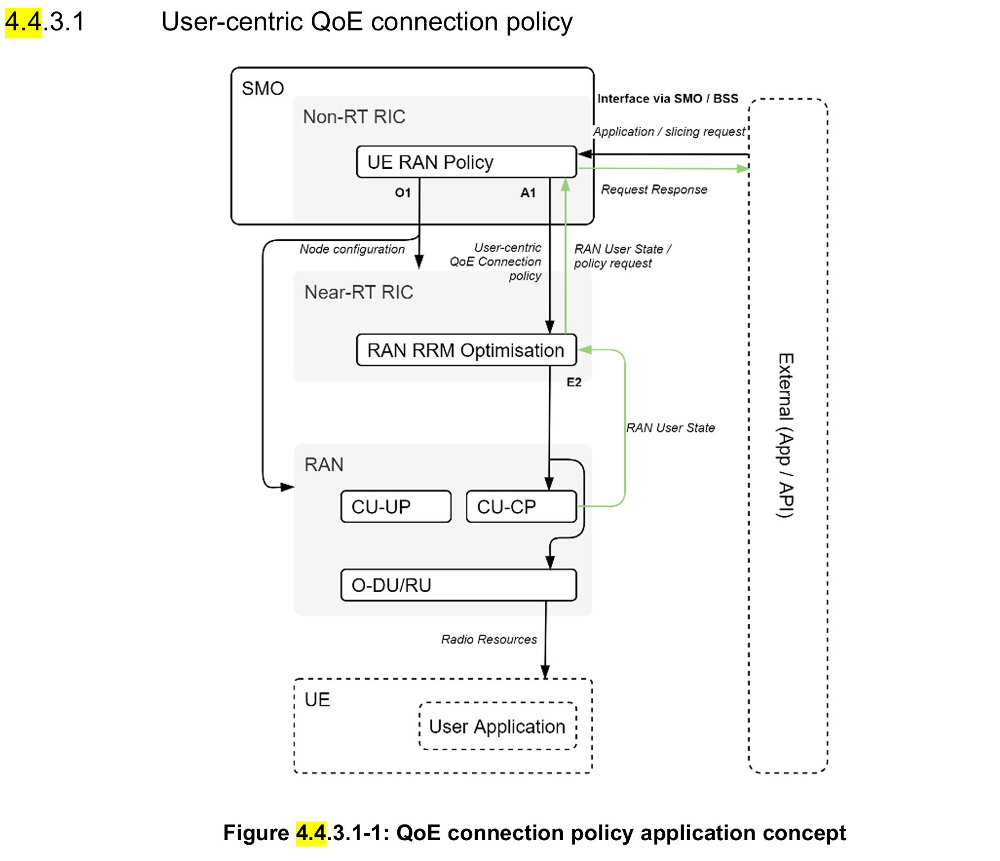
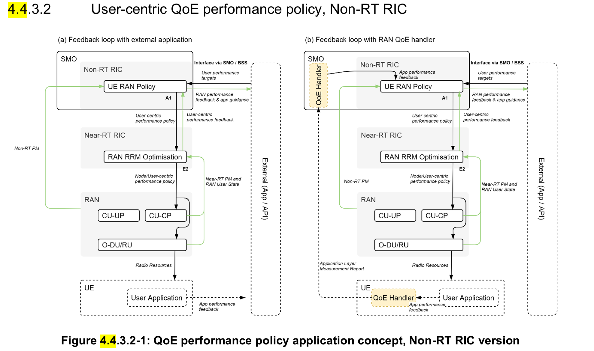
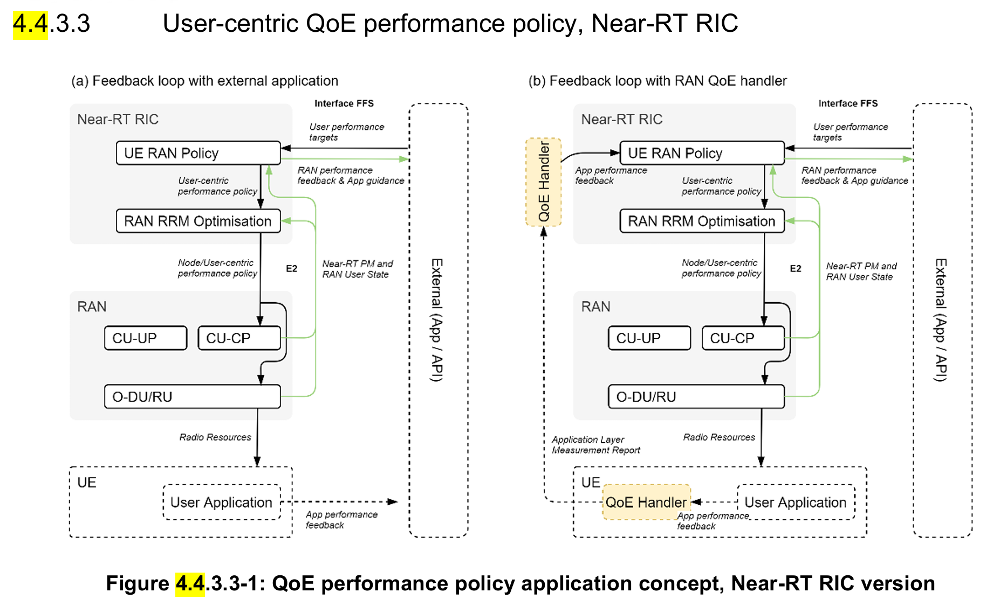
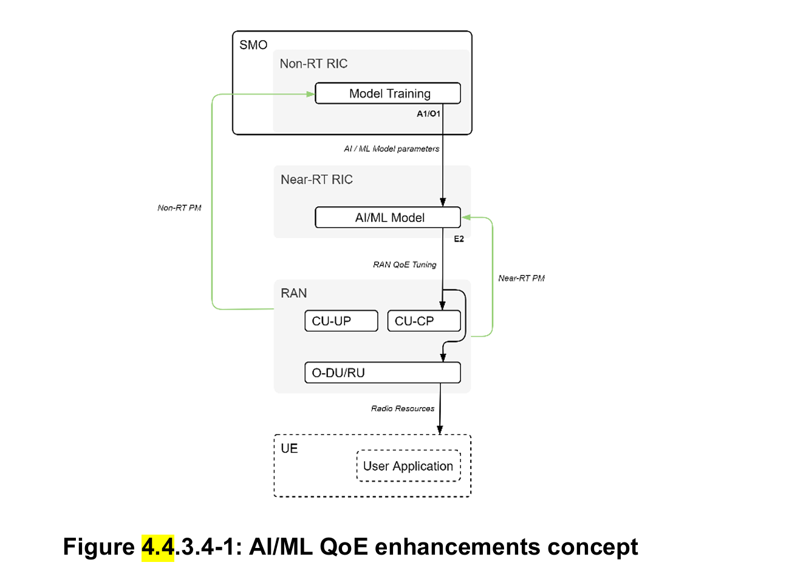
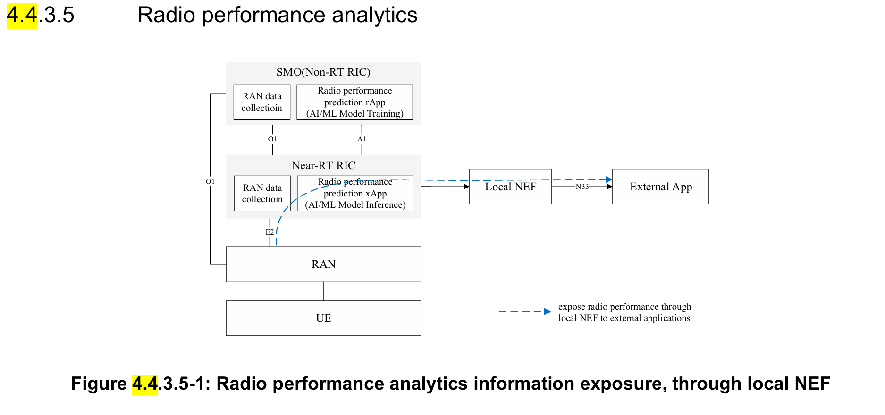
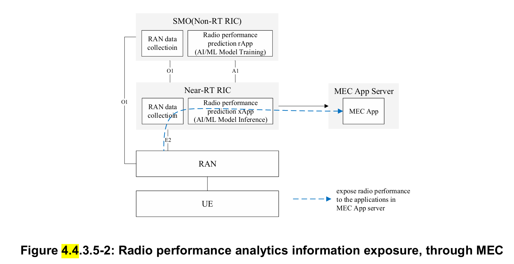

4.4 QoE optimization
4.4.1  Background information 
Highly demanding 5G native applications like cloud VR and industrial automation are both bandwidth consuming and 
latency sensitive. Demanding contemporary 4G and 5G applications like online multiplayer gaming and connected 
vehicles are today often handled in a best effort way with low or no application specific optimization. These traffic
intensive and highly interactive applications are not well served by current semi-static QoS framework which does not 
efficiently satisfy diversified QoE requirements. These requirements can vary during an application lifetime, especially 
taking into account potentially significant fluctuation of radio transmission capability and applications with dynamic 
performance requirements. It is expected that QoE estimation/prediction from application level can help deal with such 
uncertainty and improve the efficiency of radio resources, and eventually improve user experience and yield a more 
efficient use of RAN resources. Furthermore, an increased set of mobile applications with varying QoE demands will increasingly become unmanageable if semi-static profiles are “preloaded” into the relevant RAN nodes without a more 
automated closed-loop approach. RAN performance exposure to an external application are also envisioned to be helpful 
for the application to improve the user experience. 

4.4.2  Motivation 
The main objective is to ensure QoE optimization be supported within the O-RAN architecture and its open interfaces in 
a way that allows per-user, slice or 5QI flow modification of RAN behavior, features, scheduling procedures and other 
configuration based on user application requirements or other input. This includes:  
1. A user-centric QoE policy approach. Input from external systems, such as user applications, can be used to set 
or request specific RAN behavior automatically and without preloading of static configuration data and QoS 
profiles into E2 Nodes. Feedback is provided to these systems on the acceptance of the request. 
2. A user-centric QoE update and feedback approach. During a user or application session lifetime, a closed-loop 
including the user application or other external input can provide enriched performance targets to the RAN, 
varying the targeted performance in response to these external factors. Feedback is provided to the requesting 
source on the RAN performance for measurement against an SLA or for the application itself to take action to 
improve the user QoE. 
3. Using AI / ML approaches embedded in the RAN. Multi-dimensional data, e.g., user traffic data, QoE 
measurements, network measurement report, can be acquired and processed via ML algorithms to support traffic 
recognition, QoE prediction, QoS enforcement decisions. ML models can be trained offline and model inference 
will be executed in a real-time manner. 
4. Radio performance analytics and exposure. Based on the data analysis and ML algorithms, Near-RT RIC 
provides either statistics or predictions on the cell level or UE level, e.g., traffic rate, latency, packet loss rate. 
Furthermore, Near-RT RIC can expose the real time RAN analytics information to the external applications, and 
helps external applications to execute logic control, e.g., TCP sending window adjustment, video coding rate 
selection to improve the user QoE. 
The use case focus is a general solution that supports any specific QoE use case (e.g., cloud VR, video, gaming, connected 
vehicles, etc.).  

4.4.3 Proposed solution 
Traditional technologies involve manual configuration of RAN parameters for the congested cells to improve QoE of the 
network users. This can include per-site or per-cell parameter modification to target congested cells, or deployment of 
network-wide configurations to create application or user specific handling policies. The O-RAN architecture facilitates 
QoE optimization in a real-time way with proactive closed-loop network optimization, both within the RAN and including 
input from external applications. This will improve the way congested cells are detected and automatically allocate 
resources based on the end user experience, whose demands can change over time.   
The proposed solution consists of O-RAN components, Non-RT RIC, Near-RT RIC and E2 nodes, empowered with 
machine learning algorithms and user, slice or 5QI flow-centric feature and QoS modification interfaces. The solution 
introduces a “user RAN policy”, hosted at the Non-RT RIC (3.4.3.2) or Near-RT RIC (3.4.3.3). The user RAN policy will 
be instantiated as an rApp or xApp which will apply the operator’s desired QoE configuration for specific user, slice or 
5QI flow types on the network in response to requests from external systems or in response to UE mobility, and provide 
feedback and reporting mechanisms, including SLA information, to external systems which are hosting the user 
application(s). The solution also includes exposing per-user or per-cell radio performance analytics information to external 
applications, and the application can optimize user QoE based on the RAN analytics information.

This solution is expected to be invoked in response to changes in the applications being delivered to a UE, updates in the 
intended use-case handling behavior by an operator, implementation of a new network slice within the network, or 
mobility of a UE to a node which requires an update of the relevant handling policy. 
The concept of QoE connection policy application is shown in figure 4.4.3.1-1. 
The Non-RT RIC hosts a RAN QoE connection policy configuration which can be modified by operators to apply RAN 
connection level behaviors to a network slice, 5QI flow per device, specific user types or specific user ID(s). 
The Non-RT RIC will use the O1 interface to activate and configure the features of a particular QoE connection policy as 
they are needed across the network, while the A1 interface is used to request policy updates from the Non-RT RIC by 
specific network nodes (policy request) and by the Non-RT RIC to communicate the performance handling features that 
apply to a specific user, slice or 5QI flow (user-centric QoE connection policy). 
For example, in response to an A1 interface policy request: The O1 interface is first used to implement or update a 
constellation of carrier aggregation configuration, traffic steering, mobility, power control or scheduling priority or other 
behaviors (e.g. DRX) as a constellation of features which can be referred to by a feature activation policy index. The A1 
interface is then used to indicate the users or flows this set of features is to be applied to. 
E2 nodes provide updated RAN user state information with sufficient granularity to the Near-RT RIC to trigger policy 
requests as needed.

This solution is expected to be invoked in response to changes in the user experience which could happen at any time 
during the lifetime of an application or session. This will typically operate as a continuous closed-loop including feedback 
from the user application(s). 
The concept of QoE performance policy application, Non-RT RIC version is shown in figure 4.4.3.2-1. 
In (a), the Non-RT RIC hosts a RAN QoE performance policy configuration which accepts input from external systems 
(user application or via other SMO/BSS functions) that provide closed-loop feedback on the user experience. This will 
be translated into a user-centric performance policy which is communicated via the A1 interface towards the Near-RT 
RIC which in turn, enforces these policies on the set of E2 nodes which currently host UEs of the type configured in the 
performance policy. For example, this policy would include specific latency, bitrate, and jitter targets which are used in 
conjunction with the connection policy described at 4.4.3.1 to determine how a specific user is handled in real time. 
An alternative, optional approach is shown at (b), which instead uses application layer measurement reporting from the 
UE to the RAN as defined in [i.43] (MeasReportAppLayer RRC Container) and [i.12] for LTE and in [i.21] 
(MeasurementReportAppLayer RRC Container) and [i.12] for NR. This approach is complementary to (a) and will be 
limited to those user applications with access to UE AT interfaces or appropriate middleware, and so is not universally 
applicable. The MeasReportAppLayer is forwarded from the RAN to a QoE handling node (outside of the O-RAN 
architecture) and provides input to the Non-RT RIC analogous to the external system but with reduced latency. 
E2 nodes provide updated user state information with sufficient granularity to allow for the distribution of connection 
policy, and PMs with required granularity to SMO to report on performance KPIs given the performance policy targets. 
This is then used to determine if an agreed performance target or SLA has been met, or alternatively, to indicate the RAN 
performance to an external application which can itself take action to improve the user QoE.

This solution has the same set of usage patterns as described at 4.4.3.2, except the RAN QoE performance policy 
configuration is moved to the Near-RT RIC. This solution is only expected to be necessary to support QoE input from 
edge-hosted applications co-located with the Near-RT RIC or CU-UP nodes.  
The concept of QoE performance policy application, Near-RT RIC version is shown in figure 4.4.3.3-1. 
In (a), the edge hosted external app provides input to the Near-RT RIC. The specific interface used is not defined here and 
can be vendor specific or part of a future O-RAN release. In the (b) variant, which instead uses application layer 
measurement reporting [i.21][i.12], the QoE handler is also implemented at the edge location, with MeasReportAppLayer 
RRC containers forwarded for handling and then providing input to the Near-RT RIC rather than relying on the external 
app. 

4.4.3.4 AI/ML QoE enhancements 
The concept of AI/ML QoE enhancements is shown in figure 4.4.3.4-1. 

The Non-RT RIC will construct AI/ML models trained with data retrieved from SMO, network level measurements and 
policies to be sent Near-RT RIC for managing RAN parameters. The ML model will be deployed in the Near-RT RIC to 
assist QoE optimization such as making predictions on application/traffic types, QoE and available bandwidth. 
To achieve all these functions, E2 nodes should provide the PMs with required granularity to SMO over O1 and to the 
Near-RT RIC over E2. Also, RRM behaviour updates should be allowed by E2 nodes through E2 to support QoS 
enforcement. 

4.4.3.5 Radio performance analytics 

This solution is expected to be invoked when the external application requests for RAN performance from Near-RT RIC. 
In response to application requests, Near-RT RIC subscribes measurements through E2 interface and runs radio 
performance prediction model to generate predicted performance for a specific UE or cell. 
As shown in figure 4.4.3.5-1, Near-RT RIC exposes radio performance prediction information through local NEF (defined 
in 3GPP) to external apps. As shown in figure 4.4.3.5-2, Near-RT RIC exposes radio performance prediction information 
directly to MEC app deployed in MEC app server (defined in ETSI MEC). 
External application receives radio performance prediction information and executes logic control based on the service 
and user requirements, e.g., for 4K/8K/VR videos, application could execute TCP sending window adjustment, video 
coding rate selection to improve user experience. 

4.4.4 Benefits of O-RAN architecture 
The proposed solution to support a real-time QoE optimization for any specific use e.g., cloud VR, video. It requires 
features provided by O-RAN architecture to orchestrate these requirements via interoperable A1/O1/E2 interfaces and 
including input from external systems and user applications. Retrieving measurement metrics, AI/ML training and 
executing the AI/ML model in near-real-time are also offered by the O-RAN architecture. 