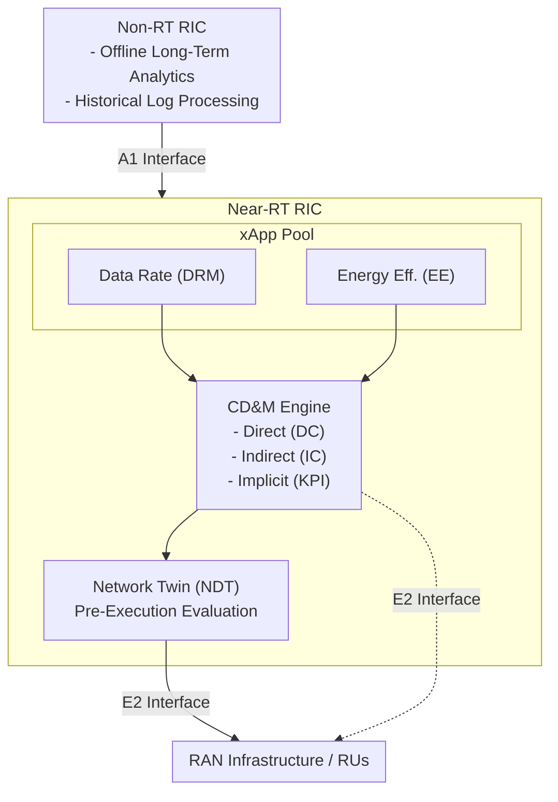

### **1. Problem**

- **xApp Objective Conflicts:** Concurrent operation of multiple independent xApps targeting the same underlying RAN nodes (RUs) with conflicting goals (e.g., maximizing data rate vs. minimizing energy consumption) leads to network instability, suboptimal performance, and increased interference.
- **Uncertainty & Safety Risks:** Direct execution of competing actions on live networks can degrade service quality or cause Service-Level Agreement (SLA) breaches.

---

### **2. Similar Work Mentioned in the Paper**

- Standard O-RAN Alliance Conflict Mitigation Framework (CMF) architectural guidelines.
- Prior methods focused on game theory, preemptive SMO architectures, or cooperative team-learning frameworks.

---

### **3. Gap Addressed**

- Existing literature lacked concrete use-case validations and quantitative performance comparisons under realistic network conditions.
- Absence of a proactively guided decision pipeline leveraging Network Digital Twins (NDT) to evaluate conflicting Deep Reinforcement Learning (DRL) actions before execution on live infrastructure.

---

### **4. Approach**

#### Architectural Overview

The COMIX framework operates across the O-RAN two-tier controller structure: the **Non-Real-Time (Non-RT) RIC** and the **Near-Real-Time (Near-RT) RIC**.

- **Non-RT RIC (Long-Term Analytics):** Processes historical logs over longer timescales (e.g., minutes to hours) to calculate and update feature importances and domain relationship matrices without disrupting live operational latency constraints.
- **Near-RT RIC (Live Execution):** Hosts the Conflict Detection & Mitigation (CD&M) module, running inline with active xApps. Because it executes lightweight arithmetic operations, decision-making cycles complete in **under 1 millisecond**.
- **Interfaces:** The **A1 interface** transfers enrichment information (EI) and policies from the Non-RT RIC to the Near-RT RIC. The **E2 interface** handles control parameter (CP) execution updates and key performance measurement (KPM) telemetry collection directly to/from RAN nodes (E2 nodes).

#### Decision Pipeline

The core mechanism operates as a three-phase pipeline: **Detection**, **Grouping/Association**, and **NDT-Guided Resolution**.

**Phase 1: Conflict Classification Pipeline**

When xApps issue control commands simultaneously, COMIX categorizes potential interactions into three conflict classes:

1. **Direct Conflict (DC):** Occurs when two or more xApps attempt to manipulate the exact same Control Parameter (CP) on a shared Radio Unit (RU) at the same time (e.g., two xApps concurrently demanding different downlink transmit powers $P_{\text{Tx}}$).
2. **Indirect Conflict (IC):** Occurs when xApps manipulate *different* CPs that ultimately influence the same downstream Key Performance Indicator (KPI). COMIX groups CPs into functional dependency clusters to identify these hidden couplings.
3. **Implicit Conflict:** Occurs when xApps adjust CPs that appear independent, but unexpected systemic interactions cause performance degradation across shared network resources. COMIX uses a **KPI Notifier** to continuously cross-reference real-time metrics against historical association matrices.

**Phase 2: NDT-Guided Pre-Execution Evaluation**

Instead of committing raw conflicting commands directly to the live network, actions are routed through a **Network Digital Twin (NDT)**. The NDT simulates expected network KPI outcomes prior to execution.

**Phase 3: Enforced Resolution Policies**

The decision module evaluates simulated candidate outcomes against five explicit resolution policies:

$$\begin{aligned} \text{MaxTS}  &\implies \text{Maximize aggregate throughput } (T) \\ \text{MinPS}  &\implies \text{Minimize total radiated power } (P) \\ \text{EES}    &\implies \text{Maximize Energy Efficiency } \left(\text{EE} = \frac{T}{P}\right) \\ \text{TVS}    &\implies \text{Filter actions violating Throughput SLAs, then optimize} \\ \text{EEVS}   &\implies \text{Filter actions violating Energy Efficiency SLAs, then optimize} \end{aligned}$$

---

### **5. Results**

#### Baseline Comparison (CMF-Free vs. COMIX)

In conventional setups lacking a Conflict Management Framework (CMF), parameter updates are applied strictly by **arrival time / overwriting**. Under this baseline, conflicting requests oscillate violently, causing high power consumption and frequent service-level degradation.

| Resolution Metric / Strategy | Baseline (No CMF) | MinPS | MaxTS | EES (Energy-Efficiency) |
| --- | --- | --- | --- | --- |
| **Average Power Consumption** | High (Uncontrolled) | **Lowest** (~70% reduction) | High | **Optimal** (~50–65% reduction) |
| **Aggregate Throughput Retention** | Oscillatory / Unstable | Moderate degradation | **Highest** | **Near-Peak** (>95% retained) |
| **SLA Violation Rate** | High | Low (Power SLA focus) | Low (Rate SLA focus) | **Minimal** |

#### Action Selection Frequency

Across balanced runtime testing, the CMF selected the **EE xApp's actions in a majority of time slots** when evaluating under balanced policies (EES, TVS, EEVS). Because the EE xApp inherently optimizes the ratio of data rate to power consumption ($\text{Mbit/s per Watt}$), its proposed parameter adjustments naturally yielded higher global utility scores within the NDT simulation than the aggressive power demands of the DRM xApp.

#### Real-World Imbalance Handling

When testing the classification module under realistic, heavily imbalanced dataset conditions (where normal network states outnumber conflict events 9:1):

- The conflict classifier maintained strong generalization, misclassifying **only 1 implicit conflict out of 114 test instances** as an indirect conflict.
- Root-cause reporting accurately pinpointed the precise xApp origin vectors ($a_1, a_2, \dots, a_n$) and parameter associations ($p_1, p_2, \dots, p_n$) driving each conflict event.

---

### **6. Conclusion**

- COMIX demonstrates that combining proactive conflict classification with NDT pre-execution scoring successfully resolves direct xApp conflicts in multi-channel power control scenarios.
- The framework enables mobile network operators to balance antagonistic operational objectives—such as user QoS and system energy efficiency—without risking live network disruption.

#### Trade-offs & Operational Considerations

While COMIX successfully prevents network degradation from conflicting xApps, two key operational factors must be managed:

- **NDT Evaluation Latency:** Evaluating every candidate parameter set inside the NDT adds latency to the Near-RT loop. To keep decision times below $1\text{ ms}$, the NDT must use lightweight, pre-trained context models rather than heavy simulations.
- **Sensitivity to Digital Twin Drift:** The resolution policy relies on the NDT's accuracy. If the digital twin drifts from live physical channel conditions, the system can select suboptimal control actions. Integrating real-time drift detection with fallback options (such as Last-Known-Good states) provides an additional safety buffer for live deployments.
