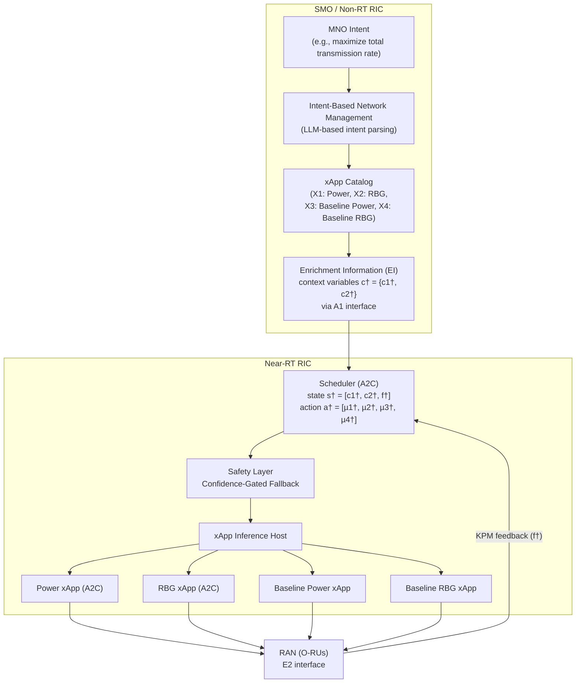

```text
Pointer:
- All information should remain grounded in the paper's/summary's content.
- Avoid introducing new information or making assumptions not present in the paper/summary.
- Convert ASCII diagrams to mermaid diagrams
- Make sure markdown tables are properly formatted and rendered.
```

### **1. Problem**

Open RAN (O-RAN) enables multi-vendor interoperability and data-driven control, but independently pre-trained xApps deployed in the Near-RT RIC may issue **conflicting control decisions**. Although the O-RAN architecture mandates offline training and validation before deployment, dynamic network conditions can still precipitate operational conflicts.

The paper identifies four critical open challenges in existing conflict management:

| Challenge | Description |
|---|---|
| **Reliance on accurate KPM estimation** | Prioritization-based approaches depend on accurate KPM prediction for every xApp/action combination, which is overly optimistic without a highly accurate digital twin |
| **Uncertainty in concurrent xApp deployments** | Predicting which xApps will be concurrently active is hard; xApps trained together offline may never operate together in real deployments |
| **Immutability of deployed xApps** | Once trained, tested, and verified, xApps cannot be modified after deployment — operators cannot retrain or adapt xApp policies to address emerging conflicts |
| **Context-dependent nature of conflicts** | Two xApps may conflict under certain conditions yet coexist under others; many solutions ignore these contextual nuances, resulting in overgeneralized or static strategies |

The paper focuses on an **indirect conflict** between a Power allocation xApp and a Resource Block Group (RBG) allocation xApp. Both independently tune different NCPs to optimize the same KPM (transmission rate), causing unintentional interference. The severity of this conflict is context-dependent: performance degradation reaches **16%** in the high scenario (8 Mbps, 45 m/s) versus only **5%** in the low scenario (2 Mbps, 5 m/s).

---

### **2. Similar Work Mentioned in the Paper**

The paper traces conflict management through three paradigms — SON, Intent-Driven Networking (IDN), and O-RAN:

#### SON Conflict Management (Predecessor)

| Approach | Description | Limitation |
|---|---|---|
| Policy-based strategies | Static rules: priorities, impact-time sequencing, parameter ranges, threshold truncation | Lack flexibility to adapt to evolving network conditions |
| Co-design | Unify multiple SONFs into a single entity via joint optimization or decision trees | Increased complexity |
| Objective-driven | Compute feasible parameter sets in real time | Exponential state-space growth |
| Closed-loop frameworks | Exploit mutual influences and priorities | NCP-KPM relationships hard to model precisely |
| Data-driven (SVM, MARL) | Proactive and cognitive coordination | — |

#### IDN Conflict Management

| Approach | Description |
|---|---|
| Game-theoretic (NSWF, Fisher market, bargaining) | Optimize parameter values via Nash social welfare, intent priorities, Jain-based fairness |
| Penalty-based frameworks | Minimize aggregated penalty across active intents |
| Gradient-based (MGDA) | Minimize multiple intent-specific loss functions via unified descent direction |
| MARL | Allocate resources based on intent-defined priorities |

#### O-RAN Conflict Management (Direct Competitors)

| Method | Mechanism | Key Limitation |
|---|---|---|
| CMF [87] | CD/CR modules; prioritization-based resolution | Simplistic resolution; cumbersome PG configuration; requires KPM estimation |
| COMIX [88] | NDT evaluates each proposed action via scoring function | Latency challenges; success hinges on NDT performance |
| PACIFISTA [89] | Statistical profiling; blocks/removes offending apps | Requires detailed statistical profiles for each app across scenarios |
| QACM [90] | Minimizes weighted QoS-threshold distances | Assumes reliable KPM prediction in dynamic RAN conditions |
| Team learning [92,93] | DQN/TMADRL joint training | Requires joint training; infeasible across vendors; overhead scales with xApps |
| xApp distillation [94] | Consolidates xApps into single DQN controller | Depends on teacher quality; offline data collection; limited flexibility |

---

### **3. Gap Addressed**

1. **No context-aware conflict mitigation**: Existing methods fail to consider that conflicts are context-dependent — the same xApp pair may conflict under some network conditions and coexist under others.
2. **No solution respecting xApp immutability**: O-RAN mandates that deployed xApps cannot be modified. Joint-training approaches (team learning, distillation) violate this constraint.
3. **No avoidance of KPM/digital-twin dependence**: Prioritization-based methods rely on accurate KPM estimation via digital twins, which is unrealistic in dynamic RAN environments.
4. **No scalable, intent-driven activation**: No framework dynamically selects which xApps to activate based on real-time context variables and operator intents without retraining the xApps themselves.

---

### **4. Approach**

The paper proposes a **context-aware conflict mitigation framework based on a scheduler** that activates xApps according to explicit contextual variables and user-defined KPM targets — without requiring joint training or retraining of xApps.



#### 4.1 System Model

- $B = \{1, \dots, B\}$ O-RUs serving user set $U = \{1, \dots, U\}$
- $R = \{1, \dots, R\}$ resource block groups (RBGs) per O-RU
- $\delta_{b,r,u}^{t,e} \in \{0,1\}$: binary RBG allocation indicator
- $p_{b,r,u}^{t,e} \in \mathcal{P}$: discrete power level from a finite set of $K$ quantization levels
- Traffic arrivals follow a Poisson distribution with mean rate $d_e$ per episode
- Users move at constant random speed $v_u^e \in [V_{min}, V_{max}]$ with direction-change probability $\rho$

The transmission rate $\Psi_{b,r,u}^{t,e}$ equals the capacity $C_{b,r,u}^{t,e}$ if queued data exceeds capacity (excess discarded); otherwise it equals the arrival rate.

#### 4.2 From REINFORCE to A2C

The REINFORCE policy gradient:

$$
\nabla_\theta J(\theta) = \mathbb{E}\left[ \nabla_\theta \log \pi_\theta(a_t|s_t) \cdot G_t \right]
$$

Subtracting a state-dependent baseline $b(s_t) = V^\pi(s_t)$ reduces variance, yielding the Actor-Critic framework. Using the one-step return $G_{t:t+1} = \tau_t + \gamma V_\phi(s_{t+1})$ gives the **advantage function**:

$$
A(s_t, a_t) = G_{t:t+1} - V_\phi(s_t)
$$

The A2C policy gradient maximizes expected advantage:

$$
\nabla_\theta J(\theta) = \mathbb{E}\left[ \nabla_\theta \log \pi_\theta(a_t|s_t) \cdot A(s_t, a_t) \right]
$$

while the critic minimizes the value loss:

$$
\mathcal{L}(\phi) = \mathbb{E}\left[ (G_{t:t+1} - V_\phi(s_t))^2 \right]
$$

#### 4.3 xApp Modeling with A2C

**Power xApp (X₁)**: Actor outputs a categorical distribution over $K$ power levels per RBG:

$$
\pi_\theta(a_t|s_t) = \prod_{r=1}^{R} \frac{\exp(z_{r,\iota}(s_{t,e}))}{\sum_{\iota'=1}^{K} \exp(z_{r,\iota'}(s_{t,e}))}
$$

**RBG xApp (X₂)**: Actor outputs a probability distribution over RBG assignment decisions $\delta_{b,r,u}^{t+1,e}$.

Both xApps are trained to maximize the normalized data transmission per episode:

$$
\tau_e = \frac{\sum_t \tau_{t,e}}{d_e \cdot R \cdot B}
$$

#### 4.4 Scheduler Design

The scheduler is also an A2C model with:
- **State**: $s^\dagger = [c_1^\dagger, c_2^\dagger, f^\dagger]$ — two context variables (average user speed, mean data arrival rate) plus the target KPM
- **Action**: $a^\dagger = [\mu_1^\dagger, \mu_2^\dagger, \dots, \mu_n^\dagger]$ — binary activation decisions for each xApp
- **Reward**: normalized transmission rate $\tau_e$, computed episodically over $\dagger = 10$ time steps

**Method 1: Retain previous action** — Scheduler chooses between individual or simultaneous deployment of the two A2C xApps. If only one xApp is activated, the system retains the last action of the deactivated xApp. This is an enhanced, A2C-driven form of prioritization.

**Method 2: Extend with baselines** — Scheduler selects one xApp for power allocation (A2C X₁ or baseline X₃) and one for resource allocation (A2C X₂ or baseline X₄), subject to constraints $\mu_1^\dagger + \mu_3^\dagger = 1$ and $\mu_2^\dagger + \mu_4^\dagger = 1$. This expands the scheduler's action space with baseline policies.

#### 4.5 Safety Layer: Confidence-Gated Fallback

To bound performance when context vectors fall outside the training distribution, the scheduler is encapsulated in a lightweight confidence gate:

- Maintain EWMA estimates of the critic's value estimate mean and dispersion with forgetting factor $\beta$
- Classify a state as out-of-distribution if the z-score falls below an MNO-defined threshold
- When triggered, override the learned action for $T_{back}$ decisions with a deterministic fallback policy (equal resource allocation or the single xApp with highest offline average reward)
- Statistics are frozen during the back-off window; the gate re-arms automatically

---

### **5. Results**

The simulation was built in Python with 4 O-RUs serving 16 users.

#### Simulation Parameters

| Parameter | Value |
|---|---|
| Number of O-RUs (B) | 4 |
| Inter-site distance | 900 m |
| Resource blocks | 100 RBs, each with 12 subcarriers |
| RBGs per O-RU (R) | 12 |
| Carrier configuration | 20 MHz bandwidth |
| Max / min transmission power | 38 dBm / 1 dBm |
| Propagation model | 120.9 + 37.6·log(ω) dB |
| Log-normal shadowing | 8 dB |
| Traffic arrival rates (d_e) | {3, 5, 7, 9} Mbps |
| Number of users (U) | 16 |
| User speed range | 1–50 m/s |
| Training episodes | 10⁵ |
| Time slots per episode (T) | 50 |
| Scheduling period (†) | 10 |
| Learning rate (η) | 10⁻⁴ |
| Discount factor (γ) | 0.95 |

#### xApp Training

Both xApps trained over 100,000 episodes (T=50 time steps each), with mean data arrival rate and average user speed randomly selected from {3,5,7,9} Mbps and {10,20,30,40} m/s. Training assumed equal allocation of all other resources as baseline.

#### Conflict Severity (Independent Deployment)

| Scenario | Data Rate | User Speed | Performance Degradation |
|---|---|---|---|
| Low | 2 Mbps | 5 m/s | 5% |
| Mid | 5 Mbps | 25 m/s | Intermediate |
| High | 8 Mbps | 45 m/s | **16%** |

Conflicts arise when: (a) the Power xApp assigns power to an RBG not allocated to any user by the RBG xApp, or (b) the RBG xApp assigns many RBGs to a user while the Power xApp provides low power for those RBGs.

#### Scheduler Performance (9 context combinations: c₁ ∈ {2,5,8} Mbps, c₂ ∈ {5,25,45} m/s)

| Configuration | Performance |
|---|---|
| Both xApps deployed independently (conflicting case) | Baseline (worst) |
| Method 1: Both A2C xApps + scheduler (retain previous action) | Improved vs conflicting case, but limited by constrained action set |
| **Method 2: 4 xApps (2 A2C + 2 baseline) + scheduler** | **Best overall performance** |

Key findings:
- Variations in mean user speed have **lesser impact** on performance than increases in mean data arrival rate
- Method 1 improves over the conflicting case but remains limited because each A2C xApp determines actions autonomously without scheduler influence
- Method 2's expanded action space enables flexible selection between pre-trained policies and baseline options based on network context
- Mean leftover (discarded) bits at episode end confirm Method 2 reduces conflicts most effectively

---

### **6. Conclusion**

The paper introduces an **intent-driven, scheduler-based conflict mitigation framework** that selects active xApps based on contextual variables and target KPMs, without requiring xApp re-training.

Key contributions:
1. **Context-aware activation**: The scheduler dynamically selects and orchestrates xApp activations aligned with prevailing network context and operator intents
2. **Respects xApp immutability**: Only the lightweight scheduler is re-trained online; pre-trained xApps remain untouched
3. **No digital-twin dependence**: Avoids KPM estimation for all xApp/action combinations
4. **Two scheduling strategies**: Retain-previous-action (A2C-driven prioritization) and extend-with-baselines (expanded action space)
5. **Safety layer**: Confidence-gated fallback bounds performance under out-of-distribution contexts

**Key findings:**
- A scheduler trained with contextual variables improves performance relative to independently deployed conflicting xApps
- Extending the action space with baseline xApps yields the highest overall performance
- Conflicts are inherently context-dependent — two xApps may conflict under specific conditions yet coexist under alternative scenarios

**Limitations and future work**: Only two context variables were used; adding more could further improve scheduler performance. The ideal scheduler should dynamically manipulate pre-trained xApps based on context-specific network state variables and be easily updated to accommodate various intents and xApp combinations. Future work includes advanced testbed platforms for practical deployment validation.