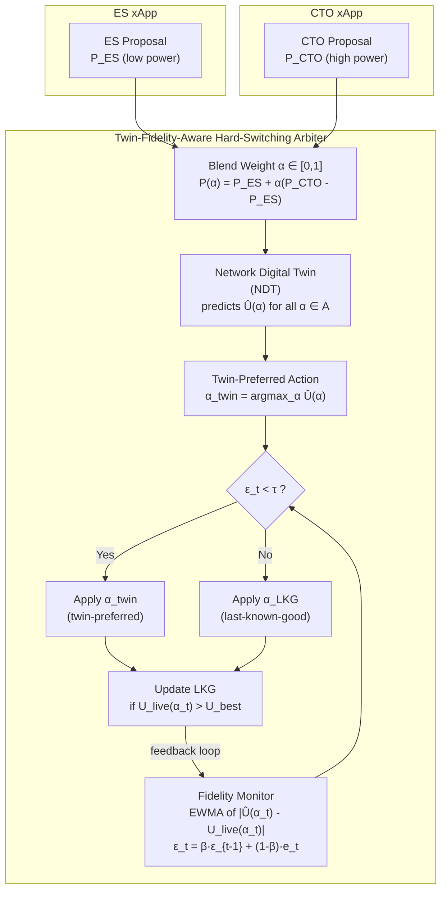

```text
Pointer:
- All information should remain grounded in the paper's/summary's content.
- Avoid introducing new information or making assumptions not present in the paper/summary.
- Convert ASCII diagrams to mermaid diagrams
- Make sure markdown tables are properly formatted and rendered.
```

### **1. Problem**

In Open RAN, independently developed xApps in the Near-RT-RIC may issue incompatible control actions for the same RAN parameter. This paper addresses a **direct conflict** where an energy-saving (ES) xApp and a coverage/throughput-oriented (CTO) xApp simultaneously control a cell's downlink transmit power — the ES xApp requests lower power to reduce energy consumption, while the CTO xApp requests higher power to improve coverage and throughput.

The paper identifies that existing conflict resolution methods that rely on a **Network Digital Twin (NDT)** to predict and rank candidate actions before live deployment suffer from a critical flaw: the NDT may **drift** from the live network due to modeling error, stale calibration, and changing interference/traffic conditions. Blindly following NDT predictions when the twin is inaccurate leads to substantial performance degradation. The problem therefore combines conflict resolution with **decision-making under model uncertainty**.

**Key assumptions of the proposed framework:**

| Assumption | Description |
|---|---|
| A1: Calibrated warm-up | During an initial warm-up period, the twin is assumed well-calibrated (d=0), enabling reliable LKG action initialization |
| A2: Slowly varying optimum | The utility-maximizing action evolves more slowly than the control timescale, so recent strong actions remain meaningful fallbacks |
| A3: Twin query budget | The NDT can evaluate all candidate actions within a single control interval |

---

### **2. Similar Work Mentioned in the Paper**

The paper organizes related work into four directions along the conflict-management lifecycle:

| Direction | Representative Work | Key Feature | Limitation Addressed |
|---|---|---|---|
| Conflict detection & characterization | PACIFISTA [8], GRAPHICA [9] | Sandbox profiling, graph convolutional learning | Not runtime arbitration methods |
| Conflict mitigation (rule-based/optimization) | CMF [2], QACM [10] | Priority-based resolution, QoS-aware optimization | No NDT fidelity monitoring |
| Learning-based coordination | Team learning [11], xApp distillation [12] | Joint training, xApp consolidation | Requires offline training or data sharing |
| Twin-assisted decision making | COMIX [5], DT frameworks [6,7,13–15] | NDT-assisted action evaluation | Assumes twin remains reliable throughout operation |

The paper positions itself at the intersection of the second and third directions, uniquely providing:
- Runtime NDT-in-the-loop decision making ✓
- Explicit NDT-fidelity monitoring ✓
- Live-validated fallback ✓
- No offline training or per-application profiling ✓

**Comparison with related methods (Table I from paper):**

| Work | Direct Runtime Arbitration | NDT in Decision Loop | Runtime Fidelity Monitoring | No Offline Training | Live-Validated Fallback |
|---|---|---|---|---|---|
| CMF [2] | Yes | No | No | Yes | No |
| QACM [10] | Yes | No | No | Partial | No |
| PACIFISTA [8] | Pre-deployment | No | No | No | No |
| GNN/Causal [9,17,18] | No | No | No | No | No |
| Team learning [11,12] | Partial | No | No | No | No |
| COMIX [5] | Yes | Yes | No | Yes | No |
| DT frameworks [6,7,13–15] | No | Yes | Partial | No | No |
| **This work** | **Yes** | **Yes** | **Yes** | **Yes** | **Yes** |

---

### **3. Gap Addressed**

1. **No NDT fidelity monitoring in conflict arbitration**: Existing twin-based methods (e.g., COMIX) assume the NDT remains accurate throughout operation. No prior method explicitly monitors whether twin predictions are consistent with live-network observations during conflict resolution.
2. **No training-free runtime fallback**: Prior approaches either require offline training (e.g., team learning, distillation) or perform rollback to a previously verified safe configuration without online learning of the best action from live feedback.
3. **No explicit treatment of twin drift as a runtime property**: Digital twin literature discusses model alignment but does not gate conflict-arbitration decisions on an explicit twin-fidelity signal with a live-validated fallback action.

---

### **4. Approach**

The proposed method is a **twin-fidelity-aware hard-switching arbiter** that continuously monitors NDT prediction error and switches to a live-validated fallback when the twin becomes unreliable.



#### 4.1 Action Parameterization

The arbiter selects a **continuous blend weight** α ∈ [0, 1] that interpolates between the two proposals on the logarithmic power scale:

$$
P(\alpha) = P_{ES} + \alpha \cdot (P_{CTO} - P_{ES})
$$

where α = 0 reproduces the ES request and α = 1 reproduces the CTO request. The continuous space is discretized into a 21-point action grid:

$$
A = \{0, 0.05, 0.10, \dots, 1.0\}
$$

#### 4.2 Energy-Aware Utility Function

Each candidate action is evaluated using a utility that jointly considers throughput and power consumption:

$$
U(\alpha) = T(\alpha) - w_E \cdot P^W(\alpha)
$$

where:
- $T(\alpha)$: aggregate system throughput (Mbit/s)
- $w_E \geq 0$: operator-defined energy-weight parameter
- $P^W(\alpha)$: transmit power converted to watts: $P^W(\alpha) = 10^{(P(\alpha)-30)/10}$

Larger $w_E$ places greater emphasis on energy efficiency; $w_E = 0$ reduces to throughput maximization.

#### 4.3 Regret Metrics

$$
\alpha^* = \arg\max_{\alpha \in A} U(\alpha)
$$

$$
r(\alpha) = U(\alpha^*) - U(\alpha) \geq 0
$$

Normalized regret for cross-$w_E$ comparison:

$$
\bar{r}(\alpha) = \frac{r(\alpha)}{\Delta_U}, \quad \Delta_U = U(\alpha=0) - U(\alpha=1)
$$

#### 4.4 Runtime Fidelity Estimation

The instantaneous prediction error at step $t$:

$$
e_t = |\hat{U}(\alpha_t) - U_{\text{live}}(\alpha_t)|
$$

EWMA smoothing:

$$
\varepsilon_t = \beta \cdot \varepsilon_{t-1} + (1 - \beta) \cdot e_t, \quad \varepsilon_0 = 0
$$

with smoothing factor β ∈ (0, 1). The detection delay for a sustained mismatch $m$:

$$
t_{\text{detect}} = \frac{\log(1 - \tau/m)}{\log \beta}
$$

#### 4.5 Hard-Switching Decision Rule

$$
\alpha_t = \alpha_{\text{twin}} \cdot \mathbf{1}[\varepsilon_t < \tau \lor \alpha_{\text{LKG}} = \emptyset] + \alpha_{\text{LKG}} \cdot \mathbf{1}[\varepsilon_t \geq \tau \land \alpha_{\text{LKG}} \neq \emptyset]
$$

The **last-known-good (LKG) action** is continuously updated from live feedback:

$$
U_{\text{best},t} = \max_{\tau \leq t} U_{\text{live}}(\alpha_\tau)
$$

$$
\alpha_{\text{LKG},t} = \arg\max_{\tau \leq t} U_{\text{live}}(\alpha_\tau)
$$

#### 4.6 Theoretical Properties

| Property | Description |
|---|---|
| **Detection delay** | $t_{\text{detect}} = \log(1 - \tau/m) / \log \beta$; decreases with larger mismatch, increases with β → 1 |
| **Reversibility** | If twin realigns, ε decays below threshold and control automatically returns to twin-selected action |
| **On-policy fidelity** | Prediction errors evaluated only on executed actions; no exploratory probing required |
| **Complexity** | O(|A|) per step (21 twin queries); O(1) storage (three scalars: ε, α_LKG, U_best) |

---

### **5. Results**

The method was evaluated using a MATLAB 5G Toolbox system-level simulator with a 7-cell hexagonal deployment (42 UEs, round-robin scheduler, 2.5 GHz, 10 MHz BW).

#### Key Simulation Parameters

| Parameter | Value |
|---|---|
| Cell layout | 7-cell hexagonal (1 cell of interest + 6 neighbors) |
| Inter-site distance / cell radius | 120 m / 60 m |
| Carrier / BW / subcarrier spacing | 2.5 GHz / 10 MHz / 30 kHz |
| Users per cell | 6 (uniform angle, 0.75–0.95 of cell radius) |
| CoI transmit-power range [P_ES, P_CTO] | [10, 46] dBm |
| Action grid A | {0, 0.05, …, 1} (21 actions) |
| Control steps per run | 40 (10 warm-up + 30 main) |
| Twin drift levels d | {0, 2, 4, 6, 8, 10} dB |
| EWMA factor β | 0.70 |
| Fidelity threshold τ | 1 |
| Energy weights w_E | {0.05, 0.1, 0.2, 0.5, 1, 2, 5} |
| Independent random seeds | 20 |

#### Normalized Utility Regret Across Operator Priorities (Table III)

| Method | Normalized Regret |
|---|---|
| **Proposed hard-switch (τ=1)** | **0.017 ± 0.006** |
| Soft-ES | 0.036 ± 0.013 |
| ES-only | 0.046 ± 0.015 |
| QACM-style | 0.046 ± 0.015 |
| Naive blend | 0.053 ± 0.018 |
| Soft-LKG | 0.059 ± 0.017 |
| COMIX-style | 0.159 ± 0.052 |
| CTO-only | 0.665 ± 0.037 |

#### QoS-Satisfaction Ratio (Table IV)

| Method | QoS Satisfaction |
|---|---|
| ES-only | 1.000 ± 0.000 |
| QACM-style | 1.000 ± 0.000 |
| Soft-ES | 0.742 ± 0.060 |
| **Proposed hard-switch** | **0.740 ± 0.061** |
| Soft-LKG | 0.739 ± 0.061 |
| COMIX-style | 0.724 ± 0.066 |
| Naive blend | 0.500 ± 0.000 |
| CTO-only | 0.500 ± 0.000 |

#### Robustness Under NDT Drift (w_E = 0.1)

| Drift (dB) | Proposed Regret | COMIX-style Regret |
|---|---|---|
| 0 | ~0 | ~0 |
| 2 | <0.65 | Growing |
| 6 | <0.65 | Substantial |
| 10 | **0.55 ± 0.25** | **11.19 ± 3.58** |

The proposed method reduces regret by **more than one order of magnitude** (20×) relative to blind twin-based selection at 10 dB drift.

#### EWMA-Factor Sensitivity (Table V)

| w_E | β=0.5 | β=0.7 | β=0.9 |
|---|---|---|---|
| 0.1 | 0.482 ± 0.194 | **0.466 ± 0.192** | 0.548 ± 0.221 |
| 0.2 | 0.496 ± 0.160 | **0.448 ± 0.137** | 0.475 ± 0.131 |
| 1.0 | 0.544 ± 0.177 | **0.543 ± 0.176** | 0.579 ± 0.188 |

Sensitivity to β is negligible compared with robustness gains; β = 0.7 is not highly tuned.

---

### **6. Conclusion**

The proposed **twin-fidelity-aware hard-switching arbiter** is the first method to explicitly monitor NDT fidelity as a runtime signal during direct xApp conflict resolution in O-RAN. Key contributions:

1. **Formulates direct ES/CTO conflict** as continuous blend-weight optimization with an energy-aware utility
2. **Training-free, model-agnostic** — requires no offline training, no modification of underlying xApps, and no oracle knowledge of the true optimum
3. **Explicit fidelity monitoring** via EWMA of prediction error — detects twin drift and switches to a live-validated last-known-good action
4. **Lightweight**: O(|A|) per step (21 queries), O(1) storage
5. **Reversible and on-policy**: automatically recovers when twin realigns; no exploratory probing needed

**Key findings:**
- The utility-maximizing conflict-resolution decision depends strongly on operator energy preference, confirming the need for adaptive arbitration
- Blind twin-based arbitration (COMIX) performs well at d=0 but deteriorates rapidly under drift
- Explicit fidelity monitoring reduces regret from 11.19 to 0.55 at 10 dB drift (>20× improvement)
- In boundary-optimum regimes where drift doesn't affect the optimal operating point, the proposed method matches the strongest baselines without penalty

**Limitations and future work:** Assumes an approximately stationary live optimum (A2); highly nonstationary conditions may require additional aging or exploration mechanisms. The framework is demonstrated on direct transmit-power conflicts but the fidelity-monitoring principle is generalizable to other conflict types and NDT-assisted decision scenarios.
