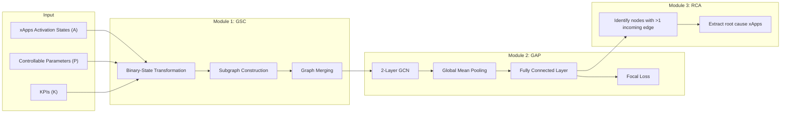
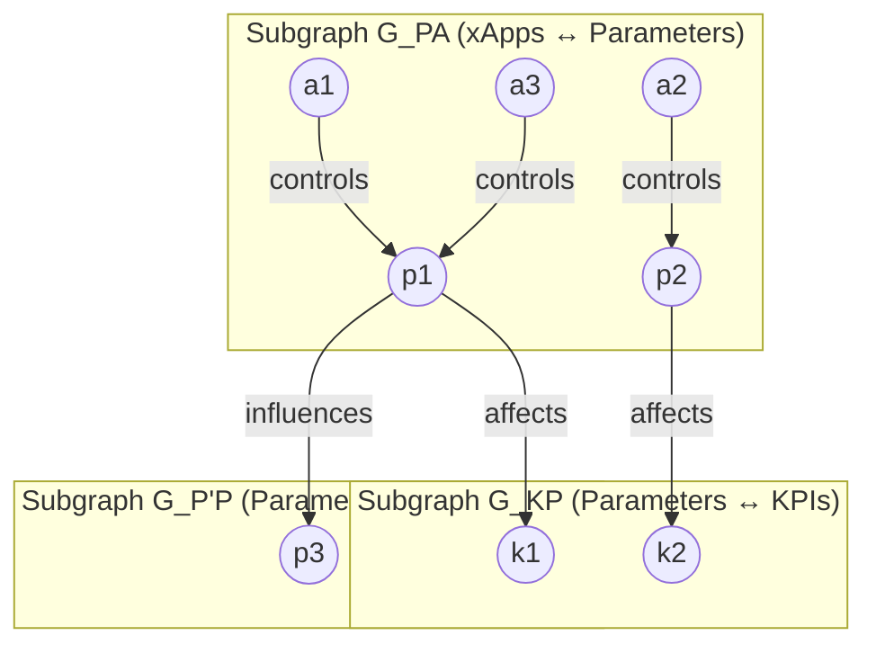

```text
Pointer:
- All information should remain grounded in the paper's/summary's content.
- Avoid introducing new information or making assumptions not present in the paper/summary.
- Convert ASCII diagrams to mermaid diagrams
- Make sure markdown tables are properly formatted and rendered.
```

### **1. Problem**

In O-RAN architectures, multiple independently managed **xApps** (eXtended Applications) run on the Near-RT RIC, each with distinct optimization objectives (e.g., load balancing, interference management, handover optimization). Because these xApps share network resources and control parameters, their autonomous operation creates three types of conflicts:

| Conflict Type | Description | Example |
|---|---|---|
| **Direct** | Multiple xApps simultaneously modify the same network parameter with incompatible settings | One xApp increases transmission power for coverage while another reduces it to minimize interference |
| **Indirect** | Multiple xApps modify different parameters whose effects cascade through interdependencies | One xApp redistributes traffic while another adjusts handover parameters, leading to congestion |
| **Implicit** | Multiple xApps target different optimization objectives that indirectly interfere via intrinsic parameter-KPI relationships | One xApp reduces power for energy efficiency while another increases it for coverage |

Existing conflict management approaches suffer from three critical limitations:
1. **Distribution dependency**: Methods rely on Gaussian distribution assumptions for KPI values, which is unrealistic in practice.
2. **Scalability issues**: Game-theoretic and deep Q-learning approaches struggle with state-space explosion as the number of xApps grows.
3. **Neglect of data imbalance**: Real-world conflict instances are rare, but existing methods do not address class imbalance, limiting practical applicability.

---

### **2. Similar Work Mentioned in the Paper**

The paper categorizes related work into **non-graph-based** and **graph-based** approaches:

| Method | Category | Key Limitation |
|---|---|---|
| **Team Deep Q-Learning** [12] | Non-graph | Scalability challenges; state-space explosion with more xApps |
| **Bargaining Game Theory** [13] | Non-graph | Difficulty making optimal decisions with incomplete information |
| **QoS-Aware Conflict Mitigation (QACM)** [14] | Non-graph | Limited to Python simulations with simplified network models |
| **xApp Distillation** [27] | Non-graph | Requires repeated distillation as network conditions change |
| **PACIFISTA** [26] | Graph (hierarchical) | Requires detailed statistical profiles for each application across diverse operational scenarios |
| **GraphSAGE** [15] | Graph | Assumes Gaussian-distributed KPIs; does not handle data imbalance |

GRAPHICA differs from all of these by being **distribution-independent**, **scalable**, and specifically designed for **highly imbalanced datasets** (as low as 10% conflict instances).

---

### **3. Gap Addressed**

GRAPHICA addresses three interconnected gaps in the literature:

1. **No distribution-independent method** that generalizes across diverse KPI contexts without assuming Gaussian or any specific statistical distribution.
2. **No method designed for highly imbalanced datasets** where conflict instances constitute as little as 10% of data — reflecting realistic operational environments where conflicts are rare events.
3. **No integrated framework** that simultaneously predicts all three conflict types (direct, indirect, implicit) **and** performs root cause analysis (RCA) to identify the specific xApps responsible.

---

### **4. Approach**

GRAPHICA (**GRAPH**-based Intelligent xApp Conflict Prediction and **A**nalysis) is a three-module, event-driven framework:



#### 4.1 Initial Data Processing & Binary-State Transformation

Raw multivariate time-series data is encoded into a **binary-state dataset**. For each data point *i*, a binary vector captures whether each xApp, parameter, or KPI **changed state** relative to the previous timestamp:

$$
s_A^{(i)} = \left[ s_{a_1}^{(i)}, s_{a_2}^{(i)}, \dots, s_{a_n}^{(i)} \right], \quad s_{a_j}^{(i)} \in \{0, 1\}
$$

$$
s_P^{(i)} = \left[ s_{p_1}^{(i)}, s_{p_2}^{(i)}, \dots, s_{p_m}^{(i)} \right], \quad s_{p_j}^{(i)} \in \{0, 1\}
$$

$$
s_K^{(i)} = \left[ s_{k_1}^{(i)}, s_{k_2}^{(i)}, \dots, s_{k_l}^{(i)} \right], \quad s_{k_j}^{(i)} \in \{0, 1\}
$$

The full binary-state vector for data point *i* is:

$$
S^{(i)} = \left( s_A^{(i)},\; s_P^{(i)},\; s_K^{(i)} \right)
$$

This transformation is **distribution-independent** — it encodes behavioral change rather than raw values.

#### 4.2 Binary-State Dataset Creation (Synthetic)

Since no public O-RAN conflict datasets exist, the authors synthesize data using an **event-driven** approach:

1. Create three dictionaries encoding relationships:
   - **D_AP**: Maps xApps → parameters they control
   - **D_KP**: Maps parameters → KPIs they affect
   - **D_P'P**: Maps parameters → other parameters they influence

2. For each event *i*, binary states are set to 1 if the corresponding element appears as a key or value in any dictionary.

3. Label assignment: `y ∈ {0, 1, 2, 3}` (normal, direct, implicit, indirect).

The synthetic setup uses **10 xApps, 15 controllable parameters, and 20 KPIs** with up to 3 influencing nodes per target.

#### 4.3 Graph Structure Creator (GSC)

The GSC constructs graph-structured data from the binary-state dataset by building **three subgraphs** based on simultaneous state changes:



- **G_PA**: Edges between xApps and parameters that change simultaneously
- **G_KP**: Edges between parameters and KPIs that change simultaneously
- **G_P'P**: Edges between parameters that change simultaneously

All three subgraphs are **merged** into a single unified graph. Category-specific edge attributes are assigned so the GCN can distinguish relationship origins during convolution:

$$
f_e(G) = \begin{cases} 1, & \text{if } G = G_{PA} \\ 2, & \text{if } G = G_{KP} \\ 3, & \text{if } G = G_{P'P} \end{cases}
$$

#### 4.4 Graph Anomaly Predictor (GAP)

The GAP module uses a **2-layer GCN** followed by global mean pooling and a fully connected classifier.

**GCN Layer Operation:**

$$
H^{(l)} = \sigma\left( \hat{D}^{-1/2} \hat{A} \hat{D}^{-1/2} H^{(l-1)} W^{(l)} \right)
$$

where:
- $\hat{A} = A + I$ (adjacency with self-loops)
- $\hat{D}$ is the degree matrix
- $W^{(l)}$ is the learnable weight matrix
- $\sigma$ is the ReLU activation

**Graph-Level Representation (Mean Pooling):**

$$
h_G = \frac{1}{|V|} \sum_{v \in V} H^{(L)}_v
$$

**Classification:**

$$
z = W_{fc} \cdot h_G + b
$$

**Focal Loss Function** (to handle class imbalance):

$$
\mathcal{L}_{FL} = -\alpha_c \left(1 - p_t^c\right)^\gamma \log\left(p_t^c\right)
$$

where:
- $\alpha_c$: class balancing weight (inverse frequency)
- $p_t^c$: predicted probability for true class $c$
- $\gamma$: focusing parameter (tuned per dataset)

**L2 Regularization:**

$$
\mathcal{L}_{total} = \mathcal{L}_{FL} + \lambda \sum_i \|w_i\|_2^2
$$

**Training details:**
- Adam optimizer, learning rate 0.01, weight decay 1e-4
- Batch size 128, 2000 epochs, 5-fold stratified cross-validation
- Early stopping with patience mechanism

#### 4.5 Root Cause Analyst (RCA)

After GAP predicts a conflict, RCA identifies the responsible xApps by:

1. Extracting the subgraph corresponding to the prediction
2. Finding nodes with **more than one incoming edge** (the affected node)
3. Tracing back the connected source nodes as root causes

Example from Table III:

| Predicted | Conflict Type | Affected Node | Root Cause Nodes | Root Cause xApps |
|---|---|---|---|---|
| 1 | Direct | p12 | a1, a3 | a1, a3 |
| 3 | Indirect | p8 | p1, p3 | a1, a3 |
| 2 | Implicit | k10 | p1, p9 | a1, a9 |

---

### **5. Results**

#### 5.1 Experimental Setup

Five datasets were tested: one balanced (671 samples/class, 2684 total) and four imbalanced with conflict proportions of 40%, 30%, 20%, and 10%.

| Dataset | Total | Normal | Direct | Implicit | Indirect |
|---|---|---|---|---|---|
| Balanced | 2,684 | 671 | 671 | 671 | 671 |
| 40% Conflict | 1,145 | 689 | 145 | 158 | 153 |
| 30% Conflict | 977 | 683 | 92 | 102 | 100 |
| 20% Conflict | 848 | 678 | 53 | 59 | 58 |
| 10% Conflict | 752 | 673 | 25 | 27 | 27 |

#### 5.2 Performance on Binary-State KPIs Datasets

| Conflict % | Metric | γ=0.0 | γ=0.5 | γ=1.0 | γ=1.5 | γ=2.0 | γ=2.5 | γ=3.0 | γ=3.5 | γ=4.0 |
|---|---|---|---|---|---|---|---|---|---|---|
| 40 | F1 | 0.9802 | 0.9859 | 0.9889 | **0.9930** | 0.9914 | 0.9918 | 0.9912 | 0.9871 | 0.9867 |
| 30 | F1 | 0.9795 | 0.9864 | 0.9876 | 0.9919 | **0.9946** | 0.9898 | 0.9875 | 0.9888 | 0.9869 |
| 20 | F1 | 0.9568 | 0.9586 | 0.9797 | 0.9824 | **0.9908** | 0.9818 | 0.9820 | 0.9814 | 0.9807 |
| 10 | F1 | 0.9757 | 0.9792 | 0.9798 | 0.9945 | **0.9954** | 0.9854 | 0.9878 | 0.9735 | 0.9630 |

Key findings:
- Best F1-scores: 0.9930 (40%), 0.9946 (30%), 0.9908 (20%), 0.9954 (10%)
- Optimal γ: 1.5 for 40% conflict; 2.0 for 30%, 20%, and 10% conflict
- Performance degrades for γ > 2.0 due to overfitting on hard examples
- Balanced dataset (γ=0): Precision=0.9829, Recall=0.9818, F1=0.9817

#### 5.3 Performance on Gaussian Distribution KPIs Datasets

Benchmarked against the GraphSAGE dataset [15] (γ=2.0):

| Conflict % | Precision | Recall | F1-Score |
|---|---|---|---|
| 40% | 0.9826 | 0.9827 | 0.9812 |
| 30% | 0.9954 | 0.9977 | 0.9965 |
| 20% | 0.9958 | 0.9957 | 0.9951 |
| 10% | 0.9785 | 0.9880 | 0.9828 |

#### 5.4 Comparison with Other Methods

| Method | Distribution Independent | Scalable | Handles Imbalanced Data |
|---|---|---|---|
| Team Learning [12] | ✗ | ✗ | ✗ |
| Game Theory [13] | ✗ | ✗ | ✗ |
| QoS-Aware [14] | ✗ | ✓ | ✗ |
| xApp Distillation [27] | ✓ | ✗ | ✗ |
| PACIFISTA [26] | ✓ | ✗ | ✗ |
| GraphSAGE [15] | ✗ | ✗ | ✗ |
| **GRAPHICA** | **✓** | **✓** | **✓** |

#### 5.5 Confusion Matrix (10% Conflict)

On the 10% conflict test set (114 samples), only **1 implicit conflict** was misclassified as indirect — demonstrating strong generalization under severe imbalance.

---

### **6. Conclusion**

GRAPHICA is a novel GCN-based, event-driven framework for O-RAN xApp conflict prediction and root cause analysis. Key takeaways:

- **Binary-state encoding** eliminates reliance on distributional assumptions, enabling generalization across diverse KPI contexts
- **Focal loss function** enables effective learning on highly imbalanced datasets (as low as 10% conflict rate)
- **F1-scores exceeding 98%** across all tested imbalance levels (balanced through 10% conflict)
- **RCA module** identifies the specific xApps contributing to predicted conflicts, providing actionable insights for mitigation
- The framework is **distribution-independent**, **scalable**, and handles **direct, indirect, and implicit** conflicts simultaneously

**Limitations and future work**: The evaluation relies on synthetic datasets; real-world O-RAN benchmarks are needed. Future work will extend GRAPHICA to include proactive mitigation strategies and multi-conflict prediction in vendor-agnostic environments.
