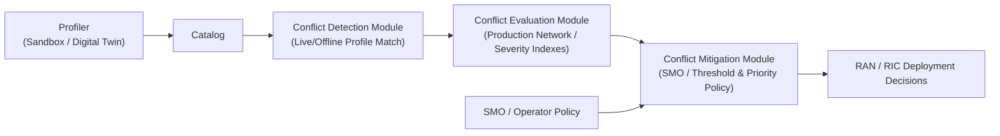

### **1. Problem**

Guaranteeing that multi-vendor, AI-based O-RAN applications (xApps, rApps, dApps) make control decisions without generating conflicting policies that degrade performance, particularly given that conflicts vary, manifest at different timescales, and impact diverse network components and Key Performance Measurements (KPMs) [cite: 1].

---

### **2. Similar Work Mentioned in the Paper**

* **Team learning** (power/radio resource allocation; 8% higher throughput, 64.8% lower packet drop rate; distribution/scalability/imbalance limitations) [cite: 1]
* **Game theory** (general; conflict mitigation between xApps; distribution/scalability/imbalance limitations) [cite: 1]
* **QoS-Aware Conflict Mitigation** (general; effective in maintaining QoS requirements for conflicting xApps; scalable, but distribution/imbalance limitations) [cite: 1]
* **xApp Distillation** (general; consistent 10 Mbps downlink data rate; scalability/imbalance limitations) [cite: 1]
* **GraphSAGE** (general; 88% reconstruction accuracy, 100% detection of conflicts; distribution/scalability/imbalance limitations) [cite: 1]
* **GRAPHICA** (general; F1-score: 40% conflicts: 0.9930, 30% conflicts: 0.9946, 20% conflicts: 0.9908, 10% conflicts: 0.9954; distribution-independent, scalable, imbalanced-dataset capable) [cite: 1]
* **Other indirect-conflict study [32]** (addresses indirect conflicts only, ignores direct/implicit) [cite: 1]
* **DRL-based xApp conflict detection using Network Digital Twin (NDT) [33]** (requires NDT to evaluate proposed actions and evaluate every xApp-generated value of network control parameters) [cite: 1]

---

### **3. Gap Addressed**

Lack of an empirical and formal framework to characterize, detect, and evaluate direct, indirect, and implicit conflicts across multi-vendor AI-based O-RAN applications while handling diverse timescales, components, and KPM impacts without impractical reliance on full raw data storage or exhaustive real-time digital-twin evaluations for every action [cite: 1].

---

### **4. Approach**

* **Modular Architecture**: Four major logical blocks (Profiler, Conflict Detection Module, Conflict Evaluation Module, Conflict Mitigation Module) plus an application catalog [cite: 1].

* **Application Profiling**: Runs in sandbox testing environments (digital twins, emulation), recording operational conditions (channel conditions, traffic demand, mobility, node location) and extracting Empirical Cumulative Density Functions (ECDFs) for control parameters and KPMs [cite: 1].
* **Graph-Based Classification**: Combines hierarchical graphs with statistical behavior to classify conflicts into direct, parameter conflicts (e.g., rApp powers off base station while xApp adjusts transmission power), and KPM conflicts [cite: 1].
* **Statistical Evaluation Pipeline**: Uses Kolmogorov-Smirnov (K-S), Integral Area (INT), and Chi-Square distance metrics on ECDFs (unitless in $$) rather than raw data logs during evaluation.
* **Threshold-Based Mitigation**: SMO applies conflict tolerance $\delta_{\text{TOL}} \in$ and per-application priority indexes $I_a$ to block high-conflict deployments or remove subset applications [cite: 1].

---

### **5. Results**

* **Use Case Evaluated**: Throughput maximization and energy saving [cite: 1].
* **Performance / Effectiveness**: Demonstrated effectiveness in characterizing conflicts and providing actionable insights for informed xApps deployment decisions (throughput maximization and energy saving profile) [cite: 1].

---

### **6. Conclusion**

PACIFISTA provides a formal, data-driven, and tunable conflict-mitigation framework leveraging statistical profiling and hierarchical graphs to manage O-RAN application coexistence, preventing performance degradation in multi-vendor RAN deployments [cite: 1].
