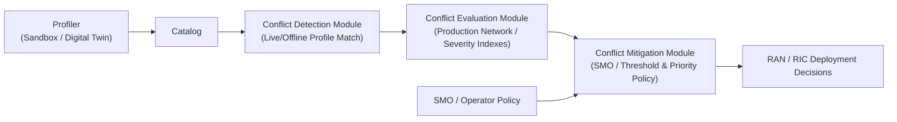
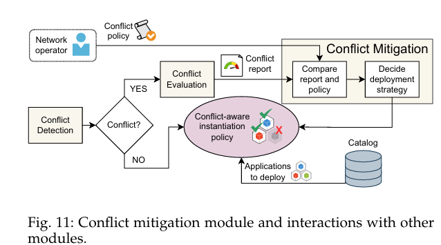
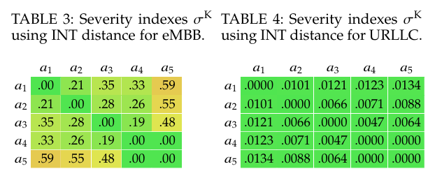

# **1. Problem**

Guaranteeing that multi-vendor, AI-based O-RAN applications (xApps, rApps, dApps) make control decisions without generating conflicting policies that degrade performance, particularly given that conflicts vary, manifest at different timescales, and impact diverse network components and Key Performance Measurements (KPMs) .

---

# **2. Similar Work Mentioned in the Paper**

* **Team learning** (power/radio resource allocation; 8% higher throughput, 64.8% lower packet drop rate; distribution/scalability/imbalance limitations) 
* **Game theory** (general; conflict mitigation between xApps; distribution/scalability/imbalance limitations) 
* **QoS-Aware Conflict Mitigation** (general; effective in maintaining QoS requirements for conflicting xApps; scalable, but distribution/imbalance limitations) 
* **xApp Distillation** (general; consistent 10 Mbps downlink data rate; scalability/imbalance limitations) 
* **GraphSAGE** (general; 88% reconstruction accuracy, 100% detection of conflicts; distribution/scalability/imbalance limitations) 
* **GRAPHICA** (general; F1-score: 40% conflicts: 0.9930, 30% conflicts: 0.9946, 20% conflicts: 0.9908, 10% conflicts: 0.9954; distribution-independent, scalable, imbalanced-dataset capable) 
* **Other indirect-conflict study [32]** (addresses indirect conflicts only, ignores direct/implicit) 
* **DRL-based xApp conflict detection using Network Digital Twin (NDT) [33]** (requires NDT to evaluate proposed actions and evaluate every xApp-generated value of network control parameters) 

---

# **3. Gap Addressed**

Lack of an empirical and formal framework to characterize, detect, and evaluate direct, indirect, and implicit conflicts across multi-vendor AI-based O-RAN applications while handling diverse timescales, components, and KPM impacts without impractical reliance on full raw data storage or exhaustive real-time digital-twin evaluations for every action .

---

# **4. Approach**

## **Modular Architecture**: 
Four major logical blocks (Profiler, Conflict Detection Module, Conflict Evaluation Module, Conflict Mitigation Module) plus an application catalog .

## **Application Profiling**

* **Operational Condition Scope**: Profiles are generated offline by executing sandbox testing (digital twins, emulation) per operational condition $c \in C$, recording wireless environment characteristics, traffic demand, mobility, and node location .
* **Multi-App Virtual Aggregation**: When concurrent tests involve multiple applications ($a_1, a_2$), they are treated as a "virtual" application $a$ controlling $\mathcal{P}_a = \mathcal{P}_{a_1} \cup \mathcal{P}_{a_2}$ .
* **Statistical Extraction**: Raw data from interfaces (O1 for rApps, E2 for xApps, direct for dApps) is processed into Empirical Cumulative Density Functions (ECDFs) for parameters $\mathcal{P}$ and KPMs $\mathcal{K}$, which form the application profile stored in the catalog .

---

## **Graph Structure Creation (GSC Module)**

* **Algorithm Inputs & Outputs**:
* Input sets: $\text{Apps } A = \{a_1, \dots, a_n\}$, Parameters $\mathcal{P} = \{p_1, \dots, p_m\}$, KPMs $\mathcal{K} = \{k_1, \dots, k_l\}$, number of events $N$ [cite: 3].
* Output dictionaries: $\mathcal{D}_{AP}^{(i)}, \mathcal{D}_{KP}^{(i)}, \mathcal{D}_{P'P}^{(i)}$, Dataset $\{B_t^{(i)}\}$ [cite: 3].

* **Binary-State Transformation**: Ingests high-dimensional multivariate time-series data, checking value variation from previous timestamp to update binary states ($0$ or $1$) [cite: 3].
* **Subgraph Construction & Categorization**: Event-driven construction linking nodes whose states change simultaneously across three groups [cite: 3]:
* **Group $G^{AP}$**: Links xApp states and parameter states ($s_{aj} \text{ and } s_{pj} == 1$) to model joint application-level behavior [cite: 3].
* **Group $G^{P'P}$**: Links simultaneous controllable parameter state changes to isolate parameter dynamics [cite: 3].
* **Group $G^{KP}$**: Links parameter states and KPM states ($s_{pj} \text{ and } s_{kj} == 1$) to reveal performance impact [cite: 3].

* **Graph Integration**: Individual subgraphs are combined into a unified graph-structured data representation per test data point [cite: 3]. (*Note: Explicit mathematical formulas for edge weighting/message passing are not defined in the source text.*)

---

## **Conflict Evaluation**

### **Pairwise Selection & Extraction**:
* Select two applications $a', a''$, retrieve profiles, and choose operational condition $c \in C$ .
* For each parameter pair $p \in \mathcal{P}_{a'} \times \mathcal{P}_{a''}$, extract distance metrics $\mathbf{D}_{a', a''}^f(\mathcal{P}, c)$ and $\mathbf{D}_{a', a''}^f(\mathcal{K}, c)$ .

### **Distance Functions (Table 1)**: All metric values map to $$ :
* **K-S (Kolmogorov-Smirnov)**: $\max \vert{}F_1(x) - F_2(x)\vert{}$ (maximum vertical distance between two ECDFs) .
* **INT (Integral Area)**: $\sqrt{\frac{1}{L} \int \vert{}F_1(x) - F_2(x)\vert{}}$ (integral of absolute distance between two ECDFs, with $L = \max(x) - \min(x)$) .
* **$\chi^2$ (Chi-Square)**: $1 - \text{p-value}$ (likelihood that data from two categorical distributions differ) .

### **Severity Index Aggregation**:
* For an application set $A^*$ of cardinality $A^*$, total conflict pairs = $A^*(A^* - 1)/2$ .
* Computes severity indexes $\sigma_{a', a''}^P(\mathcal{P}^* \vert{} c)$ and $\sigma_{a', a''}^K(\mathcal{K}^* \vert{} c)$ by aggregating distances $D_{a', a''}^f(z \vert{} c)$ for variables $z \in \mathcal{P}^*$ or $z \in \mathcal{K}^*$ under condition $c$ using combining function $H(\cdot)$ .

---

# **5. Results**

* **Use Case Evaluated**: Throughput maximization and energy saving .
* **Performance / Effectiveness**: Demonstrated effectiveness in characterizing conflicts and providing actionable insights for informed xApps deployment decisions (throughput maximization and energy saving profile) .

---

# **6. Conclusion**

PACIFISTA provides a formal, data-driven, and tunable conflict-mitigation framework leveraging statistical profiling and hierarchical graphs to manage O-RAN application coexistence, preventing performance degradation in multi-vendor RAN deployments .
