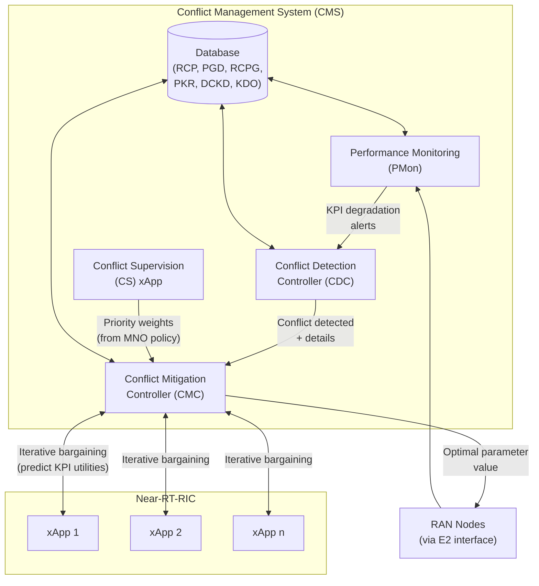

```text
Pointer:
- All information should remain grounded in the paper's/summary's content.
- Avoid introducing new information or making assumptions not present in the paper/summary.
- Convert ASCII diagrams to mermaid diagrams
- Make sure markdown tables are properly formatted and rendered.
```

### **1. Problem**

In Open RAN, multiple independently developed **xApps** from different vendors are deployed in the Near-RT-RIC to optimize network objectives (e.g., energy saving, mobility robustness, load balancing). Because these xApps share network resources and control parameters, they produce **control decision conflicts** that degrade RAN KPIs. The paper identifies three types of intra-component conflicts:

| Conflict Type | Visibility | Description | Example |
|---|---|---|---|
| **Direct** | Easily identifiable | Multiple xApps simultaneously request different values for the same parameter | ES and CCO xApps both want to set Transmission Power (TXP) differently |
| **Indirect** | Less obvious | One xApp's parameter adjustment inadvertently affects another xApp's operational area | MLB adjusting RET alters the handover boundary, impacting MRO's KPIs |
| **Implicit** | Hard to detect | Two xApps optimizing different targets inadvertently degrade each other's performance via hidden parameter-KPI relationships | QoS-focused xApp and handover-minimization xApp interfere subtly |

Existing conflict mitigation methods have critical shortcomings:

- **xApp prioritization** [6]: Only addresses indirect conflicts; does not ensure QoS of individual xApps
- **Team learning (DRL)** [7]: Requires data sharing among xApps; high computational cost; poor scalability with more xApps
- **Severity threshold** [8]: Determines whether xApps should coexist but does not resolve the conflict by adjusting parameter values
- **Previous NSWF/EG methods** [1]: Maximize collective utility but do not account for individual QoS requirements, causing xApps to fall below their QoS targets

---

### **2. Similar Work Mentioned in the Paper**

The paper categorizes related work into **SON conflict management** (predecessor to O-RAN xApps) and **O-RAN conflict mitigation** approaches:

| Method | Category | Key Limitation |
|---|---|---|
| CIO restriction [13] | SON | Only restricts parameter range; does not optimize |
| CIO optimization [15] | SON | Focuses on MLB-MRO pair only |
| Coordination algorithm [14] | SON | Relies on pre-defined thresholds; limited generality |
| xApp prioritization [6] | O-RAN | Handles indirect conflicts only; no QoS guarantees |
| Team learning [7] | O-RAN | Requires data sharing; computational overhead; poor scalability |
| Severity threshold [8] | O-RAN | Does not adjust parameter values; binary deploy/don't-deploy decision |
| PACIFISTA [8] | O-RAN | Threshold-based; lacks parameter-level mitigation |
| NSWF/EG [1] | O-RAN | Maximize collective utility; ignore individual QoS thresholds |

The proposed QACM method is the first to combine QoS-aware optimization with cooperative game theory for all three conflict types while requiring **no data sharing** between xApps.

---

### **3. Gap Addressed**

QACM addresses three interconnected gaps:

1. **No QoS-aware mitigation**: Existing methods (NSWF, EG, team learning, prioritization) maximize collective utility or throughput but do not ensure that **each individual xApp** meets its own QoS threshold derived from SLA requirements.
2. **No parameter-level resolution for all conflict types**: Prioritization handles only indirect conflicts; severity thresholds offer binary deploy/don't-deploy decisions without adjusting the conflicting parameter value itself.
3. **Scalability without data sharing**: Team learning (MARL) requires inter-xApp data sharing, which is impractical when vendors refuse to share proprietary xApp data. QACM operates through a centralized CMC that only needs each xApp's predicted KPI utility for a given parameter value.

---

### **4. Approach**

QACM (**Q**oS-**A**ware **C**onflict **M**itigation) is designed as the Conflict Mitigation Controller (CMC) component within a Conflict Management System (CMS) framework.



#### 4.1 System Model & Notation

Given *n* xApps in the Near-RT-RIC:

- $X = \{x_1, x_2, \dots, x_n\}$: set of xApps
- $P$: set of input control parameters (ICPs)
- $K$: set of KPIs
- $Q$: set of QoS thresholds
- $U(p)$: utility function converting KPIs to a scalar via z-score normalization
- $X' \subset X$: subset of conflicting xApps
- $w_i$: priority weight for xApp $i$ (assigned by CS xApp)
- $\delta_i \in \{0, 1\}$: binary indicator — 0 if KPI should be maximized, 1 if minimized
- $s_i$: binary QoS satisfaction indicator for xApp $i$
- $\zeta = 10^3$: tuning constant for the objective function

#### 4.2 KPI to Utility Conversion

KPIs are converted to a uniform scalar utility using **z-score normalization** (preferred over min-max because it preserves the Gaussian distribution):

$$
U(p) = \frac{k(p) - \mu}{\sigma}
$$

This yields utilities in the range $[-3, +3]$ for Gaussian-distributed KPIs. For xApps with multiple KPIs, a single utility is derived through manual or ML-assisted aggregation.

#### 4.3 KPI Prediction

Each xApp is trained with an **ANN regression model** (4 hidden layers × 128 neurons, tanh activation, dropout 0.2, Adam optimizer, MSE loss, 10 epochs) to predict its KPI utility for any given parameter value. ANN outperforms Polynomial Regression across all xApps:

| xApp | ANN R² | ANN MSE | PR R² | PR MSE |
|---|---|---|---|---|
| x₁ | 0.95 | 0.04 | 0.82 | 0.18 |
| x₂ | 0.99 | 0.0006 | 0.93 | 0.067 |
| x₃ | 0.99 | 0.0045 | 0.99 | 0.0003 |
| x₄ | 0.98 | 0.01 | 0.96 | 0.02 |
| x₅ | 0.98 | 0.015 | 0.81 | 0.185 |

#### 4.4 Optimal Configuration Range Estimation

When a conflict is detected, the CMC asks each conflicting xApp for its individual optimal range $\{p_{\min,x'_j}^l, p_{\max,x'_j}^l\}$. The overall optimal range is:

$$
\{p_{\min,\text{opt}}^l,\; p_{\max,\text{opt}}^l\} \approx \{\min(p_{\min,x'_1}^l, \dots),\; \max(p_{\max,x'_1}^l, \dots)\}
$$

#### 4.5 QACM Optimization Formulation

The objective minimizes weighted QoS deviation while maximizing the number of xApps meeting their QoS thresholds:

$$
\min_{p_l} \quad \sum_{i \in [1, |X'|]} w_i d_i \zeta - \left(\sum_{i \in [1, |X'|]} s_i\right)^2
$$

subject to:

$$
\sum_{i=1}^{|X'|} w_i = 1
$$

$$
\sum_{i=1}^{|X'|} s_i \leq |X'|
$$

$$
d_i \geq q'_i - U_i(p_l) \quad \text{if } \delta_i = 0 \text{ (KPI maximized)}
$$

$$
d_i \geq U_i(p_l) - q'_i \quad \text{if } \delta_i = 1 \text{ (KPI minimized)}
$$

$$
U_i(p_l) - q'_i + M(1 - s_i) \geq 0 \quad \text{if } \delta_i = 0
$$

$$
q'_i - U_i(p_l) + M(1 - s_i) \geq 0 \quad \text{if } \delta_i = 1
$$

$$
s_i \in \{0, 1\}, \quad p_{\min,\text{opt}}^l \leq p_l \leq p_{\max,\text{opt}}^l
$$

where $M$ is a large constant enforcing the binary condition for $s_i$.

**Complexity**: $4|X'|$ variables + $4|X'| + 2|N| + 3$ constraints (polynomial in conflicting xApps).

#### 4.6 Heuristic Algorithm for Dynamic Environments

For large-scale scenarios, Algorithm 1 provides an $O(N \cdot |X'|)$ heuristic that:

1. Iterates over all discrete values of $p_l$ in the optimal range
2. For each value, queries each conflicting xApp's predicted utility
3. Computes weighted distance cost and QoS satisfaction count
4. Returns the $p_l$ that minimizes total cost

#### 4.7 Benchmark Methods

| Method | Type | QoS-Aware | Priority Support | Data Sharing |
|---|---|---|---|---|
| **NSWF** | Cooperative game theory | ✗ | ✗ | No |
| **EG** | Cooperative game theory | ✗ | ✓ | No |
| **QACM** | Optimization + game theory | ✓ | ✓ | No |

**NSWF** (Nash's Social Welfare Function):

$$
\max_{p_l} \prod_{i \in X'} U_i(p_l)
$$

**EG** (Eisenberg-Gale):

$$
\max_{p_l} \sum_{i \in X'} w_i \cdot U_i(p_l)
$$

---

### **5. Results**

Four case studies plus a MATLAB simulation validated QACM against NSWF and EG:

#### Case Study A: Direct Conflict (2 xApps)

- x₁ and x₂ conflict over $p_2$ (preferred values: 18 vs 25)
- **Non-priority** ($w_1=w_2=0.5$): QACM suggests $p_2 \approx 27$ → both meet QoS. NSWF suggests $p_2 \approx 23$ → only x₁ meets QoS.
- **Priority** ($w_1=0.7, w_2=0.3$): QACM suggests $p_2 \approx 25$ → both meet QoS. EG suggests $p_2 \approx 22$ → only x₁ meets QoS.

#### Case Study B: Direct Conflict (3 xApps)

- x₁, x₂, x₃ conflict over $p_1$ (preferred: 0, 20, -45 respectively)
- **Non-priority**: QACM → $p_1 \approx 23$ (x₁, x₂ satisfy QoS). NSWF → $p_1 \approx -45$ (only x₃ satisfies QoS).
- **Priority** ($w_1=0.1, w_2=0.2, w_3=0.7$): QACM → $p_1 \approx 5$ (x₃ and x₁ satisfy QoS; x₂ close). EG → $p_1 \approx 1$ (x₁, x₃ satisfy; x₂ deviation increased).

#### Case Study C: Concurrent Direct + Indirect Conflicts

- After resolving direct conflict ($p_2 \approx 27$), an indirect conflict emerges with x₄ over $p_2$
- **Non-priority**: QACM maintains $p_2 \approx 27$ (both x₁, x₂ satisfy QoS despite x₄'s interference). NSWF → $p_2 \approx 11$.
- **Priority** ($w_4=0.7$): QACM → $p_2 \approx 18$ (x₁ and x₄ satisfy QoS). EG → $p_2 \approx 14$ (only x₄ satisfies).

#### Case Study D: Concurrent Direct + Implicit Conflicts

- Resolution of 3-way direct conflict creates implicit conflict with x₅ over $p_1$
- **Non-priority**: QACM → $p_1 \approx 22$ (x₁, x₂, x₅ satisfy QoS — 3 out of 4). NSWF → $p_1 \approx -13$ (x₁, x₃ satisfy — only 2 out of 4).

#### Simulation Validation (MATLAB 5G Toolbox)

- 2 gNBs, 10 UEs, O-RAN 7.2 split, ES vs CCO conflict over TXP
- **Non-priority**: QACM → TXP = 15 dBm → throughput shortfall reduced from 39% to 3% relative to threshold; power consumption exactly matches threshold. NSWF → TXP = 6 dBm → throughput 39% below threshold.
- **Priority** ($w_{ES}=0.1, w_{CCO}=0.9$): QACM → TXP = 16 dBm → throughput +3%, power +5% relative to thresholds. EG → TXP = 40 dBm → throughput +200%, power +256% (severe imbalance).

**Summary of key findings across all cases:**

| Scenario | QACM xApps Meeting QoS | NSWF/EG xApps Meeting QoS |
|---|---|---|
| Direct (2 xApps) | **2/2** | 1/2 |
| Direct (3 xApps) | **2/3** | 1/3 |
| Direct + Indirect | **2/3** | 1/3 |
| Direct + Implicit | **3/4** | 2/4 |
| Simulation (ES vs CCO) | **2/2** (3% and 0% shortfall) | 1/2 |

---

### **6. Conclusion**

QACM is the first QoS-aware conflict mitigation method for O-RAN xApps that:

- **Integrates cooperative game theory** (NSWF, EG) with a **QoS-aware optimization objective** that minimizes weighted QoS deviation while maximizing the count of satisfied xApps
- **Handles all three conflict types** (direct, indirect, implicit) through a unified framework
- **Requires no data sharing** between xApps — only KPI utility predictions for given parameter values
- **Scales efficiently** with $O(N \cdot |X'|)$ complexity via the heuristic algorithm
- **Outperforms benchmarks** in all case studies, consistently ensuring more xApps meet their individual QoS thresholds

**Limitations and future work**: The current KPI prediction uses a simplified ANN model (proof of concept); real-world RAN environments require more sophisticated prediction models. The Conflict Supervision (CS) xApp concept needs full implementation. Practical testbed validation with deployed xApps in a Near-RT-RIC is planned for future work.
