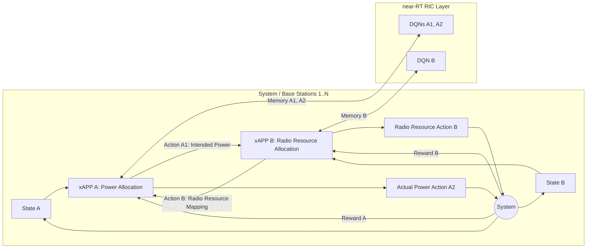

### **1. Problem**

* **Core conflict**: Coexistence of multiple third-party xAPPs (specifically power allocation and radio resource allocation) with overlapping control objectives in the near-RT RIC of O-RAN creates hard-to-detect conflicts (direct, indirect, and implicit) .
* **Operational example**: Power allocation xAPP assigns high transmission power to a resource block group (RBG), while radio resource allocation xAPP assigns that same RBG to a user with a small traffic load .
* **Impact**: Wastes scarce bandwidth resources and increases total power consumption and interference . Existing single-vendor joint optimization schemes are inapplicable to multi-vendor O-RAN settings .

---

### **2. Similar Work Mentioned in the Paper**

| Reference / Work | Focus / Methodology |
| --- | --- |
| Samarakoon et al. | Federated learning for joint transmit power and radio resource allocation in vehicular networks |
| Elsayed & Erol-Kantarci | Reinforcement learning-based joint power and radio resource allocation for URLLC in 5G |
| Wu et al. | Energy efficiency-aware joint resource allocation and power allocation in multi-user beamforming |
| Iturria et al. | Multi-agent team learning in disaggregated virtualized O-RAN |
| Elsayed & Erol-Kantarci | AI-enabled future wireless networks (challenges, opportunities, and open issues) |
| Meng et al. [8] | DQN-based power allocation in multi-user cellular networks |
| Zhou et al. [9] | Multi-agent correlated Q-learning for RAN resource slicing in 5G |
| Wang et al. [10] | Asynchronous multi-user deep reinforcement learning for handover control |
| Bega et al. [11] | Framework for deploying AI-based algorithms in virtualized RANs |
| Zhou et al. [12] | Transfer reinforcement learning for joint radio and cache resource allocation |
| He et al. [13] | DRL and attention-based neural network for joint power allocation and channel assignment in NOMA |

---

### **3. Gap Addressed**

* Prior approaches assume traditional single-vendor RAN architecture where all resource functions are optimized via joint training or shared parameters/frameworks .
* In O-RAN and multi-vendor future architectures, xAPPs are independently managed by different vendors, use heterogeneous frameworks/learning parameters, and maintain high independence with only necessary information sharing .

---

### **4. Approach**

* **Team Deep Q-Learning (TDL)**: Proposed collaborative team learning algorithm where power allocation and radio resource allocation xAPPs cooperate for the shared team goal of maximizing total system transmission rate .
* **Information Exchange / Two-Round Action Flow**:
* **Power Allocation xAPP**: Maintains two experience replay memories and two DQN models. DQN1 determines a first-round *intended power action* using environment state observations.
* **Information Sharing**: Intended power action is sent to the radio resource allocation xAPP.
* **Radio Resource Allocation xAPP**: Uses one DQN to select user-to-RB/RBG mapping action based on environment state and the received intended power action $p_{t+1}^{n,m}$.
* **Second Round Power Action**: Radio resource action is fed back to the power allocation xAPP, which uses DQN2 to select the final *actual power action* .

* **Objective Function**: Maximize total transmission rate $\sum_{n \in N} \sum_{m \in M} R^{n,m}$ subject to power bounds ($P_{\min} \le P^{n,m} \le P_{\max}$) and resource allocation binary indicator constraints ($\sum_{k \in K} \alpha^{n,m,k} = 1$) .
* **Deployment/Training**: Instantiated in non-RT RIC via AI servers (e.g., Acumos AI) and deployed as containerized images in the near-RT RIC .

---

### **5. Results**

* **Simulation Setup**: Python/TensorFlow platform, 4 base stations, 30 users, Poisson traffic arrival rate varying from **3 to 6 Mbps**, constant user velocity with 0.3 direction change probability per time slot, **20,000 time slots** (1 slot = 100ms), 4-layer DNNs (256/128 neurons for power xAPP, 512/256 neurons for radio xAPP), discount factor $\gamma = 0.2$, initial lr = $0.001$, $\varepsilon$-greedy start 0.3 . Compared TDL vs. Independent Deep Q-Learning (IDL) .
* **Throughput & Convergence (4 Mbps, $20\text{ m/s}$)**: TDL provides more stable learning curves and achieves **4.6% higher throughput** upon stabilization (Fig. 4) .
* **Varying Traffic Load (3–6 Mbps, $20\text{ m/s}$)**:
* At **6 Mbps**, TDL achieves **8.8% higher throughput** than IDL (Fig. 5) .
* TDL achieves **64.8% lower packet drop rate (PDR)** than IDL at 6 Mbps (Fig. 6); the performance gap widens at higher loads due to critical resource contention .

* **Varying User Speed (0–30 m/s, 4 Mbps)**: TDL's performance advantage grows at higher velocities due to frequent allocation shifts and intensified cross-xAPP conflicts, reaching **5.0% higher throughput** at $30\text{ m/s}$ (Fig. 7) .

---

### **6. Conclusion**

* Team learning effectively eliminates hidden/indirect conflicts between multi-vendor xAPPs in O-RAN (and future multi-vendor RAN architectures) via selective intended action sharing .
* TDL consistently outperforms independent deep Q-learning (IDL) across various traffic loads and user mobility profiles, yielding higher system throughput and lower PDR .
* The biggest limitation is scaling the team learning framework to incorporate additional xAPPs and multi-agent coordination scenarios beyond two agents, which introduces increased complexity in managing and maintaining the system.