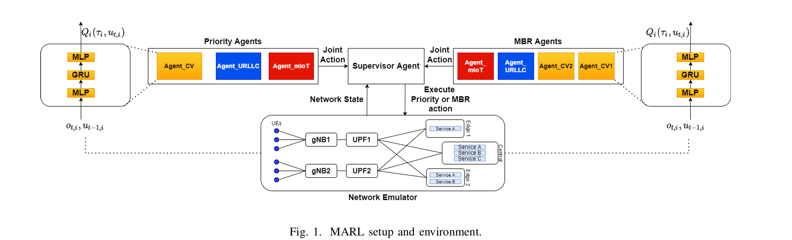
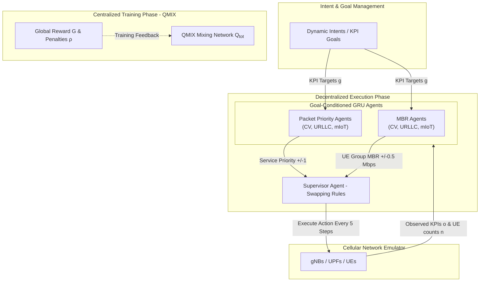

Here is a grounded overview of the paper **"Intent-based multi-agent reinforcement learning for service assurance in cellular networks"**.

---

### **1. Problem**

* **Multi-Intent Closed Loop Interference**: In future cellular networks (such as 6G), high-level intent-based management uses automated closed control loops to satisfy key performance indicator (KPI) goals across multiple services (e.g., Conversational Video [CV], Ultra-Reliable Low-Latency Communication [URLLC], and massive IoT [mIoT]).
* **Resource and Parameter Conflicts**: Individual control loops often adjust shared control knobs (e.g., packet priority and Maximum Bit Rate [MBR]). In resource-constrained settings, actions taken by one closed loop (e.g., increasing CV packet priority) directly degrade the KPIs assured by other loops (e.g., URLLC packet loss).
* **Uncertain and Dynamic Environments**: Higher-level domain management functions feeding intents are typically unaware of underlying conflicts, mathematical models of the network environment are unavailable, runtime compute capacity is limited, and intent targets change frequently without opportunity for pre-planned conflict avoidance.

---

### **2. Similar Work Mentioned in the Paper**

The paper highlights several existing approaches in Self-Organized Network (SON) management and conflict coordination:
* **Independent or Sequential Optimization**: Optimizing individual objectives in isolation or sequentially using traditional telecom control methods.
* **Heuristic Coordination**: Problem-specific rule sets designed to resolve parameter clashes between specific use cases.
* **Multi-Step Coordination Workflows**: Structured workflows designed to coordinate independent control loops while attempting to manage scalability issues.
* **Centralized RL Coordinator**: Employing a top-level Reinforcement Learning agent as a central coordinator to resolve parameter conflicts among lower-level loops.

---

### **3. Gap Addressed**

* **Greedy and Independent Loop Training**: Existing methods rely on control loops trained independently as greedy policies, requiring complex central coordinators or heuristic rules that do not scale well as the number of loops increases.
* **Model Dependency and Retraining Overhead**: Classical optimization and model-driven techniques fail when an exact environment model is unavailable or when frequent intent target changes require time-consuming retraining cycles in conventional RL algorithms.
* **Runtime Communication Bottlenecks**: Many multi-agent coordination approaches require agents to continuously exchange action proposals or reward signals during execution, creating heavy signaling overhead.

---

### **4. Approach**
#### **4.1 Environment and setup**

The authors propose a **model-free Goal-Conditioned Multi-Agent Reinforcement Learning (MARL)** architecture using **QMIX** value function factorization.

#### **Key Methodological Innovations**:
1. **Goal-Conditioned RL**: Intent goals ($g$) are appended directly into each agent's observation space ($s_j = [o_j, g_j, G, n_j]$). During training, goals are randomly sampled across the KPI domain so that policies generalize seamlessly to new target goals at execution time without retraining.
2. **QMIX Centralized Training with Decentralized Execution (CTDE)**: Individual agent $Q_i$ functions are combined into a joint $Q_{tot}$ via a monotonic mixing network during training. At runtime, each agent acts fully local based only on its own local KPI observation, target goal, active UE count, and the aggregated global reward—requiring **zero direct agent-to-agent signaling**.
3. **Dual Agent Structure & Action Spaces**:
    * **Packet Priority Agents**: Adjust service-level packet priority in discrete increments ($\Delta = \pm 1$) within the configured priority range.
    * **MBR Agents**: Adjust group-level UE Maximum Bit Rates in discrete steps ($\Delta = \pm 0.5\text{ Mbps}$).
   * Both agent types are implemented using 2-layer **Gated Recurrent Unit (GRU)** networks.
4. **Supervisor Agent**: A top-level rule supervisor toggles control between MBR agents and Priority agents every 5 time steps (activating MBR agents when all UE throughputs equal their MBR, and Priority agents otherwise).
5. **Differentiated Penalty Weights ($\rho_j$)**: The global reward function is formulated as $G(s) = \sum \rho_j \cdot r_j(o_j, g_j)$. By assigning higher penalty multiplier values ($\rho_j$) to high-priority services, agents learn to trade off low-priority KPIs during resource scarcity.

---

### **5. Results**

The approach was evaluated on a cellular network emulator across two primary scenarios using an average KPI distance metric $M = \frac{1}{H}\sum_{t=1}^H |o_t - g_t|$ (where lower values indicate faster and closer convergence to intent goals):

#### **Scenario 1: Plenty of Resources (20 Mbps Airlink Bandwidth)**
* **Superior Convergence**: Orchestrating both Priority and MBR agents via the Supervisor achieved the lowest distance metric $M$ across all three services compared to single-agent setups:
    * **Conversational Video (CV)**: $M = 0.25$ (vs. $1.49$ Priority-only, $0.97$ MBR-only).
    * **URLLC**: $M = 0.85$ (vs. $1.27$ Priority-only, $1.68$ MBR-only).
    * **mIoT**: $M = 1.09$ (vs. $1.49$ Priority-only, $2.27$ MBR-only).
* **Goal Adaptability**: When the CV service intent was dynamically changed midway through an episode (QoE target raised from $3.0$ to $3.5$), the goal-conditioned agents adjusted control parameters in real time and successfully reached the new target.

#### **Scenario 2: Scarce Resources (4 Mbps Airlink Bandwidth)**
* **Equal Penalties ($\rho_j = 1$)**: When resources were insufficient to satisfy all intents simultaneously, equal penalties caused proportional performance degradation across all three services.
* **Differentiated Penalties ($\rho_{\text{URLLC}} = 10, \rho_{\text{CV/mIoT}} = 1$)**: When URLLC was assigned a higher penalty weight, the agents autonomously learned an optimal trade-off mechanism—degrading CV QoE and increasing mIoT packet loss to ensure URLLC met its packet-loss ratio intent ($\le 0.02$).

---

### **6. Conclusion**

* **Effective Multi-Intent Assurance**: Goal-conditioned MARL with QMIX successfully manages conflicting closed loops and fulfills multi-service intents without requiring a mathematical model of the underlying network.
* **Elimination of Runtime Signaling Overhead**: The CTDE paradigm enables decentralized execution where agents require no runtime communication with one another, eliminating potential control signaling bottlenecks.
* **Autonomous Intent Prioritization**: Incorporating intent preference penalties into the global reward function allows the system to autonomously learn resource trade-offs during network congestion, prioritizing critical services without human intervention.

---

