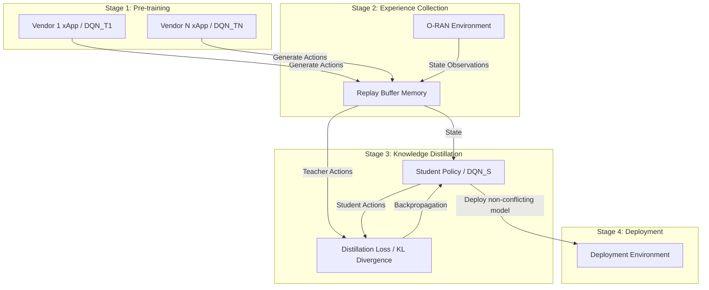

### 1. Problem

- Deploying multiple machine learning-based near-real-time network management applications (xApps) in overlapping areas of B5G Open-Radio Access Networks (O-RAN) causes conflicts.
- xApps are typically designed for specific objectives in isolation, which leads to both direct conflicts (controlling the same parameter simultaneously) and indirect conflicts (adjusting different parameters that affect the same metric).
- Existing O-RAN conflict mitigation schemes handle conflicts by selecting one action and disabling or rolling back others, causing mitigation delays, high service instability, sub-optimal performance, and network outages.

---

### 2. Similar Work Mentioned in the Paper

- **O-RAN Alliance Conflict Mitigation Procedures:** Standard approaches that handle direct conflicts by ignoring actions from one xApp, and address indirect conflicts by monitoring performance metrics and rolling back actions if degradation occurs.
- **Team-Learning Schemes:** Joint reinforcement learning approaches (e.g., Zhang et al.) where multiple xApps share action information during training to improve coordination, throughput, and packet drop rates.
- **Single-xApp Approaches:** Deep Reinforcement Learning (DRL) frameworks (e.g., Actor-Critic or Graph Neural Network-based xApps) that address resource allocation or connection management under the assumption of a single controlling agent in the network.

---

### 3. Gap Addressed

- **Discarded Action Information:** O-RAN Alliance conflict mitigation strategies discard or ignore candidate actions from non-selected xApps, failing to leverage the decision-making intelligence embedded in those xApps.
- **Inability to Avoid Indirect Conflicts Pre-Action:** Indirect conflicts cannot be detected prior to execution, forcing conventional frameworks to rely on post-action rollbacks that introduce delays and service disruption.
- **Limited Scope of Team-Learning:** Existing team-learning frameworks only consider indirect conflicts, require xApps to perform single operations, and fail to incorporate standard post-action O-RAN conflict mitigation procedures.

---

### 4. Approach

The authors propose **xApp Distillation**, a multi-stage conflict mitigation framework that uses policy distillation to transfer knowledge from multiple, potentially conflicting pre-trained xApps (teachers) into a single, comprehensive DRL model (student).

#### Methodology & Key Innovations:

- **Four-Stage Framework:**
  1. *xApp Pre-training:* Individual xApps (e.g., xApp 1 handling handover/RB allocation; xApp 2 handling handover/transmit power) are pre-trained by vendors.
  2. *Experience Collection:* Pre-trained teacher models interact with the deployment environment to populate a shared replay buffer with state-action transitions before conflict mitigation alters them.
  3. *Policy Distillation:* A unified multi-headed Deep Q-Network (DQN) student model is trained via supervised learning using Kullback-Leibler (KL) divergence loss applied to matching output heads.
  4. *Deployment:* The consolidated student xApp is deployed as a single decision-maker, eliminating inter-xApp conflicts at runtime.
- **Multi-Headed Neural Network Architecture:** Utilizes a multi-headed Multi-Layer Perceptron (MLP) to output simultaneous control decisions (handover, resource block allocation, transmit power) in a single inference step, preventing greedy sequential action-taking among users.
- **Proportional Fairness Reward:** Incorporates a logarithmic data rate reward function $PF = \sum_{i=1}^{K} \log(r_i)$ to ensure fair bandwidth allocation.

---

### 5. Results

The proposed approach was evaluated using a Gymnasium-based `mobile-env` simulation of an urban area (250m × 250m) with mobile users and multiple base stations.

| Metric / Scenario | Individual Learning (O-RAN Mitigation) | Team Learning (O-RAN Mitigation) | xApp Distillation (Proposed) |
| --- | --- | --- | --- |
| **Direct & Indirect Conflicts** | Subject to inter-xApp conflicts & rollbacks | Subject to inter-xApp conflicts & rollbacks | Completely eliminated (single deployed agent) |
| **Throughput Distribution** | High concentration near low rates (< 50 Mbps) | Broad distribution peaking around 50–100 Mbps | Highest data rate density, peaking around 100–150 Mbps and ~250 Mbps |
| **10 Mbps Outage Ratio** | ~33% | ~26% | **~5%** (83.3% reduction vs. Team Learning) |
| **25 Mbps Outage Ratio** | ~52% | ~43% | **~32%** |
| **50 Mbps Outage Ratio** | ~66% | ~62% | **~53%** (33.3% improvement vs. Individual) |

---

### 6. Conclusion

- xApp Distillation successfully resolves inter-xApp direct and indirect conflicts by consolidating multi-vendor xApp capabilities into a single, unified DRL agent.
- The approach preserves the decision-making intelligence of teacher models without requiring access to their original training pipelines or model parameters.
- Evaluated against standard O-RAN conflict mitigation and team-learning baselines, xApp Distillation significantly improves throughput consistency and reduces network outage rates by up to six times in specific operational conditions.