# Approach 1: A2C Context-Aware Scheduler — Flow & Steps

**Source:** `literature/Context-Aware Dynamic Schedulers/2504.06867v3.md` (Cinemre et al., "xApp Conflict Mitigation with Scheduler")
**Role:** Macro-level action coordinator / orchestrator inside the Near-RT RIC.
**Core idea:** A lightweight A2C policy selects *which pre-trained xApps are active* ($\mu^\dagger$) based on real-time network context ($c^\dagger$) and operator intent ($f^\dagger$), without ever re-training the xApps.

---

## 1. Flowchart

```mermaid
flowchart TD
    Start([Scheduling period † begins]) --> EI["INPUT: Context variables c† via A1 EI\nc1† = mean data arrival rate d (Mbps)\nc2† = average user mobility speed v (m/s)"]
    EI --> INTENT["INPUT: Intent target f†\n(e.g., maximize total normalized transmission rate τe)"]
    INTENT --> STATE["Build state vector\ns† = [c1†, c2†, f†]"]

    STATE --> ACTOR["COMPUTE: A2C Actor network\nπθ(a†|s†) → probability distribution\nover activation decisions"]
    ACTOR --> CRITIC["COMPUTE: A2C Critic network\nVφ(s†) ≈ E[G†|s†] (state-value baseline)"]
    CRITIC --> ADV["COMPUTE: Advantage\nA(s†,a†) = G†:†+1 − Vφ(s†)\n(used only for training updates)"]

    ADV --> GATE{"SAFETY: Confidence gate\nz-score of Vφ(s†) below\nMNO-defined threshold?"}
    GATE -->|"Yes (out-of-distribution)"| FALLBACK["Override action for T_back decisions\nwith deterministic fallback π_safe:\n(i) equal resource allocation, or\n(ii) single xApp with highest offline reward"]
    GATE -->|"No"| SAMPLE["Sample action from Actor distribution\na† = [μ1†, μ2†, …, μn†], μn† ∈ {0,1}"]

    FALLBACK --> MASK
    SAMPLE --> MASK["OUTPUT: xApp activation mask μ†"]

    MASK --> METHOD{"Scheduling method?"}
    METHOD -->|"Method 1: Retain previous action"| M1["Activate selected A2C xApps\n(Power X1, RBG X2)\nDeactivated xApp keeps its last action"]
    METHOD -->|"Method 2: Extend with baselines"| M2["Select 1 power xApp (X1 or baseline X3)\n+ 1 RBG xApp (X2 or baseline X4)\nconstraints: μ1†+μ3†=1, μ2†+μ4†=1"]

    M1 --> IH["xApp Inference Host (IH)\nSelected xApps access shared data repository"]
    M2 --> IH
    IH --> XAPP["Active xApps run their own A2C policies\n(Power allocation, RBG allocation)"]
    XAPP --> E2["RESULT USED: E2SM Control messages\n→ RAN (O-RUs) apply NCP adjustments"]
    E2 --> KPM["RAN streams KPM feedback via E2SM-KPM\n(transmission rate, leftover/discarded bits)"]
    KPM --> REWARD["COMPUTE: Reward τe\n= normalized transmission rate\n= Στt,e / (de · R · B)"]
    REWARD --> TRAIN["COMPUTE: Online training update\nActor: ∇θ J = E[∇θ log πθ(a†|s†) · A(s†,a†)]\nCritic: L(φ) = E[(G†:†+1 − Vφ(s†))²]"]
    TRAIN --> LOOP{"Next scheduling period †?"}
    LOOP -->|"Yes"| EI
    LOOP -->|"No"| End([End episode])
```

---

## 2. Input Parameters

| Symbol | Description | Source | Example Value |
| :--- | :--- | :--- | :--- |
| $c_1^\dagger$ | Mean data arrival rate $d$ (traffic load) | A1 EI from Non-RT RIC | {2, 5, 8} Mbps |
| $c_2^\dagger$ | Average user mobility speed $v$ | A1 EI from Non-RT RIC | {5, 25, 45} m/s |
| $f^\dagger$ | Intent target KPM (e.g., maximize total transmission rate) | MNO intent via Non-RT RIC | $\tau_e$ |
| $s^\dagger$ | State vector $[c_1^\dagger, c_2^\dagger, f^\dagger]$ | Concatenation of above | — |
| $\tau_e$ | Reward: normalized transmission rate | Computed from RAN KPM feedback | $\frac{\sum_t \tau_{t,e}}{d_e \cdot R \cdot B}$ |

## 3. Computation Steps

1. **State construction** — Concatenate the two context variables and the intent target into the scheduler state vector $s^\dagger = [c_1^\dagger, c_2^\dagger, f^\dagger]$.
2. **Actor inference** — The A2C Actor network $\pi_\theta(a^\dagger|s^\dagger)$ outputs a probability distribution over the binary activation decisions $\mu_n^\dagger \in \{0,1\}$ for each candidate xApp.
3. **Critic inference** — The Critic network $V_\phi(s^\dagger)$ estimates the expected return from the current state, providing the baseline for the advantage function $A(s^\dagger, a^\dagger) = G_{\dagger:\dagger+1} - V_\phi(s^\dagger)$.
4. **Confidence-gated fallback (safety layer)** — Maintain EWMA estimates of the Critic's value mean $m^\dagger$ and dispersion $\sigma^\dagger$ (forgetting factor $\beta$). If the z-score of $V_\phi(s^\dagger)$ falls below the MNO-defined threshold, the learned action is overridden for the next $T_{back}$ decisions by the deterministic fallback policy $\pi_{safe}$ (equal resource allocation, or the single xApp with the highest offline average reward). Statistics are frozen during the back-off window.
5. **Action sampling** — Sample the activation mask $a^\dagger = [\mu_1^\dagger, \dots, \mu_n^\dagger]$ from the Actor distribution (or take the fallback action).
6. **Method selection** — Apply either:
   - **Method 1 (retain previous action):** activate the chosen A2C xApps; a deactivated xApp retains its last action for consistency.
   - **Method 2 (extend with baselines):** choose one power xApp (A2C $X_1$ or baseline $X_3$) and one RBG xApp (A2C $X_2$ or baseline $X_4$), subject to $\mu_1^\dagger + \mu_3^\dagger = 1$ and $\mu_2^\dagger + \mu_4^\dagger = 1$.
7. **Training update** — After the episode, update the Actor via the policy gradient $\nabla_\theta J(\theta) = \mathbb{E}[\nabla_\theta \log \pi_\theta(a^\dagger|s^\dagger) \cdot A(s^\dagger, a^\dagger)]$ and the Critic by minimizing $\mathcal{L}(\phi) = \mathbb{E}[(G_{\dagger:\dagger+1} - V_\phi(s^\dagger))^2]$.

## 4. How the Result Is Used

1. The activation mask $\mu^\dagger$ is sent to the **xApp Inference Host (IH)**, which enables the selected xApps to access the shared data repository and begin optimization.
2. Active xApps execute their own pre-trained A2C policies (power allocation, RBG allocation) and issue **E2SM Control** directives to the RAN (O-RUs).
3. The RAN applies the NCP adjustments and streams **KPM feedback** (transmission rate, leftover/discarded bits) back to the scheduler.
4. The feedback is converted into the reward $\tau_e$ (normalized transmission rate), which drives the online re-training of the lightweight scheduler only — the pre-trained xApps are never modified.

## 5. Key Parameters (from paper, Table I)

| Parameter | Value |
| :--- | :--- |
| O-RUs ($B$) / users ($U$) | 4 / 16 |
| RBGs per O-RU ($R$) | 12 |
| Max / min TX power | 38 dBm / 1 dBm |
| Traffic arrival rates $d_e$ | {3, 5, 7, 9} Mbps |
| User speed range $v_u$ | 1–50 m/s |
| Training episodes / time slots | $10^5$ / 50 |
| Scheduling period $\dagger$ | 10 time steps |
| Learning rate $\eta$ / discount $\gamma$ | $10^{-4}$ / 0.95 |
| Context variables | 2 (arrival rate, speed) |

## 6. Expected Outcomes

- **Method 1** improves over the conflicting independent-deployment case (an A2C-driven form of prioritization).
- **Method 2** (baseline xApps in the action space) yields the best overall performance and lowest leftover bits.
- Conflict severity is context-dependent: ~5% degradation at low load/speed vs. ~16% at high load/speed (8 Mbps, 45 m/s).