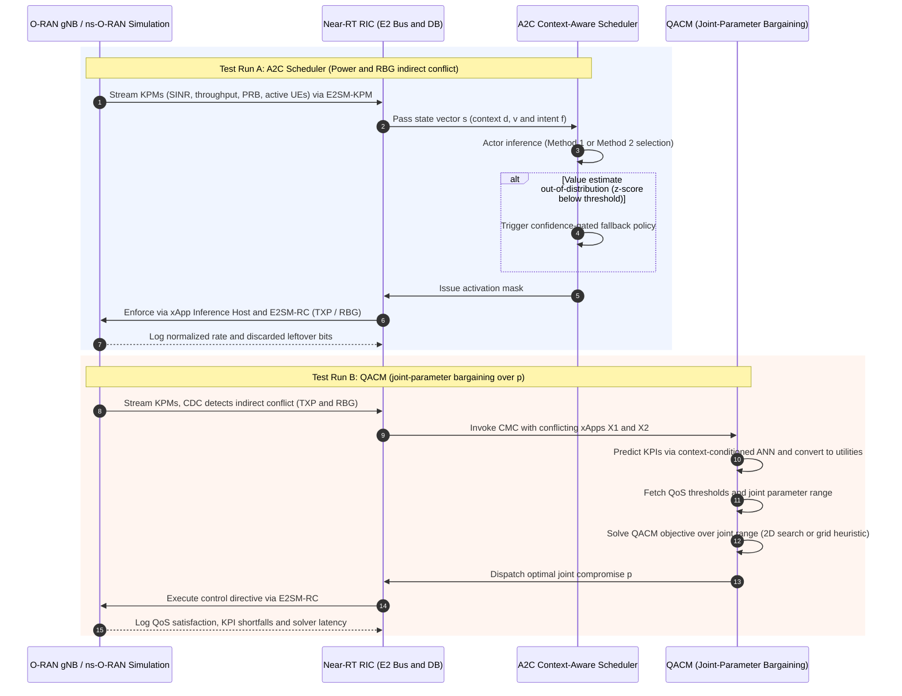

# Comparative Evaluation Methodology and Architectural Specification: A2C Context-Aware Scheduler vs. QACM in Near-RT RIC

**Status:** Draft (iter-3)
**Scope:** Merged approach + implementation specification for the head-to-head evaluation of two xApp conflict-mitigation frameworks inside the Near-RT RIC, on the ns-O-RAN testbed.
**Iteration:** iter-3 — common scenario is the **A2C scenario** (Power xApp + RBG xApp indirect conflict over TXP and RBG allocation), with QACM extended to joint-parameter bargaining. See `../plan/iteration-index.md` for the iteration history.
**Sources:**
- Flow details: `a2c-scheduler-flow.md`, `qacm-flow.md`
- Literature: `literature/Context-Aware Dynamic Schedulers/2504.06867v3.md` (A2C Scheduler), `literature/Rule-Based & SLA Constraint Projection/2405.07324v2.md` (QACM)
- Decisions: `../open-questions.md` (Q1, Q2 → Proposal B, Q3 → moot)

---

## 1. Executive Context and Strategic Framework

The evolution of Radio Access Networks (RAN) from monolithic, hardware-centric "black boxes" to disaggregated, Open RAN (O-RAN) architectures marks a definitive shift toward multi-vendor interoperability and data-driven intelligence. By decoupling the RAN software from the underlying hardware through standardized interfaces, O-RAN enables the deployment of third-party control applications, or xApps, within a Near-Real-Time RAN Intelligent Controller (Near-RT RIC). However, the proliferation of independent xApps—each pursuing narrow optimization targets—presents a critical stability risk. Without a centralized reconciliation framework like the Advantage Actor-Critic (A2C) Scheduler and QoS-Aware Conflict Mitigation (QACM), the network is susceptible to uncoordinated control loops that degrade performance.

The "So What?" of this architecture lies in the mitigation of severe operational frictions. In the iter-3 scenario, a Power xApp ($X_1$) and an RBG xApp ($X_2$) both maximize the same shared KPM—the normalized transmission rate $\tau_e$—but act on two different Network Control Parameters (NCPs): TXP and RBG allocation. The indirect conflict has two concrete triggers: the Power xApp assigns power to RBGs that the RBG xApp did not allocate to any user (wasted power), and the RBG xApp assigns many RBGs to users that receive low power (underpowered allocation). The result is throughput degradation and accumulating leftover (discarded) bits, directly undermining 5G/6G Key Performance Indicators (KPIs) including throughput and spectral efficiency. To avoid these "non-stationary" environment risks, where one xApp's actions shift the underlying data distribution for others, a context-aware coordination layer is required.

The objective of this specification is to deploy an A2C-based scheduler and QACM logic that reconciles xApp directives in real-time. Crucially, this framework eliminates the need for expensive re-training of vendor-specific models. By utilizing a Critic network to stabilize the learning process against varying network contexts, the system achieves a "Zero-Touch" automation framework. This document details the technical implementation from the ns-O-RAN testbed to the mathematical foundations of the A2C model and the QACM bargaining engine.

---

## 2. Integrated System Architecture: Near-RT RIC and ns-O-RAN Testbed

Bridging the gap between AI/ML research and production deployment requires a high-fidelity sandbox. The ns-O-RAN framework serves as this bridge, integrating production-grade Near-RT RIC platforms with 3GPP-compliant discrete-event simulations in ns-3. This strategy is vital for avoiding "Online Exploration Risks," where poorly trained Reinforcement Learning (RL) agents might cause service outages in a live commercial network.

### Dual-Instance Deployment Strategy

The architecture utilizes a bifurcated environment to ensure both training scalability and execution reliability:

* Simulated Environment (ns-3): Models the full protocol stack (PHY to SDAP) using 3GPP stochastic channel models. It generates the high-volume datasets (exceeding 40 million data points) required for offline training of conflict-mitigation policies.
* Real-World Near-RT RIC: A cloud-native platform hosting xApps and platform services. It interacts with the simulation or physical RAN nodes via standardized E2AP messaging.

### Near-RT RIC Platform Services

The Near-RT RIC provides the foundational infrastructure to handle high-frequency telemetry and control:

* E2 Termination: Manages SCTP-based routing of messages between the RIC and disaggregated RAN nodes (E2 Nodes).
* Subscription Management: Validates and filters xApp requests for Key Performance Measurements (KPMs) to prevent duplicate data requests and unnecessary overhead.
* Data Pipeline (ETL/Data Aggregation): Extracts, transforms, and loads raw telemetry into a shared data repository, correlating UE-level metrics into time-series records for ML inference, and flattening per-UE/per-cell inputs into the $B \times C$ feature matrix with lookback gap-filling ($\epsilon$).

### The ns-O-RAN Bridge and Synchronization Requirements

The ns-O-RAN bridge is a prescriptive requirement for maintaining the validity of the 100 ms control loop:

* "e2sim" Extensions: The bridge extends the e2sim library to support multiple disaggregated endpoints (CU-CP, CU-UP, DU) simultaneously, allowing a single simulation process to represent a multi-cell environment with unique IP/port identifiers for each node.
* Unix-based Time Synchronization: To reconcile the simulator's discrete-event clock with the RIC's wall-clock time, the bridge establishes a baseline Unix timestamp. This ensures a consistent "happened-before" relationship for all E2 messages, critical for real-time inference.

### Iter-3 Testbed Configuration (Scenario Adaptation)

The iter-3 scenario adapts the A2C paper's simulation (4 O-RUs / 16 UEs) to the ns-O-RAN testbed constraints:

| Parameter | Paper (2504.06867v3) | Iter-3 Testbed |
| :--- | :--- | :--- |
| Topology | 4 O-RUs, 16 UEs | 2 gNBs, 10 UEs |
| Carrier / RBGs | 20 MHz, 12 RBGs per O-RU | 20 MHz, 12 RBGs per gNB |
| Power range | $P \in [1, 38]$ dBm, $K$ levels | $p_{power} \in [1, 38]$ dBm, $K$ levels |
| Time step / period | $T_s = 100$ ms, scheduling period 10 | 100 ms steps, scheduling period 10 (1 s) |
| Episode | $T = 50$ time steps (5 s) | $T = 50$ time steps (5 s) |
| Simulation length | — | 10 min at 100 ms steps |

**Why the topology differs from the paper:** the A2C paper (2504.06867v3) evaluates on a simplified Python simulation model with 4 O-RUs / 16 UEs, whereas this experiment runs on the ns-O-RAN testbed — a full-stack ns-3 simulator integrated with a Near-RT RIC over E2. The topology is therefore adapted to what is configurable in ns-O-RAN (`plan/iteration-3/spec.md` §1.1; `plan/iteration-index.md` iter-3). The reduction to 2 gNBs / 10 UEs is a deliberate design choice, not a hard testbed constraint:

* **Interference needs ≥ 2 cells.** The Power + RBG indirect conflict is interference-mediated (TXP sets the SINR floor for the RBG xApp's allocation), so at least two cells are required to reproduce the conflict at all.
* **Scale is kept paper-like and tractable.** 2 gNBs / 10 UEs stays close to the paper's 4 O-RUs / 16 UEs while keeping the A2C action space, QACM's joint search ($|P| \times (R+1)$ candidates), and training time manageable.
* **It is a reduction from the available data, not a ceiling.** The existing ns-O-RAN telemetry export already contains 10 serving cells / 49 UEs (`data/data-report.md`); the 2 gNB / 10 UE choice is flagged as a design decision in `open-questions.md` Q9, which leaves the topology open (existing 10-cell config vs. paper-like reduction) pending Phase 0.6 verification.
* **It matches the QACM paper's own simulation scale.** The QACM paper (2405.07324v2) evaluates its MATLAB 5G simulation on 2 gNBs / 10 UEs (`literature/Rule-Based & SLA Constraint Projection/QACM-summary.md`), so the topology coincidentally aligns with both source papers.
* **Caveat:** the physical TU Ilmenau ICS testbed is single-cell / single-gNB (`literature/testbed-info/tu-ilmenau-ics-testbed/testbed-limitations.md` §5.1); the 2 gNB topology is a target for the ns-O-RAN *simulation*, not the hardware testbed.

---

## 3. The Two Frameworks at a Glance

Both the **A2C Context-Aware Scheduler** and **QACM (QoS-Aware xApp Conflict Mitigation)** operate within the O-RAN Near-Real-Time RAN Intelligent Controller (**Near-RT RIC**) on near-real-time timescales (10 ms – 1 s). However, they address conflict mitigation from two distinct architectural philosophies:

* **A2C Context-Aware Scheduler (Macro-Level Policy Coordinator):** Functions as an **active action coordinator and orchestrator**. It ingests physical network context variables ($c^\dagger$: e.g., traffic arrival rate $d$, user mobility speed $v$) and intent targets ($f^\dagger$), using an Advantage Actor-Critic (A2C) DRL network to dynamically toggle which pre-trained xApps (or baseline policies) are active ($\mu^\dagger$) [343, 350, 352–353]. The full flow is specified in [a2c-scheduler-flow.md](a2c-scheduler-flow.md).
* **QACM (Micro-Level Parameter Optimizer):** Functions as a **post-action parameter bargaining engine**. When active xApps request conflicting values for shared input control parameters (e.g., transmit power, RBG allocation) [134–135, 177], QACM converts xApp KPIs into normalized scalar utilities $U(\mathbf{p})$ via z-score normalization and solves a constrained optimization problem (or heuristic loop) to calculate a single **optimal joint compromise parameter vector ($\mathbf{p}^{\text{opt}}$)** [159–163]. The full flow is specified in [qacm-flow.md](qacm-flow.md).

---

## 4. Taxonomy of xApp Conflicts and Mitigation Logic

Identifying the specific archetype of a conflict is the strategic prerequisite for applying mitigation logic. In dynamic 5G environments, static priority rules (e.g., "always prioritize throughput") fail because xApps may coexist in low-load states but conflict severely under high UE density.

### O-RAN Conflict Taxonomy

| Conflict Type | Description | Primary Example Scenario |
| :--- | :--- | :--- |
| Direct Conflict | Multiple xApps request incompatible adjustments to the same NCP. | One xApp increases antenna tilt for coverage while another decreases it for capacity. |
| Indirect Conflict | xApps modify different NCPs but impact the same KPM. | **Iter-3 scenario:** Power xApp ($X_1$) vs. RBG xApp ($X_2$) impacting the normalized transmission rate $\tau_e$. |
| Implicit Conflict | Independent KPM optimization causing latent degradation. | An Energy Efficiency xApp deactivates RUs, causing a Throughput xApp to fail QoS targets. |
| Contextual Conflict | Conflicts triggered only by specific operational factors. | High UE mobility patterns or traffic load (e.g., C-Band congestion) triggering inter-cell interference. |

The "So What?" of context-dependency is that the A2C scheduler must go beyond simple threshold-based rules. It must learn that the optimal action is a function of current network variables like UE speed and traffic arrival rate.

---

## 5. Algorithmic Foundation: A2C Scheduler and QACM Mechanics

The A2C model provides a strategic advantage over standard REINFORCE or DQN methods. In the volatile RAN environment, A2C utilizes a Critic to establish a baseline return, reducing variance and stabilizing the learning process. This is particularly effective for multi-vendor coordination where xApp actions create a non-stationary environment.

### 5.1 A2C Scheduler (as published, 2504.06867v3)

The scheduler utilizes a dual-network Actor-Critic structure. The complete flow—flowchart, computation steps, and key parameters—is documented in [a2c-scheduler-flow.md](a2c-scheduler-flow.md) (§1, §3, §5).

* **State:** $s^\dagger = [c_1^\dagger, c_2^\dagger, f^\dagger] = [d, v, \text{intent}]$, where $c_1^\dagger = d$ is the mean data arrival rate (Mbps), $c_2^\dagger = v$ is the average user mobility speed (m/s), and $f^\dagger$ is the operator intent target (maximize total normalized transmission rate $\tau_e$).
* **Actor:** Outputs a probability distribution $\pi_\theta(a^\dagger|s^\dagger)$ over potential activation decisions $\mu_n^\dagger \in \{0, 1\}$. This determines the optimal combination of xApp directives to execute.
* **Critic:** Estimates the state-value function $V_\phi(s^\dagger)$ to establish the baseline. It calculates the Advantage Function: $A(s^\dagger, a^\dagger) = G_{\dagger:\dagger+1} - V_\phi(s^\dagger)$ where $G_{\dagger:\dagger+1}$ is the one-step discounted return. This advantage quantifies whether the Actor's chosen action outperformed the expected average return.
* **Confidence-gated fallback (safety layer):** Maintains EWMA estimates of the Critic's value mean $m^\dagger$ and dispersion $\sigma^\dagger$ (forgetting factor $\beta$). If the z-score of $V_\phi(s^\dagger)$ falls below the MNO-defined threshold, the learned action is overridden for the next $T_{back}$ decisions by the deterministic fallback policy $\pi_{safe}$ (equal resource allocation, or the single xApp with the highest offline average reward). Statistics are frozen during the back-off window.
* **Scheduling methods:**
  * **Method 1 (retain previous action):** activate the chosen A2C xApps; a deactivated xApp retains its last action for consistency.
  * **Method 2 (extend with baselines):** choose one power xApp (A2C $X_1$ or baseline $X_3$) and one RBG xApp (A2C $X_2$ or baseline $X_4$), subject to $\mu_1^\dagger + \mu_3^\dagger = 1$ and $\mu_2^\dagger + \mu_4^\dagger = 1$.
* **Reward (native, no redesign):** normalized transmission rate $\tau_e = \frac{\sum_t \tau_{t,e}}{d_e \cdot R \cdot B}$.
* **Training:** online policy-gradient update $\nabla_\theta J(\theta) = \mathbb{E}[\nabla_\theta \log \pi_\theta(a^\dagger|s^\dagger) \cdot A(s^\dagger, a^\dagger)]$ and Critic MSE loss $\mathcal{L}(\phi) = \mathbb{E}[(G_{\dagger:\dagger+1} - V_\phi(s^\dagger))^2]$, with $\eta = 10^{-4}$, $\gamma = 0.95$, $10^5$ episodes, $T = 50$, scheduling period 10. Only the lightweight scheduler is re-trained; the pre-trained xApps are immutable.

### 5.2 QACM (extended to joint-parameter bargaining, 2405.07324v2)

QACM acts as the final safety layer, leveraging Enrichment Information (EI) from the A1 interface to define "QoS satisfaction indicators." It reconciles conflicting xApp utilities by solving an optimization problem grounded in Nash's Social Welfare Function and Eisenberg-Gale solutions. By minimizing the weighted distance of xApp outputs from pre-defined QoS thresholds, QACM ensures that no critical service—such as URLLC or GBR traffic—is sacrificed for secondary optimizations. The complete flow—flowchart, computation steps, and key parameters—is documented in [qacm-flow.md](qacm-flow.md) (§1, §3, §5).

The iter-3 implementation extends QACM beyond the paper to bargain over the **joint control vector** $\mathbf{p} = [p_{power}, p_{RBG}]$:

* **CMS framework:** PMon (performance monitoring), CDC (conflict detection), CMC (conflict mitigation controller), CS xApp (weight provider), and the shared database components (RCP, PGD, RCPG, PKR, DCKD, KDO).
* **Joint control vector:** $p_{power} \in [1, 38]$ dBm ($K$ levels) and $p_{RBG} \in \{0, \dots, 12\}$ RBGs per gNB (scalarized allocation).
* **Context-conditioned KPI prediction:** For each candidate value of $\mathbf{p}$, each xApp's KPI is predicted by its ANN regression model with inputs $(\mathbf{p}, d, v)$ — 4 hidden layers × 128 neurons, tanh activation, dropout 0.2, Adam optimizer, MSE loss, 10 epochs. ANN outperforms polynomial regression (R² 0.95–0.99 vs 0.81–0.99).
* **Utility conversion:** KPIs are converted to scalar utilities via z-score normalization $U(\mathbf{p}) = (k(\mathbf{p}) - \mu)/\sigma$, preserving the Gaussian distribution and yielding values in $[-3, +3]$.
* **QoS thresholds (defined for the A2C scenario):** $q_1$: $\tau_e \geq 0.9$ (Power xApp KPI); $q_2$: leftover-bits ratio $\leq 0.05$ (RBG xApp KPI).
* **Objective:** solve
  $$\min_{\mathbf{p}} \sum_{i \in [1,|X'|]} w_i d_i \zeta - \left(\sum_{i \in [1,|X'|]} s_i\right)^2$$
  subject to the weight-sum ($\sum w_i = 1$), satisfaction-count ($\sum s_i \leq |X'|$), distance ($d_i \geq q'_i - U_i(\mathbf{p})$ for $\delta_i = 0$, or $U_i(\mathbf{p}) - q'_i$ for $\delta_i = 1$), binary-indicator ($s_i \in \{0,1\}$), and range constraints. The paper's single-parameter solver ($4|X'|$ variables, $4|X'| + 2|N| + 3$ constraints) is extended to a **2D search** over the joint range ($|P| \times (R+1)$ candidates); for dynamic/large-scale cases a **2D-grid heuristic** ($O(N \cdot |X'|)$) iterates over discrete $\mathbf{p}$ values and keeps the one minimizing total cost.
* **Dispatch:** the CMC forwards the optimal joint compromise $\mathbf{p}^{opt} = [p_{power}^{opt}, p_{RBG}^{opt}]$ as a control decision to the RAN nodes via E2SM-RC.

---

## 6. Interface Specifications and Telemetry Data Model

The Near-RT RIC maintains closed-loop control at 10 ms–1 s granularities using E2SM-KPM (telemetry) and E2SM-RC (control).

### Telemetry Input and State Vector

The A2C scheduler state is the context vector $s^\dagger = [c_1^\dagger, c_2^\dagger, f^\dagger] = [d, v, \text{intent}]$ (injected via simulated A1 EI), with the $B \times C$ feature matrix as the ETL output feeding the models. The required E2SM-KPM metrics:

| Metric | Symbol | Source / Layer | Used by |
| :--- | :--- | :--- | :--- |
| UE identifier | $u$ | CU-CP | Both (per-UE state) |
| Serving/neighbor cell IDs | $c \in C'_{u,t}$ | CU-CP | Both (feature matrix columns) |
| SINR per UE per cell | $\text{SINR}_{u,c,t}$ | CU-CP (L3 RRC) | A2C state, QACM KPI |
| RSRP per UE per cell | $\text{RSRP}_{u,c,t}$ | CU-CP (L3 RRC) | A2C state, QACM KPI |
| PDCP DL throughput | $R_{u,t}$ | CU-UP (PDCP) | $\tau_e$ computation, QACM KPI |
| PRB utilization % | $\text{PRB}_{c,t}$ | DU (MAC) | RBG allocation proxy, A2C state |
| Active user count | $Z_{c,t}$ | DU (MAC) | A2C state (congestion) |
| Transport blocks | $P_{c,t}$ | DU (MAC) | Throughput proxy |
| Modulation ratios | $p^{QPSK}_{c,t}, p^{16QAM}_{c,t}, p^{64QAM}_{c,t}$ | DU (MAC) | Link-quality indicator |
| Handover cost penalty | $k(c_{u,t})$ | Near-RT RIC (calc.) | A2C reward shaping |
| 100 ms reporting periodicity | — | E2SM-KPM | Both (control-loop cadence) |
| Feature matrix $B \times C$ | — | RIC ETL | Both (model input) |
| Missing-data lookback $\epsilon$ | — | RIC ETL | Both (gap filling) |

### Control Parameter Space ($\mathbf{p}$)

The scheduler and QACM manage the activation and reconciliation of the following NCPs:

* **Transmission Power ($p_{power}$):** $p_{power} \in [1, 38]$ dBm with $K$ quantization levels, balancing inter-cell interference and coverage. Dispatched via E2SM-RC (Style 8, **unverified in ns-O-RAN** — critical gate R1).
* **RBG Allocation ($p_{RBG}$):** $p_{RBG} \in \{0, \dots, 12\}$ RBGs per gNB (scalarized allocation), optimizing spectral efficiency. Dispatched via E2SM-RC PRB quota (Style 2, expected supported).

### A1 Enrichment Information

The A1 interface provides Enrichment Information (EI), such as capacity forecasts or high-level operator intents, which guide the QACM logic in setting dynamic QoS weights. In the ns-O-RAN testbed there is no Non-RT RIC, so A1 EI is **simulated**: context variables $c^\dagger = [d, v]$ and the intent target $f^\dagger$ (maximize total transmission rate) are injected per scheduling period.

---

## 7. Operational Workflow and Execution Logic

A structured workflow is critical for maintaining "Zero-Touch" network automation. The 100 ms reporting periodicity is a hard requirement to prevent "measurement conflicts" where decisions are based on stale RAN states. The per-framework step-by-step flows are documented in [a2c-scheduler-flow.md](a2c-scheduler-flow.md) (§3) and [qacm-flow.md](qacm-flow.md) (§3).

1. **Observation:** The Near-RT RIC fetches KPMs (SINR, $Z_{c,t}$, PRB load, throughput) via E2SM-KPM reports from E2 Nodes.
2. **Enrichment:** The simulated A1 interface provides contextual enrichment variables—traffic arrival rate $d$, mobility speed $v$, and the operator-defined intent target $f^\dagger$.
3. **Inference (A2C path):** The A2C Actor processes the state $s^\dagger = [d, v, f^\dagger]$ to generate a probability distribution $\pi_\theta$ over potential xApp activation decisions. The optimal activation mask $\mu^\dagger$ is sampled from this distribution to maximize the expected Advantage, subject to the confidence-gated fallback.
4. **Conflict Check (QACM path):** The QACM module validates the sampled actions against Nash Social Welfare criteria and QoS thresholds derived from A1 intents. When co-active xApps request conflicting values for the joint control vector $\mathbf{p} = [p_{power}, p_{RBG}]$, the CMC predicts KPIs via the context-conditioned ANN, converts them to utilities, and solves the QACM objective to produce the joint compromise $\mathbf{p}^{opt}$.
5. **Execution:** The RIC issues E2SM-RC Control Service messages to E2 Nodes to implement reconciled NCP adjustments (activation-mask enforcement via the xApp Inference Host on the A2C path; joint TXP + RBG quota dispatch on the QACM path).

---

## 8. Key Technical Evaluation Dimensions

#### 8.1 Conflict Resolution Mechanism (Action Scheduling vs. Parameter Bargaining)
* **A2C Scheduler:** Resolves conflicts by controlling **xApp execution states**. It selects between Method 1 (activating xApps while retaining previous actions) or Method 2 (selecting between pre-trained xApps and baseline equal-allocation policies). It does not modify the inner mathematical logic or parameter outputs of the xApps themselves.
* **QACM:** Resolves conflicts by negotiating **contentious parameter settings**. Rather than deactivating an xApp, QACM intercepts conflicting requests over the joint vector (e.g., Power xApp requesting high TXP vs. RBG xApp requesting a sparse allocation) and calculates an optimal intermediate setting ($\mathbf{p}^{\text{opt}}$) over E2SM-RC.

#### 8.2 End-to-End Network KPI & QoS Enforcement
* **A2C Scheduler:** Optimizes overall system-wide performance (maximizing total normalized transmission rate $\tau_e$ and minimizing mean leftover/discarded bits from buffer overflow) [346–347, 350, 358]. It does not explicitly enforce individual xApp Quality of Service (QoS) guarantees.
* **QACM:** Explicitly enforces **individual xApp QoS benchmarks ($q'$)**—$q_1$: $\tau_e \geq 0.9$; $q_2$: leftover ratio $\leq 0.05$. Its objective function ($\min \sum w_i d_i \zeta - (\sum s_i)^2$) [159–160] minimizes individual KPI shortfall distances ($d_i$) from QoS thresholds while maximizing the total count of satisfied xApps ($s_i$) [159–160].

#### 8.3 Near-RT RIC Latency & Computational Overhead
* **A2C Scheduler:** Low inference latency. Executing the A2C Actor network requires a quick forward pass given state vector $s^\dagger = [c^\dagger, f^\dagger]$.
* **QACM:** Higher processing overhead. Executing QACM requires forward-pass inferences across pre-trained **context-conditioned ANN regression models** (4 hidden layers, 128 neurons, `tanh` activation) to predict KPIs for each candidate joint setting [138, 154–156], followed by solving the optimization problem over the joint range ($|P| \times (R+1)$ candidates, or the 2D-grid heuristic with $O(N \cdot |X'|)$ complexity).

#### 8.4 Adaptability Across Dynamic Network Contexts
* **A2C Scheduler:** Highly context-sensitive. It explicitly monitors real-time environmental context ($c^\dagger$: arrival load $d$, user mobility speed $v$) and incorporates a **confidence-gated fallback mechanism** (z-score thresholding on critic value $V_\phi(s^\dagger)$) to handle out-of-distribution network states safely [354–355].
* **QACM:** Context adaptability depends on the accuracy of its offline/online **context-conditioned ANN KPI prediction models** (inputs $(\mathbf{p}, d, v)$). If live network dynamics drift significantly from the ANN training distribution, KPI predictions and the resulting compromise parameter choices may become suboptimal.

#### 8.5 Training & Maintenance Requirements
* **A2C Scheduler:** Requires lightweight online re-training of the scheduler whenever new operator intent targets ($f^\dagger$) or xApp sets are onboarded. However, it **never requires re-training or modifying the pre-trained xApps**.
* **QACM:** Requires maintaining pre-trained ANN regression models for each deployed xApp to enable KPI-to-utility conversion and prediction [138, 154–156]. It does not require re-training a central RL agent when parameters change.

---

## 9. Comparison Summary Matrix

| Metric / Dimension | A2C Context-Aware Scheduler | QACM Framework |
| :--- | :--- | :--- |
| **Primary Role** | Active Macro-Level Action Coordinator | Active Micro-Level Parameter Optimizer |
| **Input Signals** | Context variables ($c^\dagger$: load $d$, speed $v$) + Intent ($f^\dagger$) | Joint control range ($p_{power} \in [1, 38]$ dBm, $p_{RBG} \in \{0, \dots, 12\}$), context $(d, v)$, z-score utilities $U(\mathbf{p})$, QoS thresholds $q'$, priority weights $w_i$ [133, 157, 159–160] |
| **Core AI / Math Engine** | Advantage Actor-Critic (A2C) DRL | Game-theoretic / Constrained Optimization (or Heuristic Alg 1) + Context-Conditioned ANN Regression |
| **Primary Output** | xApp Activation Mask ($\mu^\dagger \in \{0, 1\}^n$) | Optimal Joint Compromise Parameter Vector ($\mathbf{p}^{\text{opt}} = [p_{power}^{opt}, p_{RBG}^{opt}]$) sent over E2SM-RC |
| **QoS Guarantee** | System-wide performance maximization (throughput/buffer) | **Explicit individual xApp QoS threshold enforcement ($q'$)** [111, 117, 159–160] |
| **Explainability** | Low (Black-box RL policy decisions) | Medium/Low (Quantitative utility shortfall $d_i$ & satisfaction $s_i$, no causal graphs) |
| **Re-training Need** | Re-trains lightweight scheduler when xApps/intents change | Re-trains ANN regression models when xApp KPI behavior shifts |

---

## 10. Isolated Benchmarking Workflows (Markdown Sequence Diagram)

In the **ns-O-RAN** simulation environment, both frameworks are benchmarked in separate, isolated test runs under identical network conditions (same user distribution, mobility speed $v$, and traffic arrival rate $d$):

---

## 11. Cooperative Two-Tier Architecture (A2C + QACM)

In a fully integrated Near-RT RIC deployment, the two frameworks can be combined into a **hierarchical two-tier conflict management system**:

1. **Macro-Level Coordination (A2C Scheduler):** Evaluates real-time contextual signals ($c^\dagger$) every scheduling period $\dagger$ to select the appropriate xApp activation mask ($\mu^\dagger$).
2. **Micro-Level Parameter Bargaining (QACM):** If the xApps activated by the A2C Scheduler issue conflicting numerical requests for shared control parameters (e.g., transmit power or RBG allocation), **QACM** is invoked to calculate the optimal joint compromise parameter vector ($\mathbf{p}^{\text{opt}}$) [159–160], ensuring that co-active xApps meet their QoS thresholds without causing network instability.

---

## 12. Comparative Test Scenarios and Performance Evaluation

To validate the architecture, both frameworks are evaluated against baseline heuristics (conflicting independent deployment, NSWF, EG, and baseline policies $X_3$/$X_4$) to prove strategic value-add in multi-vendor environments.

### Validation Environment

* **Topology:** 2 gNBs, 10 UEs, 20 MHz carrier, 12 RBGs per gNB, 100 ms time steps, 10 min simulation (matches E2SM-KPM periodicity).
* **Power:** TXP ∈ [1, 38] dBm, $K$ quantization levels.
* **Scheduling period:** 10 time steps × 100 ms = 1 s; episode $T$ = 50 time steps = 5 s.

### Context Variables and Scenario Matrix

* Training set: $d \in \{3, 5, 7, 9\}$ Mbps × $v \in \{10, 20, 30, 40\}$ m/s.
* Test set: $d \in \{2, 5, 8\}$ Mbps × $v \in \{5, 25, 45\}$ m/s — **9 test combinations**.
* Fixed RNG seeds per run; N repetitions for statistical significance; isolated runs per method under identical conditions (per §10).

### Baselines and Benchmarks

* **Conflicting independent deployment:** both xApps active, no mitigation.
* **NSWF / EG:** non-priority / priority game-theoretic benchmarks over the joint vector.
* **Baseline policies $X_3$, $X_4$:** equal allocation / fixed TXP for A2C Method 2.

### Success Metrics

The A2C Scheduler is expected to outperform independent xApp deployments significantly, and QACM to outperform the game-theoretic benchmarks:

* **Normalized Transmission Rate ($\tau_e$):** Primary target for Power/RBG reconciliation, aiming for 30–50% gains; reference ordering Method 2 ≥ Method 1 > conflicting.
* **Leftover (Discarded) Bits:** Derived from offered load vs. delivered throughput; minimized by both engines.
* **Per-xApp QoS Satisfaction ($s_i$) and KPI Shortfall ($d_i$):** thresholds $q_1$: $\tau_e \geq 0.9$; $q_2$: leftover ratio $\leq 0.05$.
* **Control-Policy Volatility:** COV, SD, RMSSD of the TXP and RBG series.
* **Mitigation Latency:** QACM solver/ANN time vs. A2C forward-pass time, against the 10 ms–1 s Near-RT RIC budget.
* **Conflict Rate and Context-Dependence:** low vs. high load/speed (16% degradation at high load/speed vs. 5% at low).

By integrating the A2C Advantage function with QACM's QoS-aware validation, this architecture provides a scalable, non-intrusive path to intelligent conflict resolution, ensuring that disaggregated O-RAN ecosystems remain stable under the most dynamic 5G/6G network conditions.

---

## 13. Iter-3 Design Decisions and Accepted Extensions

The iter-3 pivot (see `../plan/iteration-index.md` and `../open-questions.md`) fixes the common scenario and the fidelity of each framework:

* **Common scenario (Q2 → Proposal B):** the **A2C scenario** (Power + RBG indirect conflict over TXP and RBG allocation) is the common evaluation scenario. A2C runs **exactly as published** (native reward $\tau_e$, Method 1/2 semantics, activation masks, pre-trained immutable xApps); Q3 (reward redesign) is **moot**.
* **Accepted QACM-side extensions (reported in the thesis):**
  1. **Joint-parameter bargaining** over $\mathbf{p} = [p_{power}, p_{RBG}]$ (the paper's solver is single-parameter).
  2. **Context-conditioned ANN** — $(d, v)$ added as features alongside candidate parameter settings.
  3. **Scalarized RBG allocation** — $p_{RBG} \in \{0, \dots, 12\}$ RBGs per gNB.
  4. **QoS thresholds defined for the A2C scenario** — $q_1$: $\tau_e \geq 0.9$; $q_2$: leftover ratio $\leq 0.05$.
* **Open decision (Q1):** QACM always returns a compromise $\mathbf{p}^{opt}$ (bounded search), so no infeasibility branch exists; the experiment must define a fallback when the best compromise still leaves some/all xApps below their QoS thresholds ($s_i = 0$) — candidates: (a) dispatch-and-log, (b) reject-and-keep-previous, (c) escalate to the CS xApp / MNO policy. This is a fair comparison point against the A2C scheduler's confidence-gated fallback.
* **Critical constraint (R1):** the scenario requires TXP control over E2SM-RC (Style 8), which is **unverified in ns-O-RAN**; RBG/PRB quota control (Style 2) is expected supported. If TXP control is unsupported, the experiment must extend ns-O-RAN with a TXP control action.
* **Leftover bits** are not a native ns-O-RAN KPM; they are derived from offered load vs. delivered throughput ($L = \max(0, d - \sum_u R_{u,t})$ per period).
* **A1 EI is simulated** (no Non-RT RIC in the ns-O-RAN testbed); context and intent are injected per scheduling period.