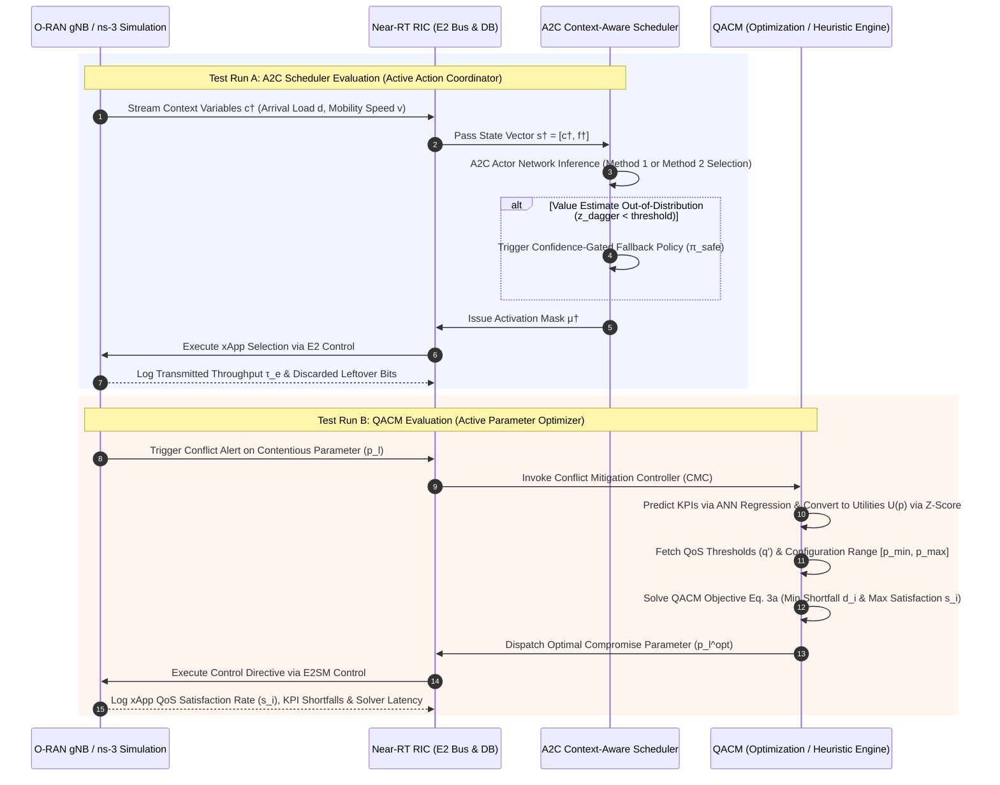

### Comparative Evaluation Methodology: A2C Context-Aware Scheduler vs. QACM

Both the **A2C Context-Aware Scheduler** and **QACM (QoS-Aware xApp Conflict Mitigation)** operate within the O-RAN Near-Real-Time RAN Intelligent Controller (**Near-RT RIC**) on near-real-time timescales (10 ms – 1 s). However, they address conflict mitigation from two distinct architectural philosophies:

* **A2C Context-Aware Scheduler (Macro-Level Policy Coordinator):** Functions as an **active action coordinator and orchestrator**. It ingests physical network context variables ($c^\dagger$: e.g., traffic arrival rate $d$, user mobility speed $v$) and intent targets ($f^\dagger$), using an Advantage Actor-Critic (A2C) DRL network to dynamically toggle which pre-trained xApps (or baseline policies) are active ($\mu^\dagger$) [343, 350, 352–353].
* **QACM (Micro-Level Parameter Optimizer):** Functions as a **post-action parameter bargaining engine**. When active xApps request conflicting values for shared input control parameters (e.g., transmit power, RET, CIO) [134–135, 177], QACM converts xApp KPIs into normalized scalar utilities $U(p)$ via z-score normalization and solves a constrained optimization problem (or heuristic loop) to calculate a single **optimal compromise parameter value ($p_l^{\text{opt}}$)** [159–163].

---

### 1. Key Technical Evaluation Dimensions

#### 1. Conflict Resolution Mechanism (Action Scheduling vs. Parameter Bargaining)
* **A2C Scheduler:** Resolves conflicts by controlling **xApp execution states**. It selects between Method 1 (activating xApps while retaining previous actions) or Method 2 (selecting between pre-trained xApps and baseline equal-allocation policies). It does not modify the inner mathematical logic or parameter outputs of the xApps themselves.
* **QACM:** Resolves conflicts by negotiating **contentious parameter settings**. Rather than deactivating an xApp, QACM intercepts conflicting requests (e.g., Energy Saving requesting 6 dBm vs. Coverage Optimization requesting 40 dBm) and calculates an optimal intermediate setting ($p_l^{\text{opt}} \approx 15\text{–}16\text{ dBm}$) over E2SM Control.

#### 2. End-to-End Network KPI & QoS Enforcement
* **A2C Scheduler:** Optimizes overall system-wide performance (e.g., maximizing total normalized transmission rate $\tau_e$ and minimizing mean leftover/discarded bits from buffer overflow) [346–347, 350, 358]. It does not explicitly enforce individual xApp Quality of Service (QoS) guarantees.
* **QACM:** Explicitly enforces **individual xApp QoS benchmarks ($q'$)**. Its objective function ($\min \sum w_i d_i \zeta - (\sum s_i)^2$) [159–160] minimizes individual KPI shortfall distances ($d_i$) from QoS thresholds while maximizing the total count of satisfied xApps ($s_i$) [159–160].

#### 3. Near-RT RIC Latency & Computational Overhead
* **A2C Scheduler:** Low inference latency. Executing the A2C Actor network requires a quick forward pass given state vector $s^\dagger = [c^\dagger, f^\dagger]$.
* **QACM:** Higher processing overhead. Executing QACM requires forward-pass inferences across pre-trained **ANN regression models** (4 hidden layers, 128 neurons, `tanh` activation) to predict KPIs for each candidate parameter setting [138, 154–156], followed by solving an optimization problem with $4|X'| + 2|N| + 3$ constraints (or running Heuristic Algorithm 1 with $O(N \cdot |X'|)$ complexity).

#### 4. Adaptability Across Dynamic Network Contexts
* **A2C Scheduler:** Highly context-sensitive. It explicitly monitors real-time environmental context ($c^\dagger$: arrival load $d$, user mobility speed $v$) and incorporates a **confidence-gated fallback mechanism** (z-score thresholding on critic value $V_\phi(s^\dagger)$) to handle out-of-distribution network states safely [354–355].
* **QACM:** Context adaptability depends on the accuracy of its offline/online **ANN KPI prediction models**. If live network dynamics drift significantly from the ANN training distribution, KPI predictions and the resulting compromise parameter choices may become suboptimal.

#### 5. Training & Maintenance Requirements
* **A2C Scheduler:** Requires lightweight online re-training of the scheduler whenever new operator intent targets ($f^\dagger$) or xApp sets are onboarded. However, it **never requires re-training or modifying the pre-trained xApps**.
* **QACM:** Requires maintaining pre-trained ANN regression models for each deployed xApp to enable KPI-to-utility conversion and prediction [138, 154–156]. It does not require re-training a central RL agent when parameters change.

---

### 2. Comparison Summary Matrix

| Metric / Dimension | A2C Context-Aware Scheduler | QACM Framework |
| :--- | :--- | :--- |
| **Primary Role** | Active Macro-Level Action Coordinator | Active Micro-Level Parameter Optimizer |
| **Input Signals** | Context variables ($c^\dagger$: load, speed) + Intent ($f^\dagger$) | Controllable parameter bounds ($[p_{\text{min,opt}}, p_{\text{max,opt}}]$), z-score utilities $U(p)$, QoS thresholds $q'$, priority weights $w_i$ [133, 157, 159–160] |
| **Core AI / Math Engine** | Advantage Actor-Critic (A2C) DRL | Game-theoretic / Constrained Optimization (or Heuristic Alg 1) + ANN Regression |
| **Primary Output** | xApp Activation Mask ($\mu^\dagger \in \{0, 1\}^n$) | Optimal Compromise Parameter Value ($p_l^{\text{opt}}$) sent over E2SM Control |
| **QoS Guarantee** | System-wide performance maximization (throughput/buffer) | **Explicit individual xApp QoS threshold enforcement ($q'$)** [111, 117, 159–160] |
| **Explainability** | Low (Black-box RL policy decisions) | Medium/Low (Quantitative utility shortfall $d_i$ & satisfaction $s_i$, no causal graphs) |
| **Re-training Need** | Re-trains lightweight scheduler when xApps/intents change | Re-trains ANN regression models when xApp KPI behavior shifts |

---

### 3. Isolated Benchmarking Workflows (Markdown Sequence Diagram)

In an **ns-3** simulation or physical testbed environment, both frameworks should be benchmarked in separate, isolated test runs under identical network conditions (same user distribution, mobility speed $v$, and traffic arrival rate $d$):

---

### 4. Cooperative Two-Tier Architecture (A2C + QACM)

In a fully integrated Near-RT RIC deployment, the two frameworks can be combined into a **hierarchical two-tier conflict management system**:

1. **Macro-Level Coordination (A2C Scheduler):** Evaluates real-time contextual signals ($c^\dagger$) every scheduling period $\dagger$ to select the appropriate xApp activation mask ($\mu^\dagger$).
2. **Micro-Level Parameter Bargaining (QACM):** If the xApps activated by the A2C Scheduler issue conflicting numerical requests for shared control parameters (e.g., transmit power or RET), **QACM** is invoked to calculate the optimal compromise parameter setting ($p_l^{\text{opt}}$) [159–160], ensuring that co-active xApps meet their QoS thresholds without causing network instability.

---