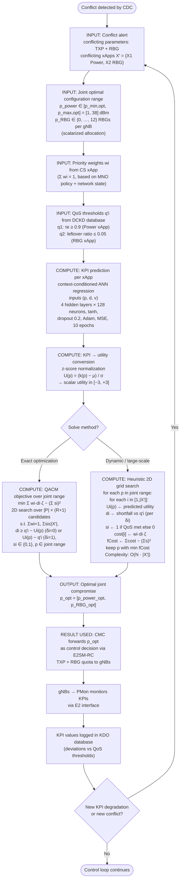

# Iter-3 Proposed Flow: A2C Scheduler and QACM on the Common Power + RBG Indirect Conflict

**Sources:** `plan/iteration-3/spec.md`, `plan/iteration-3/implementation-plan.md`, `a2c-scheduler-flow.md`, `qacm-flow.md`
**Role:** Unified iter-3 flow for the comparative experiment on the ns-O-RAN testbed. Supersedes the paper-faithful flows in `a2c-scheduler-flow.md` and `qacm-flow.md` for the iter-3 scenario.
**Core idea:** Both frameworks run on the **same scenario** — Power xApp ($X_1$) + RBG xApp ($X_2$) **indirect conflict** over TXP and RBG allocation. The A2C scheduler runs **as published** (native reward $\tau_e$, Method 1/2, confidence-gated fallback); QACM is **extended** to joint-parameter bargaining over $\mathbf{p} = [p_{power}, p_{RBG}]$ with a context-conditioned ANN.

---

## 1. Common Scenario and Testbed Adaptation

- **Conflict:** Power xApp ($X_1$) + RBG xApp ($X_2$) **indirect conflict** over two NCPs — TXP and RBG allocation — affecting the shared throughput KPM $\tau_e$.
  - $X_1$ (Power) maximizes the normalized transmission rate $\tau_e$ by setting per-cell TXP.
  - $X_2$ (RBG) maximizes $\tau_e$ by allocating RBGs to users.
  - Conflict triggers (paper): the Power xApp assigns power to RBGs not allocated to any user (wasted power); the RBG xApp assigns many RBGs to users that receive low power (underpowered allocation) → throughput drops and leftover (discarded) bits accumulate.
- **Topology (testbed adaptation):** 2 gNBs, 10 UEs, 20 MHz carrier, 12 RBGs per gNB, 10 min simulation at 100 ms time steps (matches E2SM-KPM periodicity). The paper uses 4 O-RUs / 16 UEs; the testbed constraint is 2 gNBs / 10 UEs.
- **Power:** $p_{power} \in [1, 38]$ dBm, $K$ quantization levels.
- **RBG allocation:** $p_{RBG} \in \{0, \dots, 12\}$ RBGs per gNB (scalarized allocation).
- **Scheduling period:** 10 time steps × 100 ms = 1 s; episode $T$ = 50 time steps = 5 s.
- **Context variables:** training $d \in \{3, 5, 7, 9\}$ Mbps × $v \in \{10, 20, 30, 40\}$ m/s; test $d \in \{2, 5, 8\}$ Mbps × $v \in \{5, 25, 45\}$ m/s (9 test combinations).
- **QoS thresholds (defined for the A2C scenario):** $q_1$: $\tau_e \geq 0.9$ (Power xApp KPI); $q_2$: leftover-bits ratio $\leq 0.05$ (RBG xApp KPI).
- **Leftover-bits derivation:** $L = \max(0, d - \sum_u R_{u,t})$ per period (not a native ns-O-RAN KPM).
- **A1 EI is simulated:** no Non-RT RIC in the testbed; context $c^\dagger = [d, v]$ and intent $f^\dagger$ are injected per scheduling period.

---

## 2. Flow A: A2C Scheduler (as published, iter-3)

### 2.1 Flowchart

```mermaid
flowchart TD
    Start([Scheduling period † begins]) --> EI["INPUT: Context variables via simulated A1 EI\nc1† = mean data arrival rate d (Mbps)\nc2† = average user mobility speed v (m/s)"]
    EI --> INTENT["INPUT: Intent target f†\n(e.g., maximize total normalized transmission rate τe)"]
    INTENT --> STATE["Build state vector\ns† = [c1†, c2†, f†] = [d, v, intent]"]

    STATE --> ACTOR["COMPUTE: A2C Actor network\nπθ(a†|s†) → probability distribution\nover activation decisions"]
    ACTOR --> CRITIC["COMPUTE: A2C Critic network\nVφ(s†) ≈ E[G†|s†] (state-value baseline)"]
    CRITIC --> ADV["COMPUTE: Advantage\nA(s†,a†) = G†:†+1 − Vφ(s†)\n(used only for training updates)"]

    ADV --> GATE{"SAFETY: Confidence gate\nz-score of Vφ(s†) below\nMNO-defined threshold?"}
    GATE -->|"Yes (out-of-distribution)"| FALLBACK["Override action for T_back decisions\nwith deterministic fallback π_safe:\n(i) equal resource allocation, or\n(ii) single xApp with highest offline reward"]
    GATE -->|"No"| SAMPLE["Sample action from Actor distribution\na† = [μ1†, μ2†, …, μn†], μn† ∈ {0,1}"]

    FALLBACK --> MASK
    SAMPLE --> MASK["OUTPUT: xApp activation mask μ†"]

    MASK --> METHOD{"Scheduling method?"}
    METHOD -->|"Method 1: Retain previous action"| M1["Activate selected A2C xApps\n(Power X1, RBG X2)\nDeactivated xApp keeps its last action"]
    METHOD -->|"Method 2: Extend with baselines"| M2["Select 1 power xApp (X1 or baseline X3)\n+ 1 RBG xApp (X2 or baseline X4)\nconstraints: μ1†+μ3†=1, μ2†+μ4†=1"]

    M1 --> IH["xApp Inference Host (IH)\nSelected xApps access shared data repository"]
    M2 --> IH
    IH --> XAPP["Active xApps run their own A2C policies\n(Power allocation, RBG allocation)"]
    XAPP --> E2["RESULT USED: E2SM-RC Control messages\nTXP and RBG quota to gNBs"]
    E2 --> KPM["gNBs stream KPM feedback via E2SM-KPM\n(rate, leftover/discarded bits)"]
    KPM --> REWARD["COMPUTE: Reward τe\n= normalized transmission rate\n= Στt,e / (de · R · B)"]
    REWARD --> TRAIN["COMPUTE: Online training update\nActor: ∇θ J = E[∇θ log πθ(a†|s†) · A(s†,a†)]\nCritic: L(φ) = E[(G†:†+1 − Vφ(s†))²]"]
    TRAIN --> LOOP{"Next scheduling period †?"}
    LOOP -->|"Yes"| EI
    LOOP -->|"No"| End([End episode])
```

### 2.2 Input Parameters

| Symbol | Description | Source | Example Value |
| :--- | :--- | :--- | :--- |
| $c_1^\dagger = d$ | Mean data arrival rate (traffic load) | Simulated A1 EI | training {3, 5, 7, 9} Mbps; test {2, 5, 8} Mbps |
| $c_2^\dagger = v$ | Average user mobility speed | Simulated A1 EI | training {10, 20, 30, 40} m/s; test {5, 25, 45} m/s |
| $f^\dagger$ | Intent target KPM (maximize total transmission rate) | MNO intent via simulated A1 | $\tau_e$ |
| $s^\dagger$ | State vector $[c_1^\dagger, c_2^\dagger, f^\dagger]$ | Concatenation of above | — |
| $\tau_e$ | Reward: normalized transmission rate | Computed from RAN KPM feedback | $\frac{\sum_t \tau_{t,e}}{d_e \cdot R \cdot B}$ |
| $L$ | Leftover (discarded) bits | Derived: $L = \max(0, d - \sum_u R_{u,t})$ per period | — |

### 2.3 Computation Steps

1. **State construction** — Concatenate the two context variables and the intent target into the scheduler state vector $s^\dagger = [c_1^\dagger, c_2^\dagger, f^\dagger] = [d, v, \text{intent}]$.
2. **Actor inference** — The A2C Actor network $\pi_\theta(a^\dagger|s^\dagger)$ outputs a probability distribution over the binary activation decisions $\mu_n^\dagger \in \{0,1\}$ for each candidate xApp.
3. **Critic inference** — The Critic network $V_\phi(s^\dagger)$ estimates the expected return from the current state, providing the baseline for the advantage function $A(s^\dagger, a^\dagger) = G_{\dagger:\dagger+1} - V_\phi(s^\dagger)$.
4. **Confidence-gated fallback (safety layer)** — Maintain EWMA estimates of the Critic's value mean $m^\dagger$ and dispersion $\sigma^\dagger$ (forgetting factor $\beta$). If the z-score of $V_\phi(s^\dagger)$ falls below the MNO-defined threshold, the learned action is overridden for the next $T_{back}$ decisions by the deterministic fallback policy $\pi_{safe}$ (equal resource allocation, or the single xApp with the highest offline average reward). Statistics are frozen during the back-off window.
5. **Action sampling** — Sample the activation mask $a^\dagger = [\mu_1^\dagger, \dots, \mu_n^\dagger]$ from the Actor distribution (or take the fallback action).
6. **Method selection** — Apply either:
   - **Method 1 (retain previous action):** activate the chosen A2C xApps; a deactivated xApp retains its last action for consistency.
   - **Method 2 (extend with baselines):** choose one power xApp (A2C $X_1$ or baseline $X_3$) and one RBG xApp (A2C $X_2$ or baseline $X_4$), subject to $\mu_1^\dagger + \mu_3^\dagger = 1$ and $\mu_2^\dagger + \mu_4^\dagger = 1$.
7. **Reward computation** — Compute the **native** normalized transmission rate $\tau_e = \frac{\sum_t \tau_{t,e}}{d_e \cdot R \cdot B}$ from KPM feedback (no redesign; Q3 moot).
8. **Training update** — After the episode, update the Actor via the policy gradient $\nabla_\theta J(\theta) = \mathbb{E}[\nabla_\theta \log \pi_\theta(a^\dagger|s^\dagger) \cdot A(s^\dagger, a^\dagger)]$ and the Critic by minimizing $\mathcal{L}(\phi) = \mathbb{E}[(G_{\dagger:\dagger+1} - V_\phi(s^\dagger))^2]$.

### 2.4 How the Result Is Used

1. The activation mask $\mu^\dagger$ is sent to the **xApp Inference Host (IH)**, which enables the selected xApps to access the shared data repository and begin optimization.
2. Active xApps execute their own pre-trained A2C policies (power allocation, RBG allocation) and issue **E2SM-RC Control** directives (TXP + RBG quota) to the gNBs.
3. The gNBs apply the NCP adjustments and stream **KPM feedback** (rate, leftover/discarded bits) back to the scheduler.
4. The feedback is converted into the reward $\tau_e$ (normalized transmission rate), which drives the online re-training of the lightweight scheduler only — the pre-trained xApps are never modified.

### 2.5 Key Parameters (iter-3)

| Parameter | Value |
| :--- | :--- |
| gNBs / UEs | 2 / 10 |
| RBGs per gNB ($R$) | 12 |
| TXP range | $[1, 38]$ dBm, $K$ levels |
| Traffic arrival rates $d_e$ | training {3, 5, 7, 9} Mbps; test {2, 5, 8} Mbps |
| User speed range $v_u$ | training {10, 20, 30, 40} m/s; test {5, 25, 45} m/s |
| Training episodes / time slots | $10^5$ / 50 |
| Scheduling period $\dagger$ | 10 time steps (1 s) |
| Learning rate $\eta$ / discount $\gamma$ | $10^{-4}$ / 0.95 |
| Context variables | 2 (arrival rate, speed) + intent |

### 2.6 Expected Outcomes

- **Method 1** improves over the conflicting independent-deployment case (an A2C-driven form of prioritization).
- **Method 2** (baseline xApps in the action space) yields the best overall performance and lowest leftover bits.
- Conflict severity is context-dependent: ~5% degradation at low load/speed vs. ~16% at high load/speed (8 Mbps, 45 m/s).

---

## 3. Flow B: QACM (extended to joint-parameter bargaining, iter-3)

### 3.1 Flowchart

### 3.2 Input Parameters

| Symbol | Description | Source | Example |
| :--- | :--- | :--- | :--- |
| $\mathbf{p}$ | Joint control vector $[p_{power}, p_{RBG}]$ | CDC conflict alert | $p_{power} \in [1, 38]$ dBm; $p_{RBG} \in \{0, \dots, 12\}$ |
| $X'$ | Set of conflicting xApps | CDC conflict alert | {X1 Power, X2 RBG} |
| $q'_i$ | QoS threshold of conflicting xApp $i$ | DCKD database (SLA) | $q_1$: $\tau_e \geq 0.9$; $q_2$: leftover ratio $\leq 0.05$ |
| $w_i$ | Priority weight of xApp $i$ ($\sum w_i = 1$) | CS xApp (MNO policy) | — |
| $\delta_i$ | KPI direction: 0 = maximize, 1 = minimize | xApp definition | $\delta_1 = 0$, $\delta_2 = 0$ |
| $d, v$ | Context variables (ANN features) | Simulated A1 EI | $d \in \{2, 5, 8\}$ Mbps; $v \in \{5, 25, 45\}$ m/s |
| $[p_{min,opt}, p_{max,opt}]$ | Joint optimal configuration range | Union of xApp ranges | $p_{power} \in [1, 38]$ dBm; $p_{RBG} \in \{0, \dots, 12\}$ |
| $\zeta$ | Tuning constant for weighted distance | Configuration | $10^3$ |

### 3.3 Computation Steps

1. **Conflict notification** — The CDC informs the CMC of a detected indirect conflict, identifying the conflicting parameters (TXP + RBG) and the set of conflicting xApps $X' = \{X_1, X_2\}$.
2. **Joint range estimation** — The CMC requests each conflicting xApp's individual optimal range and computes the overall joint range: $p_{power} \in [1, 38]$ dBm and $p_{RBG} \in \{0, \dots, 12\}$ RBGs per gNB (scalarized allocation).
3. **Weight assignment** — The CS xApp assesses the MNO policy and current network state, returning normalized weights $w_i$ with $\sum_{i \in [1,|X'|]} w_i = 1$.
4. **Context-conditioned KPI prediction** — For each candidate value of $\mathbf{p}$, each xApp's KPI is predicted by its ANN regression model with inputs $(\mathbf{p}, d, v)$ — 4 hidden layers × 128 neurons, tanh activation, dropout 0.2, Adam optimizer, MSE loss, 10 epochs. ANN outperforms polynomial regression (R² 0.95–0.99 vs 0.81–0.99).
5. **Utility conversion** — KPIs are converted to scalar utilities via z-score normalization $U(\mathbf{p}) = (k(\mathbf{p}) - \mu)/\sigma$, preserving the Gaussian distribution and yielding values in $[-3, +3]$.
6. **Optimization** — Solve the QACM objective over the joint range:
   $$\min_{\mathbf{p}} \sum_{i \in [1,|X'|]} w_i d_i \zeta - \left(\sum_{i \in [1,|X'|]} s_i\right)^2$$
   subject to the weight-sum, satisfaction-count, distance, binary-indicator, and range constraints. **Exact:** 2D search over the $|P| \times (R+1)$ candidates. **Heuristic:** 2D-grid search ($O(N \cdot |X'|)$) iterating over discrete $\mathbf{p}$ values, computing per-xApp shortfall $d_i$ and satisfaction $s_i$, and keeping the $\mathbf{p}$ minimizing total cost.
7. **Dispatch** — The CMC forwards the optimal joint compromise $\mathbf{p}^{opt} = [p_{power}^{opt}, p_{RBG}^{opt}]$ as a control decision to the gNBs via E2SM-RC (TXP + RBG quota).

### 3.4 How the Result Is Used

1. The optimal joint compromise $\mathbf{p}^{opt}$ is applied to the gNBs through **E2SM-RC** (e.g., TXP set to a compromise level and RBG quota set accordingly, instead of the conflicting per-xApp requests).
2. **PMon** continuously monitors the resulting KPIs via the E2 interface and compares them against the QoS thresholds ($q_1$, $q_2$).
3. KPI deviations are logged in the **KDO database**; if a new degradation or conflict emerges (e.g., an indirect/implicit conflict triggered by the resolution), the CDC alerts the CMC and the loop repeats.

### 3.5 Key Parameters (iter-3)

| Parameter | Value |
| :--- | :--- |
| ANN architecture | 4 hidden layers × 128 neurons, tanh, dropout 0.2, inputs $(\mathbf{p}, d, v)$ |
| Optimizer / loss / epochs | Adam / MSE / 10 |
| Utility range (z-score) | $[-3, +3]$ |
| Objective constant $\zeta$ | $10^3$ |
| Joint search space | $|P| \times (R+1)$ candidates (exact 2D search) |
| Heuristic complexity | $O(N \cdot |X'|)$ |
| QoS thresholds | $q_1$: $\tau_e \geq 0.9$; $q_2$: leftover ratio $\leq 0.05$ |
| Context features | $d$ (Mbps), $v$ (m/s) |

### 3.6 Expected Outcomes

- QACM (joint-parameter) satisfies **more per-xApp QoS thresholds** than NSWF/EG benchmarks over the joint vector.
- In the A2C scenario, QACM reduces throughput shortfall and leftover bits while keeping the Power xApp's $\tau_e$ at its threshold.
- Handles **direct, indirect, and implicit** conflicts through a unified framework with **no data sharing** between xApps.

---

## 4. Iter-3 Deviations from the Paper Flows

| Aspect | Paper flow | Iter-3 flow |
| :--- | :--- | :--- |
| **Common scenario** | A2C: Power + RBG indirect conflict (4 O-RUs / 16 UEs); QACM: ES vs. CCO direct conflict over TXP | **Single common scenario:** Power + RBG indirect conflict, testbed-adapted (2 gNBs / 10 UEs / 12 RBGs per gNB / 20 MHz) |
| **A2C state** | $s^\dagger = [c_1^\dagger, c_2^\dagger, f^\dagger]$ | Same, but context injected via **simulated A1 EI** (no Non-RT RIC) |
| **A2C reward** | Native $\tau_e$ | Same — **no redesign** (Q3 moot under Proposal B) |
| **A2C methods** | Method 1 / Method 2 | Same |
| **QACM bargaining space** | Single scalar $p_l$ (e.g., TXP) | **Joint vector** $\mathbf{p} = [p_{power}, p_{RBG}]$ |
| **QACM KPI prediction** | ANN predicts KPI from $p_l$ only | **Context-conditioned ANN**: inputs $(\mathbf{p}, d, v)$ |
| **QACM RBG handling** | Not applicable (paper's indirect case is single-parameter) | **Scalarized** $p_{RBG} \in \{0, \dots, 12\}$ RBGs per gNB |
| **QACM QoS thresholds** | SLA-derived per xApp | **Defined for the A2C scenario:** $q_1$: $\tau_e \geq 0.9$; $q_2$: leftover ratio $\leq 0.05$ |
| **QACM solver** | Single-parameter MILP / Heuristic Alg. 1 | **2D search** ($|P| \times (R+1)$ candidates) / **2D-grid heuristic** |
| **Leftover bits** | Native per-RBG discard model | **Derived:** $L = \max(0, d - \sum_u R_{u,t})$ per period |
| **A1 EI** | Non-RT RIC | **Simulated** (no Non-RT RIC in the ns-O-RAN testbed) |
| **Open decision (Q1)** | No fallback branch in the paper | QACM fallback when best compromise satisfies zero QoS thresholds — **to be decided** (dispatch-and-log / reject-and-keep-previous / escalate to CS xApp) |