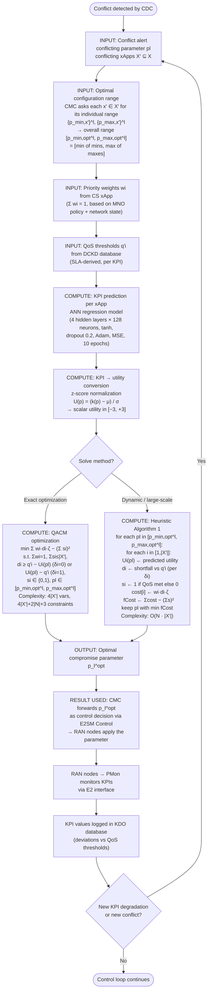

# Approach 2: QACM (QoS-Aware Conflict Mitigation) — Flow & Steps

**Source:** `literature/Rule-Based & SLA Constraint Projection/2405.07324v2.md` (Wadud et al., "QACM: QoS-Aware xApp Conflict Mitigation in Open RAN")
**Role:** Micro-level parameter bargaining engine (the Conflict Mitigation Controller, CMC, inside the CMS).
**Core idea:** When active xApps request conflicting values for a shared control parameter $p_l$, QACM predicts each xApp's KPI utility, then solves a QoS-aware optimization to find a single compromise value $p_l^{opt}$ that maximizes the number of xApps meeting their SLA/QoS thresholds.

---

## 1. Flowchart

---

## 2. Input Parameters

| Symbol | Description | Source | Example |
| :--- | :--- | :--- | :--- |
| $p_l$ | Conflicting input control parameter (ICP) | CDC conflict alert | TXP, RET, CIO, TTT |
| $X'$ | Set of conflicting xApps | CDC conflict alert | {ES, CCO} |
| $q'_i$ | QoS threshold of conflicting xApp $i$ | DCKD database (SLA) | throughput ≥ 9.5 Gbps |
| $w_i$ | Priority weight of xApp $i$ ($\sum w_i = 1$) | CS xApp (MNO policy) | $w_{ES}=0.1$, $w_{CCO}=0.9$ |
| $\delta_i$ | KPI direction: 0 = maximize, 1 = minimize | xApp definition | $\delta_{CCO}=0$, $\delta_{ES}=1$ |
| $[p_{min,opt}^l, p_{max,opt}^l]$ | Optimal configuration range | Union of xApp ranges | [6, 40] dBm |
| $\zeta$ | Tuning constant for weighted distance | Configuration | $10^3$ |
| $M$ | Large constant enforcing binary $s_i$ | Configuration | $> \max U_i(p_l)$ |

## 3. Computation Steps

1. **Conflict notification** — The CDC informs the CMC of a detected conflict, identifying the conflicting parameter $p_l$ and the set of conflicting xApps $X'$.
2. **Optimal range estimation** — The CMC requests each conflicting xApp's individual optimal range $\{p_{min,x'_j}^l, p_{max,x'_j}^l\}$ and computes the overall range as $\{\min(p_{min,x'_1}^l, \dots), \max(p_{max,x'_1}^l, \dots)\}$.
3. **Weight assignment** — The CS xApp assesses the MNO policy and current network state, returning normalized weights $w_i$ with $\sum_{i \in [1,|X'|]} w_i = 1$.
4. **KPI prediction** — For each candidate value of $p_l$, each xApp's KPI is predicted by its ANN regression model (4 hidden layers × 128 neurons, tanh activation, dropout 0.2, Adam optimizer, MSE loss, 10 epochs). ANN outperforms polynomial regression (R² 0.95–0.99 vs 0.81–0.99).
5. **Utility conversion** — KPIs are converted to scalar utilities via z-score normalization $U(p) = (k(p) - \mu)/\sigma$, preserving the Gaussian distribution and yielding values in $[-3, +3]$.
6. **Optimization** — Solve the QACM objective:
   $$\min_{p_l} \sum_{i \in [1,|X'|]} w_i d_i \zeta - \left(\sum_{i \in [1,|X'|]} s_i\right)^2$$
   subject to the weight-sum, satisfaction-count, distance, binary-indicator, and range constraints. For large instances, use Heuristic Algorithm 1 ($O(N \cdot |X'|)$): iterate over discrete $p_l$ values, compute per-xApp shortfall $d_i$ and satisfaction $s_i$, and keep the $p_l$ minimizing total cost.
7. **Dispatch** — The CMC forwards the optimal value $p_l^{opt}$ as a control decision to the RAN nodes via E2SM Control.

## 4. How the Result Is Used

1. The optimal compromise parameter $p_l^{opt}$ is applied to the RAN nodes through **E2SM Control** (e.g., TXP set to 15 dBm instead of the conflicting 6 vs 40 dBm).
2. **PMon** continuously monitors the resulting KPIs via the E2 interface and compares them against QoS thresholds.
3. KPI deviations are logged in the **KDO database**; if a new degradation or conflict emerges (e.g., an indirect/implicit conflict triggered by the resolution), the CDC alerts the CMC and the loop repeats.

## 5. Key Parameters (from paper)

| Parameter | Value |
| :--- | :--- |
| ANN architecture | 4 hidden layers × 128 neurons, tanh, dropout 0.2 |
| Optimizer / loss / epochs | Adam / MSE / 10 |
| Utility range (z-score) | $[-3, +3]$ |
| Objective constant $\zeta$ | $10^3$ |
| Optimization complexity | $4|X'|$ variables, $4|X'| + 2|N| + 3$ constraints |
| Heuristic complexity | $O(N \cdot |X'|)$ |
| Example conflict (ES vs CCO over TXP) | QACM → 15 dBm (non-priority), 16 dBm (priority) |

## 6. Expected Outcomes

- QACM consistently satisfies **more xApps' QoS thresholds** than NSWF/EG benchmarks across all four case studies (e.g., 2/2 vs 1/2 for a two-xApp direct conflict).
- In the MATLAB 5G simulation (ES vs CCO over TXP), QACM reduces throughput shortfall from 39% to 3% while keeping power consumption at its threshold.
- Handles **direct, indirect, and implicit** conflicts through a unified framework with **no data sharing** between xApps.