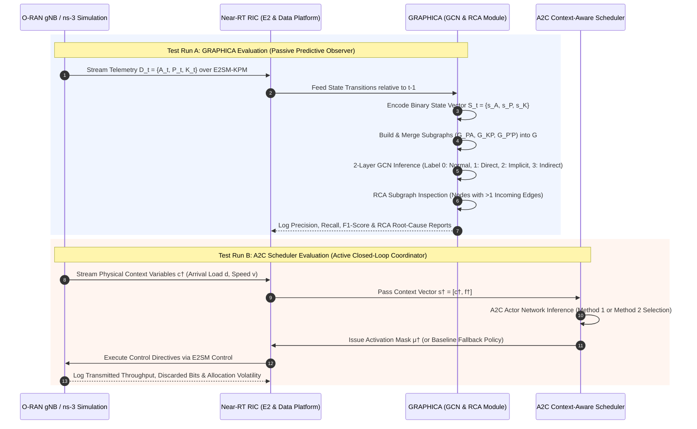

In this setup, **GRAPHICA** and the **A2C Scheduler** are evaluated in separate test runs under identical operational conditions (same user distribution, traffic load, and mobility patterns) without influencing or interacting with each other:

1. **Test Run A (GRAPHICA in Isolation):** Functions purely as a **passive predictive observer and diagnostic engine**. Telemetry streams are processed into binary state vectors and graph structures to evaluate classification accuracy (F1-score) and Root Cause Analysis (RCA) performance without altering xApp control actions.
2. **Test Run B (A2C Scheduler in Isolation):** Functions purely as an **active closed-loop policy coordinator**. Physical context variables and intent targets are evaluated every scheduling period $\dagger$ to dynamically select active xApps or baseline policies and issue E2 control commands.

---

### Sequence Diagram: Isolated Benchmarking Workflows

---

### Workflow Details

#### Test Run A — GRAPHICA (Passive Prediction & RCA)
* **Execution:** Conflicting xApps execute unhindered on the RAN. GRAPHICA subscribes to E2SM-KPM telemetry and Subscription Manager updates at each time step $t$.
* **Processing:** Converts state changes relative to $t-1$ into binary vectors $S_t = \{s_A, s_P, s_K\}$. The Graph Structure Creator merges subgraphs ($G^{PA}, G^{KP}, G^{P'P}$) into a unified graph $G$.
* **Inference:** A 2-layer GCN classifies the network state into conflict labels 0–3. The RCA module isolates target nodes receiving $>1$ incoming edge to identify the root-cause xApp pair.
* **Outputs:** **No control commands are sent back to the RAN.** The run logs prediction F1-scores across class imbalance ratios (e.g., 10%–40% conflicts), inference latency, and RCA accuracy.

#### Test Run B — A2C Scheduler (Active Closed-Loop Coordination)
* **Execution:** The A2C Scheduler operates as the active decision engine inside the Near-RT RIC.
* **Context Ingestion:** Every scheduling period $\dagger$ (e.g., 10 time slots / 1 s), the scheduler receives physical context variables $c^\dagger$ (mean arrival load $d$, user speed $v$) and intent target $f^\dagger$ in state vector $s^\dagger = [c^\dagger, f^\dagger]$.
* **Policy Decision:** The A2C Actor network selects an activation mask $\mu^\dagger$ using either **Method 1** (activating xApps while retaining previous actions) or **Method 2** (selecting between pre-trained xApps and baseline equal-allocation policies).
* **Outputs:** Directives are dispatched over E2SM Control to update gNB configurations. The run logs normalized transmission rate $\tau_e$, leftover discarded bits due to buffer overflows, and PRB allocation volatility.
