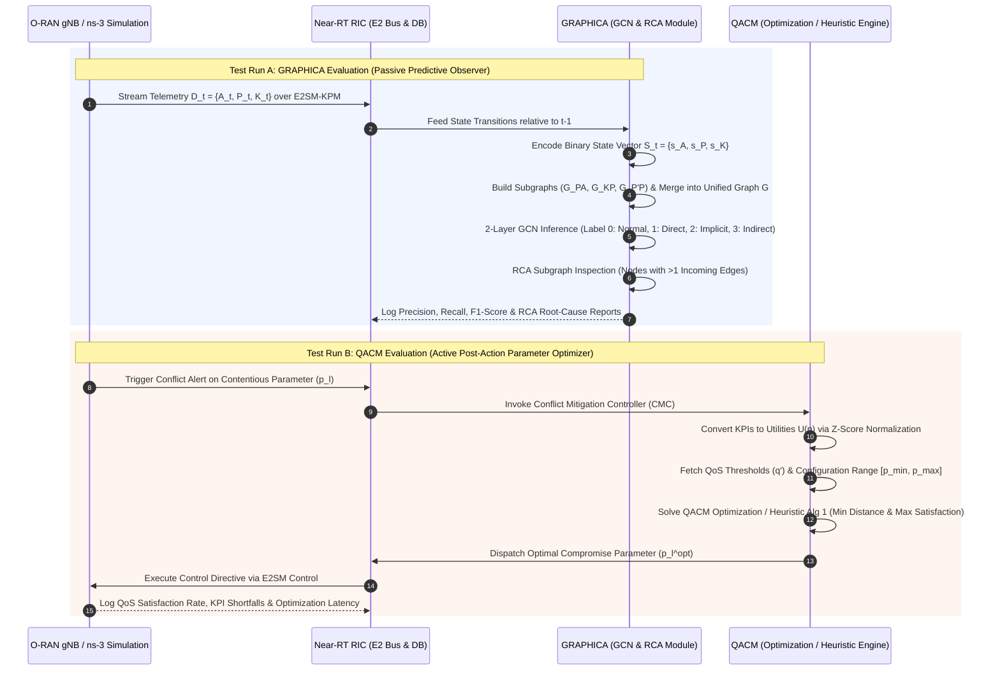

### Evaluation Methodology: GRAPHICA vs. QACM

While both **GRAPHICA** and **QACM (QoS-Aware xApp Conflict Mitigation)** operate inside the O-RAN Near-Real-Time RAN Intelligent Controller (Near-RT RIC) on near-real-time timescales (10 ms – 1 s), they fulfill fundamentally different functional roles:

* **GRAPHICA** is a **predictive anomaly detector and diagnostic tool** that uses a 2-layer Graph Convolutional Network (GCN) on binary-state subgraphs to forecast direct, indirect, and implicit conflicts before they physically manifest ($t_1$) and pinpoint root-cause xApps.
* **QACM** is an **active post-action parameter optimizer and mitigation engine** that converts Key Performance Indicators (KPIs) to utilities via z-score normalization and uses mathematical programming or heuristic bargaining to calculate an optimal compromise parameter setting ($p_l^{\text{opt}}$).

To evaluate and benchmark these two Near-RT RIC approaches in **ns-3** or on a physical testbed, structure your methodology across the following **five technical dimensions**:

---

### 1. Technical Evaluation Dimensions

#### 1. End-to-End Network KPI & QoS Preservation
Although GRAPHICA acts as an observer and QACM acts as a parameter optimizer, both ultimately aim to protect network Quality of Service (QoS). When GRAPHICA is paired with a basic reaction policy (e.g., pausing or adjusting the root-cause xApps flagged by its RCA module), its network impact can be directly compared to QACM's continuous parameter adjustments.
* **What to measure in ns-3:**
  * **QoS Satisfaction Rate:** The percentage of active xApps that meet or closely approach their required QoS benchmarks ($q'$) under conflicting conditions.
  * **KPI Shortfall & Degradation:** Relative performance shortfalls in downlink throughput (Mbps), buffer size / packet drops, power consumption (Wh), and signal quality (SINR) relative to single-app baselines.
  * **Allocation Volatility:** PRB allocation, power level, and handover parameter stability measured via the **Coefficient of Variation (COV)**, **Standard Deviation (SD)**, and **Root Mean Square of Successive Differences (RMSSD)**.

#### 2. Near-RT RIC Latency & Computational Overhead
Both frameworks must complete processing within the Near-RT RIC execution budget (10 ms – 1 s).
* **What to measure in ns-3:**
  * **Inference vs. Optimization Execution Time (ms):** Measure GRAPHICA's GCN forward-pass time and global mean pooling against QACM's optimization solver or heuristic loop (Algorithm 1) execution time.
  * **Data Pipeline Processing Cost:** Compare the overhead of constructing binary-state subgraphs ($G^{PA}, G^{KP}, G^{P'P}$) against QACM's z-score normalization and Artificial Neural Network (ANN) regression forward passes for KPI prediction.

#### 3. Scalability & Handling Imbalanced Datasets
* **Scalability under Increasing xApp Counts ($|X'|$):** GRAPHICA aggregates multi-entity interactions via graph message passing, maintaining high scalability. In contrast, QACM's optimization problem complexity grows with $4|X'| + 2|N| + 3$ constraints, requiring a heuristic algorithm ($O(N \cdot |X'|)$ complexity) for dynamic environments with large xApp sets.
* **Class Imbalance & Rare Event Handling:** Test how GRAPHICA's **Focal Loss** ($\alpha_c, \gamma$) performs when conflict instances represent only 10%–40% of operational data, compared to QACM's mathematical optimization over bounded parameter ranges [$p_{\text{min,opt}}, p_{\text{max,opt}}$].

#### 4. Diagnostic Capability & Explainability (RCA vs. Mathematical Optimization)
* **GRAPHICA:** Provides high structural explainability. Its **Root Cause Analysis (RCA)** module inspects conflict subgraphs for nodes receiving **more than one incoming edge** to identify the exact root-cause xApps and affected parameters.
* **QACM:** Functions as a quantitative optimization engine. It computes specific utility shortfall distances ($d_i$) and satisfaction indicators ($s_i$), but operates as a numerical optimizer without generating structural causal graphs explaining *why* the clash occurred.

#### 5. Data & Training Dependencies
* **GRAPHICA:** Is **distribution-independent**. It encodes state changes relative to timestamp $t-1$ into binary-state vectors ($S_t \in \{0, 1\}$), making it robust against shifting traffic distributions without needing re-training.
* **QACM:** Relies on **pre-trained KPI prediction models** (e.g., 4-layer ANN regression models) to estimate KPI responses for candidate control parameter settings. If real-world network dynamics shift away from the training data, QACM's prediction accuracy and mitigation decisions may degrade.

---

### 2. Comparison Summary Matrix

| Metric / Dimension | GRAPHICA Module | QACM Framework |
| :--- | :--- | :--- |
| **Primary Role** | Predictive Anomaly Detection & RCA | Post-Action QoS-Aware Parameter Optimization |
| **Input Signals** | Binary-state vectors ($S_t = \{s_A, s_P, s_K\}$) | Controllable parameters ($P$), z-score utilities ($U(p)$), QoS thresholds ($q'$) |
| **Core AI / Math Engine** | 2-layer GCN with Focal Loss ($\alpha_c, \gamma$) | Game-theoretic / Constraint Optimization (or Heuristic Alg 1) + ANN Regression |
| **Primary Output** | Conflict label (0–3) + Root-cause xApp list | Optimal compromise parameter value ($p_l^{\text{opt}}$) sent over E2SM Control |
| **Explainability** | **High** (Subgraph inspection of nodes with $>1$ incoming edge) | **Medium/Low** (Quantitative utility distances $d_i$, no causal graphs) |
| **Distribution Independence** | **High** (Binary state transitions relative to $t-1$) | **Low** (Requires pre-trained ANN models for accurate KPI prediction) |
| **Scalability ($|X'|$)** | **High** (Graph convolution and global mean pooling) | **Medium** (Constraint set grows as $4|X'|+2|N|+3$; relies on heuristic Alg 1) |

---

### 3. Unified Cooperative Pipeline (GRAPHICA + QACM)

Rather than treating them strictly as alternatives, GRAPHICA and QACM can be integrated into a **two-stage predictive and resolution pipeline** inside the Near-RT RIC:

1. **Predictive Detection Phase ($t_1$):** **GRAPHICA** monitors live telemetry streams over E2SM-KPM. At timestamp $t_1$ (before physical conflict onset at $t_2$ and KPI degradation at $t_3$), GRAPHICA predicts an impending conflict and runs its RCA module to identify the root-cause xApps and contentious parameters.
2. **Optimal Mitigation Phase ($t_2$):** Instead of simply pausing or deactivating the root-cause xApp, GRAPHICA's alert triggers the **QACM Conflict Mitigation Controller (CMC)**. QACM ingests the QoS thresholds of the identified xApps, executes its optimization problem (or heuristic Algorithm 1) over the parameter configuration bounds, and dispatches the optimal compromise parameter setting ($p_l^{\text{opt}}$) over E2SM Control to resolve the clash before performance degrades.

---

### 4. Isolated Benchmarking Workflows

In this setup, both frameworks run in separate test passes under identical network conditions (same traffic load, user mobility, and conflicting xApp requests) so that their execution does not influence or distort each other's metrics:

1. **Test Run A (GRAPHICA in Isolation):** Functions as a **passive predictive observer and diagnostic engine**. It monitors telemetry state changes relative to $t-1$, converts them into binary state vectors and graph structures, and evaluates classification accuracy (F1-score) and Root Cause Analysis (RCA) performance without altering xApp control actions or issuing E2 commands.
2. **Test Run B (QACM in Isolation):** Functions as an **active post-action parameter optimizer**. It ingests QoS thresholds ($q'$), converts KPIs into utility functions via z-score normalization, and calculates an optimal compromise parameter ($p_l^{\text{opt}}$) over the E2 interface to maximize the number of coexisting xApps that meet their QoS benchmarks.

---

### 5. Sequence Diagram: Isolated Benchmarking Workflows (GRAPHICA vs. QACM)

---

### Workflow Details

#### Test Run A — GRAPHICA (Passive Prediction & RCA)
* **Execution:** Conflicting xApps execute unhindered on the RAN. GRAPHICA subscribes to live telemetry streams over E2SM-KPM.
* **Processing:** Encodes relative state changes from timestamp $t-1$ to $t$ into binary vectors $S_t = \{s_A, s_P, s_K\}$ [222–224, 402]. The Graph Structure Creator merges subgraphs ($G^{PA}, G^{KP}, G^{P'P}$) into a unified graph $G$ [233–237, 402].
* **Inference & RCA:** A 2-layer GCN classifies the network state into conflict labels 0–3. The RCA module isolates graph nodes with **more than one incoming edge** to identify root-cause xApps.
* **Outputs:** **No control commands are sent to the RAN.** The run logs prediction precision, recall, F1-score across class imbalance ratios (10%–40% conflict instances), inference latency, and RCA accuracy [252–254, 402].

#### Test Run B — QACM (Active Post-Action Optimization)
* **Execution:** QACM acts as the active Conflict Mitigation Controller (CMC) within the Near-RT RIC [145–146, 150].
* **Utility Mapping & Scoping:** Converts incoming KPIs to standardized scalar utilities $U(p)$ using z-score normalization. It fetches the individual QoS benchmarks ($q'$) and bounded configuration ranges ($[p_{\text{min,opt}}, p_{\text{max,opt}}]$) from the conflicting xApps.
* **Optimization Solving:** Solves the QACM objective function (or executes heuristic Algorithm 1 for dynamic environments with large xApp sets) to minimize weighted KPI shortfall distances and maximize overall QoS satisfaction indicators [159, 162–165].
* **Outputs:** Dispatches the optimal compromise parameter ($p_l^{\text{opt}}$) over E2SM Control. The run logs the overall xApp QoS satisfaction rate, throughput/power shortfalls, allocation stability (COV, SD, RMSSD), and solver execution time.
